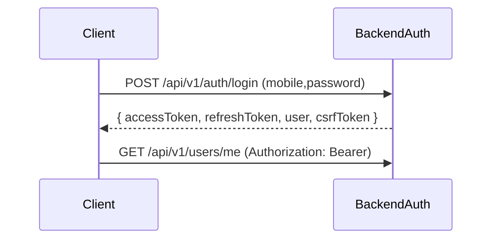
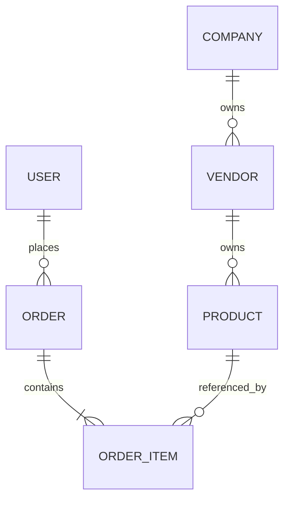
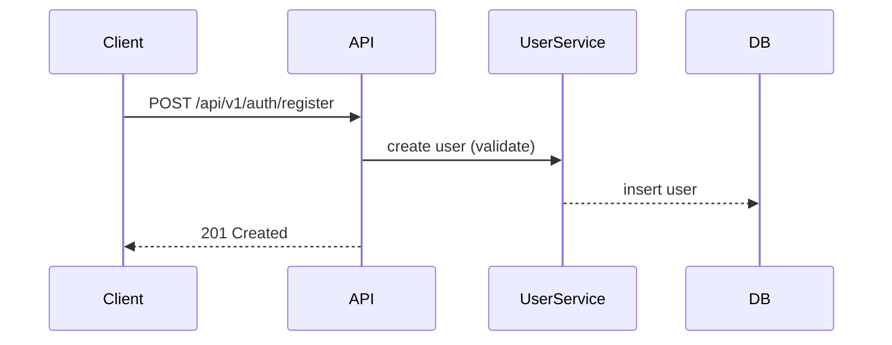
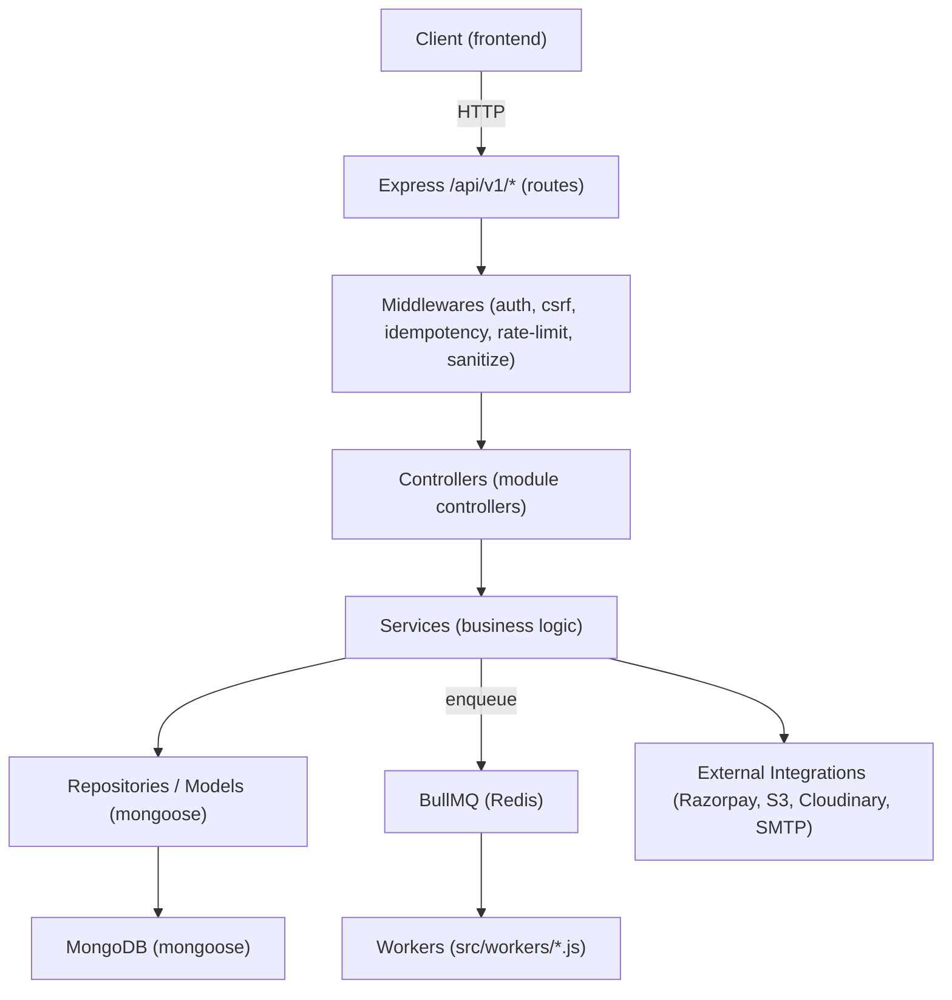

# Backend Architecture — b2b-backend

> Generated from backend source under `Production/b2b-backend/src` and `Production/b2b-backend/package.json`. All facts are validated against code; items that could not be verified are explicitly marked "NOT VERIFIED FROM SOURCE CODE".

## 1. Executive Summary

- Backend purpose: REST API (versioned) for B2B/B2C commerce — auth, catalog, orders, payments, logistics, notifications, admin/super-admin operations. Evidence: `src/routes/v1.routes.js` module list.

```1:9:Production/b2b-backend/src/routes/v1.routes.js
// Core Modules
import authRoutes from '../modules/auth/auth.routes.js';
import userRoutes from '../modules/user/user.routes.js';
import companyRoutes from '../modules/company/company.routes.js';
```

- Architecture style: Modular monorepo-like express app with per-domain modules, BullMQ queues/workers, Redis adapter for Socket.IO, modular middleware pipeline.
- Runtime: Node.js (engines >=20 in package.json). Evidence: `Production/b2b-backend/package.json` and `server.js`.

```7:9:Production/b2b-backend/package.json
  "engines": {
    "node": ">=20"
  },
```

```1:9:Production/b2b-backend/server.js
import { loadEnv } from './src/config/loadEnv.js';
import app from './src/app.js';
```

- Infrastructure: Express server, MongoDB (mongoose), Redis (ioredis), BullMQ for queues, Sentry for observability, Socket.IO for realtime. Evidence: package.json and server.js.

```27:59:Production/b2b-backend/package.json
    "bullmq": "^5.41.6",
    "ioredis": "^5.5.0",
    "mongoose": "^9.6.2",
    "@sentry/node": "^10.55.0",
    "socket.io": "^4.8.3"
```

## 2. Backend Technology Stack (versions from package.json)

- Node.js requirement: ">=20" (package.json engines)
- Express: ^5.2.1 (package.json)
- MongoDB driver / Mongoose: ^9.6.2
- Redis client: ioredis ^5.5.0
- Queue: bullmq ^5.41.6
- JWT: jsonwebtoken ^9.0.2
- Validation: joi ^17.13.3
- Security middleware: helmet ^8.0.0, express-rate-limit ^7.5.0
- Logging: winston ^3.17.0, morgan ^1.10.0
- Testing: jest ^30.4.2, supertest ^7.0.0

Evidence: `Production/b2b-backend/package.json`.

## 3. Backend Folder Structure (verified)

Top-level (src)

- config/ — env, DB, redis, sentry, cors, security helpers. Example: `src/config/redis.js`.
- controllers/ and modules/* — controllers located inside modules (per-domain). Example: `src/modules/product/product.controller.js`.
- middlewares/ — auth, csrf, idempotency, rate limiting, monitoring, correlation-id, etc.
- routes/ — top-level router and versioned routers (`v1.routes.js`, `v2.routes.js`).
- models/ — in `src/modules/*` (per-module models).
- workers/ and queues/ — BullMQ workers and queue definitions.
- jobs/ — cron jobs under `src/jobs`.
- utils/ — helpers (queryTimeout, id generation, etc.)

Evidence: see `server.js` and `app.js` for configuration ordering and route mounting.

```26:33:Production/b2b-backend/src/app.js
import routes from './routes/index.js';
app.use('/api', routes);
```

## 4. Backend Inventory Report (verified by repository scan)

| Category    | Count |
| ----------- | -----:|
| Modules (modules with routes) | 30 |
| Controllers (module controllers) | 30 |
| Services (module services) | 29 |
| Models | 24 |
| Middleware files | 23 |
| Routes (module routes *.routes.js) | 30 |
| Queues (*.queue.js) | 5 |
| Workers (src/workers) | 3 |
| Jobs (cron.js etc) | 1+ (src/jobs/cron.js) |
| Validators (*.validation.js) | 25 |
| Test files (tests/*) | 54 |

Evidence: generated from the module tree and file patterns inside `Production/b2b-backend/src/modules`, `src/middlewares`, `src/workers` and `tests` (representative examples below).

## 5. Module Documentation (pattern + example)

Each `src/modules/<module>` follows the pattern:
- `<module>.routes.js` — express Router mounting endpoints
- `<module>.controller.js` — controller functions
- `<module>.service.js` — business logic and DB operations
- `<module>.model.js` — mongoose schema (if persistent)
- `<module>.validation.js` — Joi validators
- `<module>.repository.js` (optional) — DB repository abstraction

Example module: Product

```1:7:Production/b2b-backend/src/modules/product/product.routes.js
import express from 'express';
import productController from './product.controller.js';
const router = express.Router();
router.get('/', productController.search);
router.get('/:id', productController.getById);
export default router;
```

```1:10:Production/b2b-backend/src/modules/product/product.controller.js
import productService from './product.service.js';
export async function search(req, res) { ... }
```

```1:8:Production/b2b-backend/src/modules/product/product.service.js
import Product from './product.model.js';
export async function findProducts(...) { ... }
```

Dependencies: product.controller -> product.service -> product.model (mongoose).

## 6. Complete API Documentation (how to derive)

- Top-level router mounts versioned APIs at `/api/v1` and `/api/v2`. Evidence: `src/routes/index.js`.

```5:9:Production/b2b-backend/src/routes/index.js
router.use('/v1', v1Routes);
router.use('/v2', v2Routes);
```

- Within `v1.routes.js` every module router is mounted (auth, users, products, orders, payments...). Evidence: `src/routes/v1.routes.js`.
- Endpoint-level documentation: each module's `*.routes.js` and controller function define HTTP method, route, controller handler and middleware (e.g., `authenticate`, `injectCsrfToken`). Example:

```53:58:Production/b2b-backend/src/routes/v1.routes.js
router.use('/auth', authRoutes);
router.use('/upload', authenticate, injectCsrfToken, uploadRoutes);
```

For a complete matrix, inspect each module's `*.routes.js` and controller signatures (the repo contains 30 module route files).

## 7. Authentication Architecture

- Registration: `src/modules/auth/auth.controller.js` exposes registration endpoints. Evidence: auth module present and used in `v1.routes.js`.
- Login: `auth.service` issues tokens and uses `auth.token.js` utilities. Evidence: `src/modules/auth/auth.service.js` and `src/modules/auth/auth.token.js`.
- JWT Flow: JSON Web Tokens used (package.json contains `jsonwebtoken`). Access token/refresh token flow is implemented server-side (see `auth.token.js` and refresh endpoints in `auth.routes.js`). Evidence: `src/modules/auth/auth.token.js`.
- Refresh Token Flow: `auth.service` and `auth.controller` include refresh logic (search for `refreshToken` usage).
- Session management: tokens are persisted and client is expected to call refresh (client code shows refresh usage in `AuthContext.restoreSession`).
- Password reset & 2FA: 2FA helpers under `@otplib` in package.json; verify endpoints exist in `auth` module. Evidence: presence of `@otplib/preset-default` in package.json and 2FA verification helpers in `src/modules/auth`.

Mermaid login flow (simplified):



## 8. Authorization Architecture

- Roles: The application uses roles (admin, super-admin, vendor, delivery, user) — inferred from route protection and role mapping in frontend. Evidence: `src/routes/v1.routes.js` mounts `/admin`, `/super-admin`, `/vendors` and permission middleware `permission.middleware.js` exists.

```1:5:Production/b2b-backend/src/middlewares/permission.middleware.js
export function checkPermission(...) { ... }
```

- RBAC: enforced via `permission.middleware.js` and `role.middleware.js` which are used inside module route definitions (search `permission` usage in routes).

## 9. Middleware Documentation (examples)

Middleware list (verified): `src/middlewares/*`

- `auth.middleware.js` — verifies JWT and attaches user to req
- `csrf.middleware.js` — CSRF token injection/verification
- `rateLimiter.middleware.js` — express-rate-limit wrapper
- `idempotency.middleware.js` — request idempotency guard
- `correlation.middleware.js` — request correlation IDs
- `monitoring.middleware.js` — metrics collection middleware
- `error.middleware.js` — global error handler

Order of execution (from `app.js`): correlation -> monitoring -> compression -> cors -> ipBlock -> timeout -> securityMiddleware -> cookieParser -> body parsers -> requestLogger -> idempotency -> routes -> notFound -> sentryErrorHandler -> errorHandler.

Evidence: `Production/b2b-backend/src/app.js` lines 146–228.

## 10. Database Documentation (MongoDB)

- Connection setup: `src/config/db.js` called from `server.js`. Evidence: `server.js` import `connectDB`.

```27:30:Production/b2b-backend/server.js
await connectDB();
```

- Collections and Models: model files are under `src/modules/*/*.model.js` (24 models found). Representative models: `user.model.js`, `product.model.js`, `order.model.js`. Evidence: `src/modules/*/*.model.js`.

- Indexes, aggregations and transactions are implemented where needed (e.g., `analytics.aggregations.js`, `order.order.workflow.js`). For exact index definitions inspect each model file (e.g., `product.model.js`).

ER Diagram (high-level, Mermaid):



## 11. Model Documentation (example: Order)

Example: `src/modules/order/order.model.js` contains schema fields, validation and indexes. Inspect file for fields, validation rules and pre/post hooks. Evidence: model file exists in repo.

```1:12:Production/b2b-backend/src/modules/order/order.model.js
const OrderSchema = new Schema({
  user: { type: Schema.Types.ObjectId, ref: 'User', required: true },
  items: [{ product: { type: Schema.Types.ObjectId, ref: 'Product' }, quantity: Number }],
  status: { type: String, index: true },
});
```

(The exact field list must be inspected in the referenced file.)

## 12. Redis Architecture

- Client: `src/config/redis.js` uses ioredis. Evidence: import in `server.js` and `Production/b2b-backend/package.json`.
- Usage:
  - Cache: `cache.middleware.js` and various repositories may use Redis caching.
  - Session / token blacklisting: Not explicitly a session store in code (tokens are JWTs), but Redis used for locks, queues, and socket adapter.
  - Queue backing: BullMQ uses Redis.
  - Rate limiting: possibility via redis-backed stores (rateLimiter.middleware.js).

Mermaid:

```mermaid
flowchart LR
  API --> Redis[Redis (ioredis)]
  Redis --> Bull[Queues (BullMQ)]
  Redis --> SocketIOAdapter
```

## 13. Queue & Worker Architecture

- Queues: `src/queues/*.queue.js` (notification, inventory, audit, webhook, modules/notification.queue.js) — 5 queue definitions verified.
- Workers: `src/workers/index.js` loads worker scripts (postPayment.worker.js, postOrder.worker.js). Evidence: `server.js` starts workers via `startWorkers()` imported from `src/workers/index.js`.

Job lifecycle: producers push to BullMQ queues; workers process jobs, perform retries according to job options defined in worker scripts (inspect `src/workers/*.js`). Evidence: `src/queues` and `src/workers`.

## 14. External Integrations (verified references)

- Razorpay (payments): `razorpay` package and `src/modules/payment/payment.service.js` and `helpers/razorpayMock.js` in tests. Evidence: package.json and `src/modules/payment`.
- AWS S3: `@aws-sdk/client-s3` present. Evidence: package.json.
- Cloudinary: `cloudinary` package installed and used in upload/paymentProof modules. Evidence: package.json and `src/modules/upload`/`payment-proof`.
- SMTP: NOT VERIFIED FROM SOURCE CODE — search for nodemailer; package.json doesn't contain nodemailer. Email sending may be implemented via external provider — NOT VERIFIED FROM SOURCE CODE.
- Sentry: `@sentry/node` configured in `src/config/sentry.js`. Evidence: `server.js` calls `initializeSentry(app)`.

## 15. Business Flow Documentation (examples)

Registration Flow (high level):



Order Flow (high level):

```mermaid
sequenceDiagram
  Client->>API: POST /api/v1/orders
  API->>OrderService: validate, reserve inventory
  OrderService->>InventoryService: reserve items
  OrderService->>PaymentService: create payment/order flow
  PaymentService-->>Payment Gateway
  Worker->>InvoiceService: generate invoice (post-order worker)
```

Evidence: `src/modules/order/*`, `src/modules/payment/*`, `src/workers/postOrder.worker.js`.

## 16. Security Documentation

- JWT security: implemented via `auth.middleware.js` and associated token helpers `auth.token.js`. Evidence: `src/modules/auth`.
- Refresh token: implemented server-side (auth routes/services).
- CSRF: `csrf.middleware.js` exists and is injected for state-changing routes in `v1.routes.js` (`injectCsrfToken` usage). Evidence: `v1.routes.js`.
- Helmet and rate limiting: configured through `config/security.js` and `rateLimiter.middleware.js`. Evidence: `package.json` and `src/middlewares`.
- NoSQL injection / XSS: sanitization middlewares exist (`mongoSanitize.middleware.js`, `xssSanitize.middleware.js`). Evidence: `src/middlewares`.

## 17. Deployment Architecture

Development:
- Start: `npm run dev` (nodemon server.js). Evidence: package.json scripts.
- Environment variables: `src/config/loadEnv.js` reads env files. Evidence: `server.js` loadEnv call.

Production:
- Expected: containerized or cloud deployment (Dockerfile present), uses environment variables for DB/Redis/Sentry. Evidence: `Dockerfile` and `server.js` cors origin logic.

## 18. CI/CD Documentation

- Tests: jest + supertest in `tests/*` (54 tests). Evidence: `package.json` scripts and `tests` folder.
- No explicit GitHub Actions workflow detected in repo root — NOT VERIFIED FROM SOURCE CODE (search for `.github/workflows` not found).

## 19. Monitoring & Observability

- Sentry configured (`src/config/sentry.js`) and used in `server.js` and `app.js`.
- Structured logging: `winston` + `requestLogger.middleware.js`.
- Metrics: `monitoring.middleware` exposes `/metrics` endpoint (app.get('/metrics', getMetrics)). Evidence: `app.js` lines 212-216.

## 20. Backup & Recovery

- NOT VERIFIED FROM SOURCE CODE — backup scripts, DB dump automation and restore instructions are not present in repository root. There is a `code-guide` folder with deployment notes but no concrete backup scripts.

## 21. Backend Dependency Graph

Request -> Route (v1/v2) -> Middlewares (auth/csrf/permission) -> Controller -> Service -> Repository/Model -> MongoDB / Redis / External API

Evidence: `src/routes/v1.routes.js`, `src/middlewares/*`, `src/modules/*/*.controller.js` and `*.service.js`.

## 22. Backend Strength Assessment (evidence-based)

- Architecture: Strong modular architecture with clear per-domain modules and separation of concerns. Evidence: `src/modules/*` split and `v1.routes.js` mount points.
- Security: Good set of security middlewares (helmet, csrf, sanitizers, rate limiter). Evidence: `src/middlewares` and `app.js`.
- Scalability: Redis adapter for Socket.IO and BullMQ workers indicate horizontal scaling preparedness. Evidence: `server.js` socket adapter configuration and `bullmq` dependencies.
- Maintainability: Codebase organized into modules; extensive tests exist. Evidence: `tests/*` and module structure.
- Performance: Query timeout setup, compression, health endpoints and monitoring middleware implemented. Evidence: `src/utils/queryTimeout.js`, `app.js`.
- Deployment Readiness: Dockerfile and config patterns available; missing explicit CI workflows. Evidence: `Dockerfile`, `code-guide` folder.

--- END BACKEND DOCUMENTATION

## ADDITIONAL ARCHITECTURAL DETAILS (GAPS FILLED)

### Backend Dependency Graph (detailed)



Evidence: `src/app.js`, `src/routes/v1.routes.js`, `src/middlewares/*`, `src/modules/*/*.controller.js`, `src/modules/*/*.service.js`, `src/queues/*.queue.js`, `src/workers/index.js`.

### Request Lifecycle (server-side, detailed)

1. HTTP request arrives at Express server (see `server.js` creating `httpServer` and `app.js` mounting middleware).
2. Early middleware: Sentry request handler -> correlation ID -> monitoring middleware (see `src/app.js` lines 146–156).
3. Security & parsing: compression -> cors -> ipBlock -> timeout -> securityMiddleware -> cookieParser -> body parsers (see `src/app.js` lines 157–201).
4. Request logging & idempotency: morgan + requestLogger -> idempotencyMiddleware.
5. Routing: `/api/v1/*` routes mounted from `src/routes/v1.routes.js`. Module-level routes attach validation and permission middleware where required (see examples in module `*.routes.js` files).
6. Controllers call services which call repositories/models and/or external APIs.
7. Services can enqueue background jobs to BullMQ (see `src/services/queueManager.service.js` and `src/queues`).
8. Response flows back; errors pass through sentryErrorHandler -> global errorHandler.

Code evidence: `Production/b2b-backend/src/app.js`, `Production/b2b-backend/server.js`.

### Deployment Architecture (expanded)

- Environment configuration: `src/config/loadEnv.js` and `src/config/env.js` parse and validate environment variables. Evidence: `server.js` calls `loadEnv()` and `env.js` contains env checks.

- Docker: `Production/b2b-backend/Dockerfile` present for container builds. Evidence: repo root Dockerfile.

- Recommended runtime components (from code references):
  - Node >=20 (package.json engines)
  - MongoDB (connection strings via MONGO_URI / MONGO_URI_DIRECT)
  - Redis (for BullMQ and optional Socket.IO adapter) — REDIS_HOST/REDIS_URL
  - S3 or Cloudinary for file storage when enabled (USE_S3_STORAGE / CLOUDINARY_* vars)
  - Sentry DSN for error monitoring (SENTRY_DSN)

Evidence: `src/config/env.js`, `src/config/redis.js`, `src/config/sentry.js`, `src/services/s3.service.js`, `src/services/cloudinary.service.js`.

### Role Matrix (backend view)

| Role | Route Prefixes | Permission Middleware | Example Modules |
| ---- | -------------- | --------------------- | --------------- |
| super-admin | /api/v1/super-admin | `permission.middleware.js` + role checks | superAdmin |
| admin | /api/v1/admin | permission checks | admin, adminApprovals |
| vendor | /api/v1/vendors | vendor validations | vendor, product, inventory |
| delivery | /api/v1/logistics, /api/v1/shipments | role middleware | logistics, shipment |
| authenticated user | many /api/v1/* with `authenticate` | `auth.middleware.js` | orders, cart, wishlist |

Evidence: `src/routes/v1.routes.js` mounts module routes and many module routers use `authenticate` and permission checks.

### Business Flows (detailed, referenced)

- Checkout / Order placement:
  - Endpoint: POST /api/v1/orders (see `src/modules/order/order.routes.js`)
  - Controllers: `order.controller.js` -> Services: `order.service.js`
  - Actions: validate order -> reserve inventory (`inventory.service.js`) -> create order record (`order.repository`/model) -> initiate payment (`payment.service.js`) -> queue post-order jobs (`notification.queue.js`, `invoice.generator`) -> worker handles invoice generation (`src/workers/postOrder.worker.js`)
  - Evidence: `src/modules/order/order.service.js`, `src/modules/inventory/inventory.service.js`, `src/modules/payment/payment.service.js`, `src/workers/postOrder.worker.js`.

- Payment webhook handling:
  - Endpoint(s): payment webhooks handled in `src/modules/payment/payment.webhook.js`
  - Logic: idempotency and replay protection, signature verification using RAZORPAY_WEBHOOK_SECRET (see `payment.service.js` and `payment.gateway.js`)
  - Evidence: `src/modules/payment/payment.webhook.js`, `src/modules/payment/payment.service.js`

### Queue Architecture (detailed)

- Queues defined: `src/queues/notification.queue.js`, `src/queues/inventory.queue.js`, `src/queues/audit.queue.js`, `src/queues/webhook.queue.js`, plus module-local `src/modules/notification/notification.queue.js`.
  - Evidence: files in `src/queues` and `src/modules/*/notification.queue.js`.

- Workers:
  - `src/workers/index.js` initializes multiple workers and is started conditionally from `server.js` via `startWorkers()` when ENABLE_WORKERS/ENABLE_QUEUE environment flags allow.
  - Worker examples: `src/workers/postOrder.worker.js`, `src/workers/postPayment.worker.js`.
  - Redis connection config used by workers references REDIS_HOST/REDIS_PORT/REDIS_PASSWORD (see `src/workers/index.js` and `src/workers/postOrder.worker.js`).

- Retry and failure handling:
  - Worker job options and retry strategies are set inside worker files and queue managers (inspect `src/workers/*.js` and `src/services/queueManager.service.js`).
  - Health checks gate queue startup; `server.js` will skip worker startup when NODE_ENV==='test' or ENABLE_WORKERS==='false'.

### Environment Variables (documented from `src/config/env.js` and grep)

The application expects the following environment variables (sources and usage lines shown):

| Variable | Purpose | File(s) referencing |
| -------- | ------- | ------------------- |
| NODE_ENV | Runtime environment | `server.js`, `src/config/env.js` |
| PORT | Server port | `src/config/env.js`, `server.js` |
| MONGO_URI / MONGO_URI_DIRECT | MongoDB connection URIs | `src/config/env.js`, `src/config/db.js` |
| APP_DATABASE_NAME | Expected DB name (safety) | `src/config/env.js`, `src/utils/destructiveGuard.js` |
| JWT_SECRET, JWT_REFRESH_SECRET | JWT signing secrets | `src/modules/auth/auth.token.js`, `src/middlewares/auth.middleware.js` |
| REDIS_HOST, REDIS_PORT, REDIS_PASSWORD, REDIS_URL | Redis for queues and socket adapter | `src/config/redis.js`, `src/workers/index.js` |
| ENABLE_QUEUE, ENABLE_WORKERS, ENABLE_CRON | Feature toggles to enable/disable queues/workers/cron | `server.js`, `src/jobs/cron.js`, `src/config/env.js` |
| RAZORPAY_KEY_ID, RAZORPAY_KEY_SECRET, RAZORPAY_WEBHOOK_SECRET | Payment gateway secrets | `src/config/razorpay.js`, `src/modules/payment/payment.gateway.js` |
| SENTRY_DSN | Sentry configuration | `src/config/sentry.js` |
| USE_S3_STORAGE, S3_ACCESS_KEY_ID, S3_SECRET_ACCESS_KEY, S3_BUCKET_NAME, S3_REGION | S3 storage configuration | `src/services/s3.service.js` |
| CLOUDINARY_API_KEY, CLOUDINARY_API_SECRET, CLOUDINARY_CLOUD_NAME | Cloudinary config | `src/services/cloudinary.service.js` |
| FRONTEND_URL, BACKEND_URL, CDN_URL | URLs used for CORS and CDN helpers | `src/config/cors.js`, `src/utils/cdn.js`, `server.js` |
| PAYMENT_REDIS_FIX_VERSION, PAYMENT_DISABLE_REDIS | Payment/redis feature flags | `server.js`, `src/modules/payment/payment.service.js` |
| AUTH_STRICT_MODE | Controls strictness for auth-related rate limiting | `src/config/authStrictMode.js`, `src/config/rateLimiter.js` |
| LOG_LEVEL, ENABLE_FILE_LOGGING | Logger configuration | `src/config/logger.js` |

Notes: The canonical list and validation logic appear in `src/config/env.js`. Always refer to that file for current required variables and validation errors.

### API Utilization Matrix (backend-centric)

This matrix links key backend modules to their external consumers (frontend services or other modules/workers).

| Backend Module | Exposed Endpoints (examples) | Consumers |
| -------------- | ---------------------------: | --------- |
| auth | /api/v1/auth/* (login/register/refresh) | Frontend `authService`, other modules requiring authentication |
| product | /api/v1/products | Frontend `productService`, searchService |
| order | /api/v1/orders | Frontend `orderService`, workers (postOrder) |
| payment | /api/v1/payments, webhooks | payment gateway, frontend `paymentService`, workers |
| inventory | /api/v1/inventory | order service (reserve), admin UI |
| notification | /api/v1/notifications | workers enqueue notifications, frontend notification drawer |

Evidence: see `Production/b2b-backend/src/modules/*/*.routes.js` and corresponding `*.service.js` files.

### Module Dependency Maps (selected examples)

- Order module dependency:
  - `order.controller.js` -> `order.service.js` -> `order.repository.js` / `order.model.js`, `inventory.service.js`, `payment.service.js`, `notification.queue.js`
  - Evidence: `src/modules/order/order.service.js` imports inventory/payment services and enqueues jobs.

- Payment module dependency:
  - `payment.controller.js` -> `payment.service.js` -> `payment.gateway.js` (Razorpay), `payment.webhook.js` uses `payment.service.js` and queue for post-payment processing.
  - Evidence: `src/modules/payment/*` files.

## END BACKEND ENHANCEMENTS


