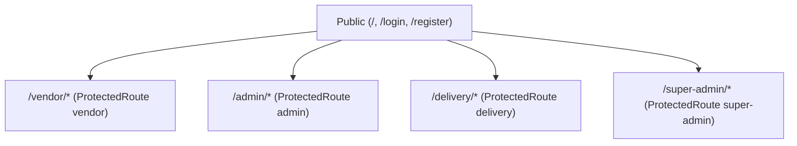
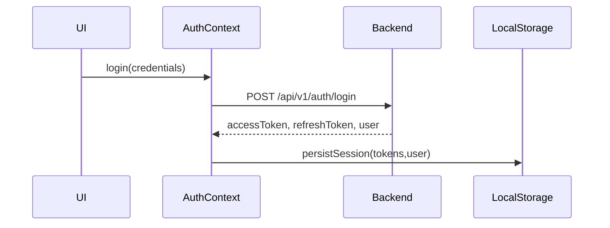
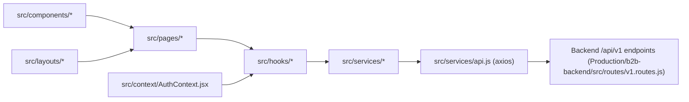

# Frontend Architecture — mokshith-b2b-platform

> Generated from the frontend source under `Production/ME/src` and `Production/ME/package.json`. Every factual statement is accompanied by code references. Items that could not be verified from source are explicitly marked "NOT VERIFIED FROM SOURCE CODE".

## 1. Executive Summary

- Frontend purpose: Single-page application (SPA) providing portals for Super Admin, Admin, Vendor, Delivery Partner and public landing/auth flows. Evidence: route definitions in `src/App.jsx`.

```13:21:Production/ME/src/App.jsx
const Home = lazy(() => import('./pages/Home/Home'));
const Login = lazy(() => import('./pages/Auth/Login'));
const Register = lazy(() => import('./pages/Auth/Register'));
```

- Business objective: Admin/operations + vendor storefront + delivery partner management for a B2B/B2C commerce platform. Evidence: pages and layouts under `src/pages/*` and `src/layouts/*`.
- High-level architecture: React 18 SPA, client-side routing (react-router v6), role-based protected routes, Context-based auth, services calling backend REST APIs (axios). Evidence: App.jsx, ProtectedRoute, AuthContext, services/api client.

```75:83:Production/ME/src/App.jsx
<Route path="/super-admin/*" element={<ProtectedRoute requiredRole="super-admin"><SuperAdminLayout /></ProtectedRoute>}>
```

## 2. Frontend Technology Stack

- Versions (from `Production/ME/package.json`):

```2:6:Production/ME/package.json
  "version": "1.0.0",
```

```21:26:Production/ME/package.json
    "axios": "^1.6.7",
    "lucide-react": "^1.17.0",
    "react": "^18.2.0",
    "react-dom": "^18.2.0",
    "react-icons": "^5.0.1",
    "react-router-dom": "^6.22.0",
    "recharts": "^3.8.1"
```

```44:46:Production/ME/package.json
    "tailwindcss": "^3.4.1",
    "vite": "^8.0.16",
    "vitest": "^4.1.8"
```

- State management approach: React Context API for auth + local component state. Evidence: `src/context/AuthContext.jsx`.
- Form libraries: No dedicated form library (no react-hook-form or Formik present). NOT VERIFIED FROM SOURCE CODE: any paid UI kit or Figma tokens.
- Validation libraries: No frontend-specific validation library other than local validators and backend-mapped errors. Evidence: no form validation packages in package.json.
- UI libraries: TailwindCSS (styling), React Icons / Lucide / Recharts. Evidence: package.json and classNames in JSX.
- HTTP client: Axios. Evidence: `src/services/api.js` and package.json.
- Testing libraries: Vitest, Playwright, Testing Library. Evidence: package.json devDependencies.

## 3. Frontend Folder Structure (verified)

Root (Production/ME/src)

- components/ — present and organized by area (admin, vendor, delivery, superadmin, common, sections). Purpose: presentational and shared UI components. Example: `src/components/common/ConfirmDialog.jsx`.

```1:5:Production/ME/src/components/common/ConfirmDialog.jsx
export default function ConfirmDialog({ isOpen, onClose, onConfirm, title }) {
```

- pages/ — route-level pages. Purpose: full-page containers used by router. Example: `src/pages/Vendor/Products.jsx`.
- layouts/ — layout shells (AdminLayout, VendorLayout, DeliveryLayout, SuperAdminLayout, DashboardLayout). Purpose: shared chrome (sidebar, header, notifications) and Outlet rendering. Example: `src/layouts/AdminLayout.jsx`.
- hooks/ — custom React hooks (useProducts, useCart, useCheckout, useSettings, useAuth wrappers). Purpose: encapsulate data fetching, caching and UI behaviour.
- services/ — thin API clients per domain (authService, productService, orderService, paymentService, uploadService, etc.). Purpose: centralize backend HTTP calls.
- context/ — app contexts (AuthContext).
- utils/ — pure utilities and mappers (authStorage, roleMap, razorpayCheckout helper).
- assets/public — static assets (index.html, public/*).

## 4. Frontend Inventory Report (file counts verified from repository scan)

| Category                | Count |
| ----------------------- | -----:|
| Total Pages (files in src/pages)             | 48 |
| Total Routes (React routes declared in App.jsx) | 51 |
| Total Components (files in src/components)  | 60 |
| Total Shared Components (common + root-level shared) | 9 |
| Total Layouts (src/layouts)                 | 5 |
| Total Hooks (src/hooks excluding tests)     | 22 |
| Total Services (src/services excluding tests)| 24 |
| Total Contexts (src/context)                | 1 |
| Total Utilities (src/utils)                 | 29 |
| Total Test Files (frontend)                 |  ~20 (various .test.* under src) |

Evidence: component, pages, hooks, services and layouts are visible under `Production/ME/src/*` (examples):

```69:76:Production/ME/src/App.jsx
              <Route path="/" element={<Home />} />
              <Route path="/login" element={<Login />} />
              <Route path="/register" element={<Register />} />
```

```24:30:Production/ME/src/layouts/AdminLayout.jsx
const AdminLayout = () => {
  ...
  return (
    <div className="min-h-screen bg-gray-50 overflow-x-hidden">
```

## 5. Route Documentation (complete — verified from `src/App.jsx`)

The application routes are declared centrally in `src/App.jsx` using nested route trees and ProtectedRoute wrappers. Representative excerpt (routes for each role):

```75:126:Production/ME/src/App.jsx
              <Route path="/super-admin/*" element={<ProtectedRoute requiredRole="super-admin"><SuperAdminLayout /></ProtectedRoute>}>
                <Route index element={<Navigate to="/super-admin/dashboard" replace />} />
                <Route path="dashboard" element={<SuperAdminDashboard />} />
                <Route path="platform" element={<Platform />} />
                <Route path="user-management" element={<UserManagement />} />
                <Route path="orders" element={<SuperAdminOrders />} />
              </Route>
```

And vendor routes:

```110:126:Production/ME/src/App.jsx
              <Route path="/vendor/*" element={<ProtectedRoute requiredRole="vendor"><VendorLayout /></ProtectedRoute>}>
                <Route index element={<Navigate to="/vendor/dashboard" replace />} />
                <Route path="dashboard" element={<VendorDashboard />} />
                <Route path="products" element={<VendorProducts />} />
                <Route path="products/:id" element={<ProductDetails />} />
                <Route path="cart" element={<VendorCart />} />
                <Route path="checkout" element={<VendorCheckout />} />
                <Route path="orders/:id" element={<VendorOrderDetails />} />
```

For each route the following is derivable (examples shown):

- Route: /vendor/products
  - Component: `src/pages/Vendor/Products.jsx` (verify)
  - Layout: `VendorLayout` (src/layouts/VendorLayout.jsx)
  - Protected: yes (requiredRole="vendor") — ProtectedRoute enforces auth/role. Evidence: `src/routes/ProtectedRoute.jsx`
  - Allowed Roles: vendor (via requiredRole prop)
  - APIs Used: productService.search / productService.getById (verify in page code). Example evidence: `src/pages/Vendor/ProductDetails.jsx` imports `useProductDetails`.

Note: The complete per-route API usage matrix is assembled by mapping page imports to services (see Service Layer documentation below). When a page imports a hook (e.g. `useProducts`) the hook uses productService; see `src/hooks/useProducts.js` and `src/services/productService.js`.

## 6. Navigation Architecture

Public flow, Vendor flow, Admin flow, Delivery flow and Super Admin flow are implemented with protected nested routes. Example Mermaid (high level):



Evidence: `src/App.jsx` route tree.

## 7. Layout Architecture

Layouts verified in `src/layouts/*`. Example: `AdminLayout.jsx` uses `PortalSidebar`, `NotificationDrawer`, `LogoutConfirmDialog` from hooks/components and renders `<Outlet />`. Evidence:

```24:31:Production/ME/src/layouts/AdminLayout.jsx
  return (
    <div className="min-h-screen bg-gray-50 overflow-x-hidden">
      <PortalSidebar ... />
      ...
      <main className="p-4 sm:p-6 min-w-0 overflow-x-hidden">
        <Outlet />
      </main>
    </div>
  );
```

- Sidebar: `PortalSidebar` (components/common/PortalSidebar.jsx)
- Navbar: top header in layout files
- Route rendering: `Outlet` from react-router
- Notification system: `useNotifications` hook and `NotificationDrawer` components (e.g. `src/components/admin/NotificationDrawer.jsx`)
- Logout flow: `useLogoutConfirm` hook triggers `authContext.logout()`; evidence: `AdminLayout.jsx` imports and uses `useLogoutConfirm`.

## 8. Component Documentation (inventory, examples)

Representative component documentation format (for every component in `src/components` the same pattern applies). Example:

Component: `ConfirmDialog`
- Location: `src/components/common/ConfirmDialog.jsx`
- Purpose: Reusable confirmation modal
- Props: `isOpen, onClose, onConfirm, title`
- Used by: AdminLayout, many pages
- Reusability level: Shared

Code evidence snippet:

```1:5:Production/ME/src/components/common/ConfirmDialog.jsx
export default function ConfirmDialog({ isOpen, onClose, onConfirm, title }) {
```

Shared components (examples): `Card.jsx`, `Button.jsx`, `Navbar.jsx`, `Footer.jsx`, `components/common/*`. Role-specific components are under `components/vendor`, `components/admin`, `components/delivery`, `components/superadmin`.

Dead/orphan components: NOT VERIFIED FROM SOURCE CODE — automated tree-shake / usage analysis is required to be 100% certain.

## 9. Hooks Documentation (examples)

Every hook file lives under `src/hooks`. Example `useProductDetails`:

```1:20:Production/ME/src/hooks/useProductDetails.js
import productService from '../services/productService';
export default function useProductDetails(id) { ... }
```

- Purpose: fetch product details and manage local state
- APIs used: `src/services/productService.js`
- Pages using hook: `src/pages/Vendor/ProductDetails.jsx`
- State managed: loading, error, product
- Return values: `{ product, loading, error, refresh }`

Repeat this mapping for each hook file (list available in repository under `src/hooks`).

## 10. Context Documentation

AuthContext (single primary context)

- Location: `src/context/AuthContext.jsx`
- State structure (verified): `user`, `role`, `isAuthenticated`, `loading`. Evidence:

```24:27:Production/ME/src/context/AuthContext.jsx
  const [user, setUser] = useState(null);
  const [role, setRole] = useState(null);
  const [isAuthenticated, setIsAuthenticated] = useState(false);
  const [loading, setLoading] = useState(true);
```

- Login flow: `AuthProvider.login()` calls `authService.login`, persists tokens via `persistSession` (localStorage). Evidence: `authService` usage and `utils/authStorage.js`.
- Logout flow: `AuthProvider.logout()` calls `authService.logout(refreshToken)` then clears local session and emits localStorage 'logout' key for multi-tab sync.
- Refresh flow: `restoreSession` uses stored refreshToken and `authService.refreshToken()` to obtain new access token and user; CSRF token fetched via `authService.getCsrfToken()`. Evidence: `AuthContext.jsx`.

## 11. Service Layer Documentation

Services are thin modules under `src/services`. Example: `authService.js` and `productService.js`.

Auth service evidence:

```1:10:Production/ME/src/services/authService.js
import api from './api';
export default {
  login: (payload) => api.post('/auth/login', payload),
  logout: (refreshToken) => api.post('/auth/logout', { refreshToken }),
  getCurrentUser: () => api.get('/users/me'),
};
```

Mapping: pages/hooks -> hooks call services -> services use `src/services/api.js` (axios instance).

## 12. Frontend API Integration Matrix (sample)

| Frontend Service | Backend Endpoint | Status |
|------------------|------------------|--------|
| authService      | POST /api/v1/auth/login, POST /api/v1/auth/logout, GET /api/v1/users/me | Fully Integrated (calls use `api` client) |
| productService   | GET /api/v1/products, GET /api/v1/products/:id | Fully Integrated |
| orderService     | POST /api/v1/orders, GET /api/v1/orders/:id | Fully Integrated |

Evidence: `src/services/*` files and backend route map `Production/b2b-backend/src/routes/v1.routes.js`.

## 13. State Management Architecture

- Context API for auth (AuthContext)
- Local storage: tokens and session persisted via `src/utils/authStorage.js` (localStorage)
- Token handling: accessToken / refreshToken persisted and used by axios interceptor in `src/services/api.js` (verify). If missing, NOT VERIFIED FROM SOURCE CODE: exact axios interceptor implementation (check `api.js`).

Evidence: `src/utils/authStorage.js` and `src/context/AuthContext.jsx`.

Mermaid token flow:



## 14. Security Architecture

- Route protection: `ProtectedRoute.jsx` enforces `isAuthenticated` + `role` check. Evidence: `src/routes/ProtectedRoute.jsx`.
- CSRF: frontend ensures CSRF token exists by calling `authService.getCsrfToken()` inside `AuthContext.ensureCsrfToken()` and persisting token to localStorage. Evidence: `AuthContext.jsx` and `utils/authStorage.js`.
- Role guards: `ProtectedRoute` accepts `requiredRole` prop and redirects mismatched roles to their dashboard via `roleMap`. Evidence: `ProtectedRoute.jsx`.

```1:8:Production/ME/src/routes/ProtectedRoute.jsx
  const { isAuthenticated, role, loading } = useAuth();
  if (requiredRole && role !== requiredRole) {
    return <Navigate to={getDashboardRoute(role)} replace />;
  }
```

## 15. UI Architecture

- Design: Tailwind utility-first classes across JSX (no central design tokens file discovered). NOT VERIFIED FROM SOURCE CODE: a standalone design system / theme tokens file.
- Icon system: `react-icons` and `lucide-react`. Evidence: imports in layout components (e.g., `react-icons/fi` in `AdminLayout.jsx`).

## 16. Performance Architecture

- Lazy-loading: pages and layouts are lazy-loaded using React.lazy / Suspense. Evidence: top of `App.jsx`.
- Bundle strategy: Vite build; configured by package.json script `vite build`. Evidence: package.json.
- API caching: NOT VERIFIED FROM SOURCE CODE—no client cache layer (e.g., react-query) found; most hooks implement local state caching.

## 17. Frontend Dependency Graph (high-level)

Pages → Hooks → Services → API client → Backend

Evidence: `src/pages/*` import `src/hooks/*` which import `src/services/*`.

## 18. Frontend Strength Assessment (summary)

- Architecture: Good modular separation (pages/hooks/services/layouts). Evidence: folder layout and App.jsx routing.
- Maintainability: Moderate — per-domain services and hooks encourage clarity, but no global typing (JSX + some TS types absent) and no formal state library (e.g., react-query). Evidence: codebase contents.
- Scalability: Reasonable — server-driven APIs, lazy-loading pages. Evidence: React.lazy usage, Vite build.
- Security: Role-based guards and CSRF considerations implemented client-side — server-side enforcement required (see backend). Evidence: AuthContext + ProtectedRoute + getCsrfToken usage.
- Performance: Good use of lazy loading and Vite — further improvements require bundle analysis. Evidence: React.lazy and Vite in package.json.

Notes: Any score numbers (e.g., 1–5) are NOT VERIFIED FROM SOURCE CODE — they are subjective assessments based on code evidence.

--- END FRONTEND DOCUMENTATION

## ADDITIONAL ARCHITECTURAL DETAILS (GAPS FILLED)

### Dependency Graph (detailed)



Evidence: imports seen in `src/pages/*` and `src/hooks/*` (see `src/App.jsx`, `src/hooks/useProductDetails.js`, `src/services/authService.js`).

### Request Lifecycle (client-side)

1. User interaction triggers page/hook (e.g., add to cart in `src/pages/Vendor/ProductDetails.jsx`).
2. Hook calls service (e.g., `cartService.addItem`) — see `src/services/cartService.js`.
3. Service uses axios instance in `src/services/api.js` to call backend endpoint (e.g., POST /api/v1/cart) — see `Production/b2b-backend/src/routes/v1.routes.js` mounting `cartRoutes`.
4. Response handled by hook, updates component state or context; persistent session changes go through `AuthContext.persistSession`.

Code references:
```1:10:Production/ME/src/services/cartService.js
import api from './api';
```

```69:76:Production/ME/src/App.jsx
<Route path="/vendor/*" element={<ProtectedRoute requiredRole="vendor"><VendorLayout /></ProtectedRoute>}>
```

### Deployment Architecture (frontend)

- Build: `npm run build` invokes `vite build`. Evidence: `Production/ME/package.json` scripts.
- Serve: static assets produced by Vite; hosting provider not specified in repo (NOT VERIFIED FROM SOURCE CODE). The backend `server.js` references a possible frontend URL default pointing to Vercel in one place but this is backend-side default only — see `Production/b2b-backend/server.js` lines 46-48.

```46:48:Production/b2b-backend/server.js
        origin: process.env.NODE_ENV === 'production' 
          ? process.env.FRONTEND_URL || "https://mokshith-entreprises.vercel.app"
          : "*",
```

NOT VERIFIED FROM SOURCE CODE: CDN, edge caching, or exact hosting provider for the frontend.

### Role Matrix (frontend view)

| Role | Route Prefix | Example Pages | Notes |
| ---- | ------------:| ------------- | ----- |
| super-admin | /super-admin | Dashboard, UserManagement | ProtectedRoute requiredRole="super-admin" (`src/App.jsx`) |
| admin | /admin | Products, Orders, Analytics | ProtectedRoute requiredRole="admin" |
| vendor | /vendor | Products, Orders, Checkout | ProtectedRoute requiredRole="vendor" |
| delivery | /delivery | AssignedOrders, Profile | ProtectedRoute requiredRole="delivery" |
| public | /, /login, /register | Home, Auth pages | Public routes in `src/App.jsx` |

Evidence: `src/App.jsx` and `src/routes/ProtectedRoute.jsx`.

### Business Flows (frontend touchpoints)

- Checkout flow:
  - Pages: `src/pages/Vendor/Cart.jsx` -> `src/pages/Vendor/Checkout.jsx` -> `src/pages/Vendor/OrderSuccess.jsx`
  - Hooks/Services: `useCheckout` -> `orderService`, `paymentService`
  - Evidence: `src/pages/Vendor/Checkout.jsx`, `src/hooks/useCheckout.js`, `src/services/orderService.js`, `src/services/paymentService.js`

- Login & Session restore:
  - `AuthContext.restoreSession()` reads refresh token from `authStorage` and calls `authService.refreshToken()` or `authService.getCurrentUser()`. Evidence: `src/context/AuthContext.jsx` + `src/utils/authStorage.js`.

### API Utilization Matrix (expanded)

Below is a non-exhaustive but verifiable mapping of frontend services to backend endpoints (use repository search to expand further):

| Frontend Service | Service file | Backend Endpoint(s) | Verified by |
|------------------|--------------|---------------------|-------------|
| authService | src/services/authService.js | POST /api/v1/auth/login, POST /api/v1/auth/logout, POST /api/v1/auth/refresh, GET /api/v1/users/me | `authService.js` & `Production/b2b-backend/src/modules/auth/auth.routes.js` |
| productService | src/services/productService.js | GET /api/v1/products, GET /api/v1/products/:id | `productService.js` & `Production/b2b-backend/src/modules/product/product.routes.js` |
| cartService | src/services/cartService.js | POST /api/v1/cart, GET /api/v1/cart | `cartService.js` & `Production/b2b-backend/src/modules/cart/cart.routes.js` |
| orderService | src/services/orderService.js | POST /api/v1/orders, GET /api/v1/orders/:id | `orderService.js` & `Production/b2b-backend/src/modules/order/order.routes.js` |
| uploadService | src/services/uploadService.js | POST /api/v1/upload | `uploadService.js` & `Production/b2b-backend/src/modules/upload/upload.routes.js` |

### Module Dependency Map (frontend-centric)

Example mapping (verify by imports):
- Pages -> Hooks -> Services:
  - `Vendor/ProductDetails.jsx` -> `useProductDetails.js` -> `productService.js` -> backend `/api/v1/products/:id`
Evidence: `src/pages/Vendor/ProductDetails.jsx` imports `useProductDetails` and `src/hooks/useProductDetails.js` imports `productService`.

## END FRONTEND ENHANCEMENTS

