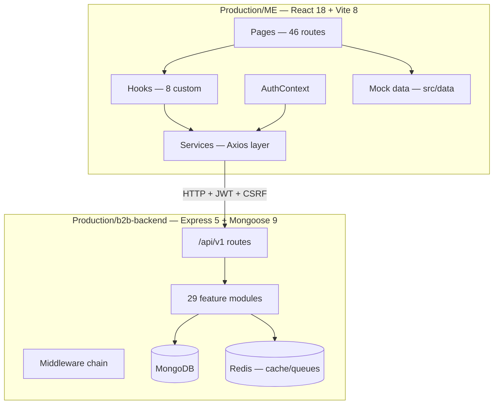
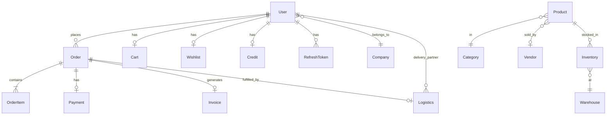

# PROJECT CURRENT STATE — Mokshith Enterprises B2B Platform

**Generated:** 2026-06-12  
**Scope:** `Production/ME` (frontend) + `Production/b2b-backend` (backend)  
**Method:** Recursive static code analysis — routes, services, imports, models verified by file path  
**Confidence legend:** 🟢 High (direct code evidence) · 🟡 Medium (inferred from patterns) · 🔴 Low (not verified at runtime)

---

## Table of Contents

1. [Architecture Overview](#architecture-overview)
2. [Phase 1 — Project Inventory Report](#phase-1--project-inventory-report)
3. [Phase 2 — Frontend Audit](#phase-2--frontend-audit)
4. [Phase 3 — Backend Audit](#phase-3--backend-audit)
5. [Phase 4 — API Mapping](#phase-4--api-mapping)
6. [Phase 5 — Integration Health Report](#phase-5--integration-health-report)
7. [Phase 6 — Database Audit](#phase-6--database-audit)
8. [Phase 7 — Security Assessment](#phase-7--security-assessment)
9. [Phase 8 — Business Flow Analysis](#phase-8--business-flow-analysis)
10. [Phase 9 — Technical Debt Report](#phase-9--technical-debt-report)
11. [Phase 10 — Performance Optimization Report](#phase-10--performance-optimization-report)
12. [Phase 11 — Production Readiness Scores](#phase-11--production-readiness-scores)
13. [Phase 12 — Gap Analysis](#phase-12--gap-analysis)
14. [Phase 13 — Execution Roadmap](#phase-13--execution-roadmap)
15. [Recommended Next Steps & Release Plan](#recommended-next-steps--release-plan)

---

## Architecture Overview



| Layer | Technology | Entry Point | API Base |
|-------|-----------|-------------|----------|
| Frontend | React 18, Vite 8, React Router 6, Axios, Tailwind | `src/main.jsx` → `src/App.jsx` | `VITE_API_BASE_URL` or `http://localhost:5000/api/v1` |
| Backend | Express 5, Mongoose 9, Redis, BullMQ, Socket.IO | `server.js` → `src/app.js` | `/api/v1` |
| Database | MongoDB | `src/config/db.js` | `MONGO_URI` |
| Auth | JWT (15m access, 7d refresh) + CSRF double-submit | `auth.middleware.js`, `api.js` interceptors | Bearer + `x-csrf-token` |

**Critical architectural split (🟢):** Vendor shopping + Super Admin management are API-integrated. Admin operations, Delivery Partner portal, and several vendor pages still consume `src/data/` mock files.

---

## Phase 1 — Project Inventory Report

### 1.1 Repository Tree Summary

#### Frontend — `Production/ME/` (199 files total)

| Folder | Files | Purpose | Responsibility | Dependencies | Actively Used | Dead Code | Missing Files |
|--------|-------|---------|----------------|--------------|---------------|-----------|---------------|
| `src/` | 182 | Application source | UI, state, API clients | React ecosystem | ✅ Yes | Partial — see §1.3 | `tests/e2e/accessibility.spec.ts` referenced in `package.json` but absent |
| `src/pages/` | 46 | Route-level views | Role dashboards, CRUD UIs | hooks, services, data | ✅ Yes | Settings pages are UI-only shells | — |
| `src/components/` | 50 | Reusable UI | Cards, tables, forms per role | lucide-react, react-icons | ✅ Mostly | 4 orphaned components | — |
| `src/services/` | 25 | HTTP API layer | Axios calls to backend | `api.js`, mappers | ✅ 13/15 used | `userService`, `deliveryService`, `index.js` barrel | No `paymentService.js` |
| `src/hooks/` | 16 | Data-fetching logic | Cart, orders, products, auth flows | services, mappers | ✅ Yes | — | — |
| `src/utils/` | 15 | Pure transforms | Backend→frontend mapping | — | ✅ Yes | — | — |
| `src/context/` | 2 | Global auth state | Session, login, register | authService, authStorage | ✅ Yes | — | — |
| `src/layouts/` | 6 | Role shells | Sidebar, outlet, notifications | useLogout, useAuth | ✅ 4/6 | `DashboardLayout.jsx` orphaned | — |
| `src/routes/` | 2 | Route guards | Role-based protection | AuthContext, roleMap | ✅ Yes | — | — |
| `src/data/` | 16 | Mock/static data | Admin, delivery, vendor stubs | — | ✅ Yes (mock paths) | `analytics.js` exports unused by pages | Should be removed post-integration |
| `tests/` | 6 | E2E setup | Playwright specs | — | ⚠️ Partial | E2E may be stale vs mobile login | `accessibility.spec.ts` |
| Root config | 10 | Build/tooling | Vite, Vitest, Tailwind, Playwright | — | ✅ Yes | — | — |

#### Backend — `Production/b2b-backend/` (402 files total)

| Folder | Files | Purpose | Responsibility | Dependencies | Actively Used | Dead Code | Missing Files |
|--------|-------|---------|----------------|--------------|---------------|-----------|---------------|
| `src/modules/` | ~200 | Feature domains | 29 bounded contexts | Mongoose, Joi | ✅ Yes | `audit` module unmounted | — |
| `src/middlewares/` | 22 | Cross-cutting | Auth, CSRF, rate limit, sanitize | Redis | ✅ Yes | Some available but rarely used | — |
| `src/services/` | ~20 | Shared infra | Cache, S3, fraud, queues | Redis, AWS | ✅ Mostly | Root `payment.service.js`, `search.service.js` stubs | — |
| `src/config/` | 12 | Configuration | DB, CORS, security, Redis | dotenv | ✅ Yes | — | `.env.example` (documented in README, not in repo) |
| `src/routes/` | 4 | Route aggregation | v1/v2 mounting | all modules | ✅ v1 | `health.routes.js` not mounted | `.env.example` |
| `scripts/` | 6 | Ops utilities | Reset DB, backup, seed | MongoDB | ✅ Yes | — | — |
| `tests/` | ~40 | Automated tests | unit/integration/e2e/load | Jest | ✅ Yes | — | — |
| `code-guide/` | ~15 | Engineering docs | Patterns, security guides | — | 📖 Docs | — | — |

### 1.2 Frontend File Inventory (Key Directories)

#### Services (`src/services/`)

| File | Lines | Purpose | Exports | Imports | Used? | Orphaned? |
|------|-------|---------|---------|---------|-------|-----------|
| `api.js` | 118 | Axios instance + JWT refresh queue | `default api` | axios, authStorage | ✅ All services | No |
| `authService.js` | ~35 | Auth endpoints | login, logout, register, refresh, getCurrentUser, getCsrfToken | api | ✅ AuthContext | No |
| `productService.js` | ~35 | Product CRUD | getProducts, getProductById, create, update, delete, updateStock | api | ✅ useProducts, useProductDetails, Admin/Products | No |
| `categoryService.js` | ~15 | Categories | getCategories, getCategoryById | api | ✅ useCategories | No |
| `cartService.js` | ~20 | Cart ops | getCart, addToCart, removeFromCart | api | ✅ useCart | No |
| `orderService.js` | ~30 | Orders + invoice | getOrders, getOrderById, createOrder, updateStatus, downloadInvoice | api | ✅ useOrders, useCheckout, SuperAdmin/Orders | No |
| `wishlistService.js` | ~25 | Wishlist | get, add, remove, clear | api | ✅ useWishlist | No |
| `pricingService.js` | ~10 | Bulk pricing calc | calculatePrice | api | ✅ useProductPricing | No |
| `searchService.js` | ~15 | Product search | searchProducts | api | ✅ useProducts | No |
| `adminService.js` | ~15 | Admin user listing | getStats, getUsers | api | ✅ SuperAdmin Vendors/DeliveryPartners | No |
| `adminApprovalService.js` | ~25 | Admin approvals | getAll, getPending, approve, reject | api | ✅ AdminApprovals | No |
| `superAdminService.js` | ~25 | SA dashboard | getStats, getMetrics, getAuditLogs, getUsers | api | ✅ SA Dashboard, Platform | No |
| `analyticsService.js` | ~10 | Analytics dashboard | getDashboard | api | ✅ SuperAdmin/Analytics | No |
| `userService.js` | ~40 | User CRUD | getUsers, getUserById, create, update, delete, getByRole | api | ❌ None | **Yes** |
| `deliveryService.js` | ~125 | Delivery partner APIs | 15+ methods on `/delivery-partners/*` | api | ❌ None | **Yes** (wrong paths vs backend) |
| `index.js` | ~20 | Barrel re-export | all services | all services | ❌ Never imported | **Yes** |

#### Hooks (`src/hooks/`)

| File | Exports | API Dependencies | Used By (pages/components) |
|------|---------|------------------|------------------------------|
| `useCart.js` | `useCart` | cartService, cartMapper, pricingCalculator | Cart, Checkout, Products, ProductDetails, Wishlist, Dashboard |
| `useCheckout.js` | `useCheckout`, `mapPaymentMethodToBackend`, `buildShippingAddress` | orderService | Checkout |
| `useCategories.js` | `useCategories` | categoryService | Admin/Categories, Vendor/Categories, Products |
| `useOrders.js` | `useOrders`, `useOrderDetails` | orderService | Vendor Orders, OrderDetails, Dashboard |
| `useProducts.js` | `useProducts` | productService, searchService | Admin/Products, Vendor/Products, Dashboard |
| `useProductDetails.js` | `useProductDetails` | productService | ProductDetails |
| `useProductPricing.js` | `useProductPricing` | pricingService | ProductDetails |
| `useWishlist.js` | `useWishlist` | wishlistService | Products, ProductDetails, Wishlist, Dashboard |
| `useLogout.js` | `useLogout` | AuthContext | All 4 role layouts |

### 1.3 Dead / Orphaned Code (🟢 Verified by import grep)

| File | Evidence | Confidence |
|------|----------|------------|
| `src/layouts/DashboardLayout.jsx` | Not imported in `App.jsx` or anywhere | 🟢 |
| `src/components/Footer.jsx` | Not imported; `Home.jsx` defines inline Footer (~L370) | 🟢 |
| `src/components/superadmin/Modal.jsx` | Not imported; admin Modal used instead | 🟢 |
| `src/components/delivery/AnalyticsCard.jsx` | Zero import references | 🟢 |
| `src/services/userService.js` | Only in unused `services/index.js` | 🟢 |
| `src/services/deliveryService.js` | Zero page/hook imports; paths don't match backend | 🟢 |
| `src/services/index.js` | Zero `from '../services'` or `from './services'` imports | 🟢 |
| `src/data/analytics.js` exports | Exported via `data/index.js` but no page imports | 🟢 |
| `Home.jsx` mock `useAuth` | L28–31 defines local mock instead of `AuthContext` | 🟢 |

### 1.4 Duplicate Logic (🟢)

| Pattern | Locations | Notes |
|---------|-----------|-------|
| `SearchBar` | admin/, vendor/, superadmin/, delivery/ | 4 separate implementations |
| `PageHeader` | admin/, vendor/, superadmin/ | 3 implementations |
| `StatusBadge` | admin/, vendor/, superadmin/, delivery/ | 4 implementations |
| `NotificationDrawer` | admin/, vendor/, superadmin/, delivery/ | 4 implementations |
| `Modal` | admin/, superadmin/ (orphaned) | 2 implementations |
| Super-admin mount | `v1.routes.js` L94–95 | `/super-admin` + `/superadmin` duplicate |

---

## Phase 2 — Frontend Audit

### 2.1 Frontend Component Matrix

| Component | Location | Used By | Key Props | State/Hooks | API Deps | Completion | Production Ready |
|-----------|----------|---------|-----------|-------------|----------|------------|------------------|
| `Button` | `components/Button.jsx` | Login, Register | variant, size, disabled | — | None | 100% | ✅ |
| `Card` | `components/Card.jsx` | Login, Register | children, hover | — | None | 100% | ✅ |
| `Navbar` | `components/Navbar.jsx` | Home, Login, Register | — | useState, useEffect | None | 90% | ✅ |
| `ProductCard` | `components/vendor/ProductCard.jsx` | Products, Dashboard | product, callbacks | — | Via parent hooks | 95% | ✅ |
| `CartItem` | `components/vendor/CartItem.jsx` | Cart | item, qty handlers | — | Via useCart | 95% | ✅ |
| `SearchBar` (vendor) | `components/vendor/SearchBar.jsx` | Products | onSearch, debounce | useState, useEffect, useRef | None | 95% | ✅ |
| `BulkPricingTable` | `components/vendor/BulkPricingTable.jsx` | ProductDetails | bulkPricing | — | Via useProductPricing | 90% | ✅ |
| `DataTable` | `components/superadmin/DataTable.jsx` | SA list pages | columns, data | — | Via page services | 85% | ✅ |
| `DeliveryCard` | `components/delivery/DeliveryCard.jsx` | AssignedOrders | order | — | **Mock data only** | 70% UI | ❌ |
| `Footer` | `components/Footer.jsx` | **None** | — | — | None | 0% used | ❌ Dead |

### 2.2 Page Audit Matrix

| Route | Component | Purpose | UI % | Backend Integration | Mock Data | API Calls | Loading | Error | Missing Features |
|-------|-----------|---------|------|---------------------|-----------|-----------|---------|-------|------------------|
| `/` | Home | Marketing landing | 95% | ❌ None | Inline + mock useAuth L28–31 | None | ❌ | ❌ | Real auth link, no API |
| `/login` | Login | Mobile login | 95% | ✅ Full | None | authService.login | ✅ L18 | ✅ L55–57 | 2FA UI not wired |
| `/register` | Register | Registration | 90% | ✅ Full | None | authService.register | ✅ | ✅ field errors | GST/business validation |
| `/vendor/dashboard` | VendorDashboard | Vendor home | 85% | ⚠️ Partial | vendorAnalytics, vendorOffers L12 | useProducts, useOrders, useWishlist | Via hooks | Via hooks | Analytics from API |
| `/vendor/products` | VendorProducts | Browse/search | 90% | ✅ Full | None | useProducts, useCart, useWishlist | ✅ | ✅ | Filters pagination |
| `/vendor/products/:id` | ProductDetails | Product detail | 90% | ✅ Full | None | useProductDetails, useProductPricing | ✅ L34–40 | ✅ L42–46 | Reviews |
| `/vendor/cart` | VendorCart | Shopping cart | 90% | ✅ Full | None | useCart | ✅ L26–38 | ✅ L40–49 | — |
| `/vendor/checkout` | VendorCheckout | Place order | 80% | ⚠️ Partial | None | useCart, useCheckout→orderService | ✅ L78–90 | ✅ L92–101 | **No Razorpay flow** |
| `/vendor/orders` | VendorOrders | Order history | 90% | ✅ Full | None | useOrders | ✅ | ✅ | — |
| `/vendor/orders/:id` | VendorOrderDetails | Order + invoice | 85% | ✅ Full | None | useOrderDetails, downloadInvoice | ✅ | ✅ invoiceError | — |
| `/vendor/wishlist` | VendorWishlist | Wishlist | 90% | ✅ Full | None | useWishlist, useCart | ✅ | ✅ | — |
| `/vendor/invoices` | VendorInvoices | Invoice list | 70% | ❌ None | vendorInvoices L6 | None | ❌ | ❌ | API integration |
| `/vendor/profile` | VendorProfile | Profile/analytics | 60% | ❌ None | vendorAnalytics L4–10 | None | ❌ | ❌ | User profile API |
| `/vendor/settings` | VendorSettings | Settings | 50% | ❌ None | Hardcoded | None | ❌ | ❌ | Persist settings |
| `/super-admin/dashboard` | SuperAdminDashboard | SA overview | 85% | ✅ Full | None | superAdminService ×3 | ✅ L74–75 | ✅ L85–87 | — |
| `/super-admin/admin-approvals` | AdminApprovals | Approve admins | 90% | ✅ Full | None | adminApprovalService | ✅ L142 | ✅ L135–137 | — |
| `/super-admin/vendors` | Vendors | Vendor list | 85% | ✅ Full | None | adminService.getUsers | ✅ | ✅ | CRUD actions |
| `/super-admin/orders` | Orders | All orders | 85% | ✅ Full | None | orderService.getAllOrders | ✅ | ✅ | Status update UI |
| `/super-admin/analytics` | Analytics | Charts | 80% | ✅ Full | None | analyticsService | ✅ | ✅ | More chart types |
| `/super-admin/settings` | Settings | SA config | 40% | ❌ None | Hardcoded | None | ❌ | ❌ | superAdmin config API |
| `/admin/dashboard` | AdminDashboard | Admin home | 60% | ❌ None | Hardcoded L7–40 | None | ❌ | ❌ | admin/stats API |
| `/admin/products` | Products | Product mgmt | 85% | ✅ Full | None | useProducts, useCategories | ✅ L67–75 | ✅ L75–79 | Create/edit may need auth test |
| `/admin/categories` | Categories | Category mgmt | 80% | ⚠️ Read-only API | None | useCategories (GET only) | ✅ | ✅ | POST/PATCH not wired |
| `/admin/inventory` | Inventory | Stock mgmt | 70% | ❌ None | data/inventory L9 | None | ❌ | ❌ | inventory API |
| `/admin/orders` | AdminOrders | Order mgmt | 70% | ❌ None | data/orders L9 | None | ❌ | ❌ | orderService |
| `/admin/vendors` | AdminVendors | Vendor mgmt | 70% | ❌ None | data/vendors L9 | None | ❌ | ❌ | vendor API |
| `/admin/delivery-assignment` | DeliveryAssignment | Assign delivery | 65% | ❌ None | orders + deliveryPartners L8–9 | None | ❌ | ❌ | logistics API |
| `/admin/analytics` | AdminAnalytics | Charts | 50% | ❌ None | Hardcoded L21–40 | None | ❌ | ❌ | analytics API |
| `/admin/reports` | Reports | Report UI | 40% | ❌ None | Hardcoded | None | ❌ | ❌ | Export APIs |
| `/admin/settings` | AdminSettings | Settings | 40% | ❌ None | Hardcoded | None | ❌ | ❌ | settings API |
| `/delivery/*` (8 pages) | Various | DP portal | 65–75% | ❌ None | All from `src/data/` | None | ❌ | ❌ | logistics API (exists on backend) |

### 2.3 Frontend HTTP Client Stack (🟢)

| Mechanism | Used? | Evidence |
|-----------|-------|----------|
| Axios | ✅ Primary | `src/services/api.js` |
| Fetch | ❌ | No direct fetch in src/ |
| RTK Query | ❌ | Not in package.json |
| Redux Thunks | ❌ | No Redux |
| React Query | ❌ | Not in package.json |
| Service Layer | ✅ | 15 service files |

---

## Phase 3 — Backend Audit

### 3.1 Backend Endpoint Matrix (Mounted Routes)

**Base:** `/api/v1` · **Mount file:** `src/routes/v1.routes.js`

#### Auth (`/auth`)

| Endpoint | Method | Controller | Validation | Auth | Authorization | DB Ops | Error Handling | Response | Prod Ready |
|----------|--------|------------|------------|------|---------------|--------|----------------|----------|------------|
| `/auth/register` | POST | auth.controller.register | registerSchema + authLimiter | Public | requireRegistrationsEnabled | User create, Credit create | asyncHandler + AppError | `{success,data}` | ✅ |
| `/auth/login` | POST | auth.controller.login | loginSchema + authLimiter | Public | fraud check | User find, RefreshToken create | ✅ | ✅ | ✅ |
| `/auth/refresh-token` | POST | auth.controller.refreshToken | — | Public | token rotation | RefreshToken rotate | ✅ | ✅ | ⚠️ Same JWT secret for access+refresh |
| `/auth/logout` | POST | auth.controller.logout | — | authenticate + CSRF | — | Revoke refresh token | ✅ | ✅ | ✅ |
| `/auth/csrf-token` | GET | getCsrfTokenHandler | — | Public | — | — | ✅ | ✅ | ✅ |
| `/auth/2fa/*` | POST | 2FA handlers | Schemas | Mixed | authenticate for enable/disable | User 2FA fields | ✅ | ✅ | ✅ Backend only |

#### Catalog & Buying

| Endpoint | Method | Controller | Auth | DB | Frontend Used? |
|----------|--------|------------|------|-----|----------------|
| `GET /products` | GET | getProducts | Public (cached) | Product.find | ✅ productService |
| `GET /products/:id` | GET | getProductById | Public (cached) | Product.findById | ✅ |
| `POST /products` | POST | createProduct | ADMIN + permissions | Product.create | ✅ Admin/Products (untested create flow) |
| `PUT /products/:id` | PUT | updateProduct | ownership/ADMIN | Product.update | ✅ |
| `DELETE /products/:id` | DELETE | deleteProduct | ownership/ADMIN | Product.delete | ✅ |
| `PATCH /products/:id/stock` | PATCH | updateStock | ADMIN | Product.update | ✅ |
| `GET /categories` | GET | getCategories | authenticate | Category.find | ✅ categoryService |
| `GET /categories/:id` | GET | getCategoryById | authenticate | Category.findById | ✅ |
| `POST /categories` | POST | createCategory | ADMIN | Category.create | ❌ Frontend read-only |
| `POST /pricing` | POST | getPrice | Public | Product pricing calc | ✅ pricingService |
| `GET /search` | GET | searchProducts | Public | Product text search | ✅ searchService |
| `GET /cart` | GET | getCart | B2B_CUSTOMER | Cart.find | ✅ |
| `POST /cart` | POST | addToCart | B2B_CUSTOMER | Cart update | ✅ |
| `DELETE /cart/:productId` | DELETE | removeFromCart | B2B_CUSTOMER | Cart update | ✅ |
| `GET /wishlist` | GET | getWishlist | B2B_CUSTOMER | Wishlist.find | ✅ |
| `POST /wishlist/add` | POST | addToWishlist | B2B_CUSTOMER | Wishlist update | ✅ |
| `DELETE /wishlist/remove/:productId` | DELETE | removeFromWishlist | B2B_CUSTOMER | Wishlist update | ✅ |
| `DELETE /wishlist/clear` | DELETE | clearWishlist | B2B_CUSTOMER | Wishlist delete items | ✅ |

#### Orders & Finance

| Endpoint | Method | Auth | Frontend Used? | Notes |
|----------|--------|------|----------------|-------|
| `POST /orders` | POST | B2B_CUSTOMER | ✅ useCheckout | Idempotency + orderLimiter |
| `GET /orders` | GET | authenticate | ✅ useOrders, SA/Orders | Role-scoped results |
| `GET /orders/:id` | GET | authenticate | ✅ useOrderDetails | |
| `PATCH /orders/:id/status` | PATCH | ADMIN | ❌ | SA/Admin UI missing |
| `GET /orders/:id/invoice` | GET | authenticate | ✅ OrderDetails | Blob download |
| `POST /payments/create-order` | POST | authenticate | ❌ | Razorpay — no frontend service |
| `POST /payments/verify` | POST | authenticate | ❌ | |
| `POST /payments/hybrid` | POST | authenticate | ❌ | |
| `POST /payments/webhook` | POST | Public (signature) | N/A | Server-side only |
| `GET /credit` | GET | authenticate | ❌ | Credit shown in checkout UI only |
| `POST /credit/use` | POST | authenticate | ❌ | |

#### Admin & Super Admin

| Endpoint | Method | Frontend Used? | Frontend File |
|----------|--------|----------------|---------------|
| `GET /admin/users` | GET | ✅ | SuperAdmin/Vendors, DeliveryPartners |
| `GET /admin/stats` | GET | ❌ | adminService defined but unused by pages |
| `GET /admin-approvals/pending` | GET | ✅ | AdminApprovals |
| `PATCH /admin-approvals/:id/approve` | PATCH | ✅ | AdminApprovals |
| `PATCH /admin-approvals/:id/reject` | PATCH | ✅ | AdminApprovals |
| `GET /super-admin/stats` | GET | ✅ | SA Dashboard, Platform |
| `GET /super-admin/metrics` | GET | ✅ | SA Dashboard, Platform |
| `GET /super-admin/audit-logs` | GET | ✅ | SA Dashboard |
| `GET /analytics/dashboard` | GET | ✅ | SuperAdmin/Analytics |

#### Logistics (Backend exists — Frontend NOT wired)

| Endpoint | Method | Auth | Frontend deliveryService Path | Match? |
|----------|--------|------|-------------------------------|--------|
| `GET /logistics/my-assignments` | GET | DELIVERY_PARTNER | `/delivery-partners/:id/assigned-orders` | ❌ **Broken** |
| `GET /logistics/history` | GET | DELIVERY_PARTNER | `/delivery-partners/:id/history` | ❌ |
| `POST /logistics/:id/accept` | POST | DELIVERY_PARTNER | `/orders/:id/accept` | ❌ |
| `POST /logistics/:id/delivered` | POST | DELIVERY_PARTNER | `/orders/:id/delivery-proof` | ❌ |
| `PATCH /notifications/:id/read` | PATCH | authenticate | ✅ deliveryService L97 | ✅ |

### 3.2 Unmounted / Dead Backend Routes (🟢)

| Item | File | Issue |
|------|------|-------|
| Audit API | `modules/audit/audit.routes.js` | Not in `v1.routes.js` |
| Health routes duplicate | `routes/health.routes.js` | Not mounted; `app.js` has inline health |
| Refund endpoints | `payment.controller.js` | createRefund, getRefundHistory — no routes |
| Settings public config | `settings.routes.js` | Route order bug: `/:key` shadows `/public/config` |

---

## Phase 4 — API Mapping

### 4.1 Complete Frontend ↔ Backend Mapping Table

| Frontend Service Call | Method | Backend Route | Used in FE? | FE File | Working? | Missing? |
|----------------------|--------|---------------|-------------|---------|----------|----------|
| `/auth/login` | POST | ✅ `/auth/login` | ✅ | authService, Login | 🟢 Likely | — |
| `/auth/register` | POST | ✅ `/auth/register` | ✅ | authService, Register | 🟢 Likely | — |
| `/auth/refresh-token` | POST | ✅ `/auth/refresh-token` | ✅ | api.js L95 | 🟢 Likely | — |
| `/auth/logout` | POST | ✅ `/auth/logout` | ✅ | authService | 🟢 Likely | — |
| `/users/me` | GET | ✅ `/users/me` | ✅ | authService | 🟢 Likely | — |
| `/products` | GET | ✅ `/products` | ✅ | productService | 🟢 Likely | — |
| `/products/:id` | GET | ✅ `/products/:id` | ✅ | productService | 🟢 Likely | — |
| `/categories` | GET | ✅ `/categories` | ✅ | categoryService | 🟢 Likely | — |
| `/cart` | GET/POST | ✅ `/cart` | ✅ | cartService | 🟢 Likely | — |
| `/wishlist/*` | GET/POST/DELETE | ✅ `/wishlist/*` | ✅ | wishlistService | 🟢 Likely | — |
| `/orders` | GET/POST | ✅ `/orders` | ✅ | orderService | 🟢 Likely | — |
| `/orders/:id/invoice` | GET | ✅ `/orders/:id/invoice` | ✅ | orderService | 🟢 Likely | — |
| `/pricing` | POST | ✅ `/pricing` | ✅ | pricingService | 🟢 Likely | — |
| `/search` | GET | ✅ `/search` | ✅ | searchService | 🟢 Likely | — |
| `/admin/users` | GET | ✅ `/admin/users` | ✅ | adminService | 🟢 Likely | — |
| `/admin-approvals/*` | GET/PATCH | ✅ `/admin-approvals/*` | ✅ | adminApprovalService | 🟢 Likely | — |
| `/super-admin/*` | GET | ✅ `/super-admin/*` | ✅ | superAdminService | 🟢 Likely | — |
| `/analytics/dashboard` | GET | ✅ `/analytics/dashboard` | ✅ | analyticsService | 🟢 Likely | — |
| `/users/role/:role` | GET | ❌ **No backend route** | ❌ | userService L37 | ❌ Broken | Backend route |
| `/delivery-partners/:id/*` | GET/POST/PUT | ❌ **No such routes** | ❌ | deliveryService | ❌ Broken | Use `/logistics/*` |
| `/orders/:id/accept` | POST | ❌ Use `/logistics/:id/accept` | ❌ | deliveryService L19 | ❌ Broken | Path mismatch |
| `/payments/*` | POST | ✅ Backend exists | ❌ | **No paymentService** | ❌ Missing | Frontend service + UI |

### 4.2 Backend APIs NOT Used by Frontend (High-Value Unused)

| Backend Module | Key Endpoints | Priority to Wire |
|----------------|---------------|------------------|
| `/logistics/*` | my-assignments, accept, delivered, history | **Critical** — entire delivery portal |
| `/payments/*` | create-order, verify, hybrid | **Critical** — online checkout |
| `/inventory/*` | GET, PATCH, low-stock | **High** — admin inventory page |
| `/credit/*` | GET, use, repay | **High** — checkout credit line |
| `/companies/*` | CRUD | Medium |
| `/vendors/*` | CRUD, approve | Medium — admin vendors page |
| `/promotions/*` | CRUD, apply | Medium |
| `/reviews/*` | add, get | Low |
| `/support/*` | tickets | Low |
| `/warehouses/*`, `/shipments/*` | logistics admin | Medium |
| `/settings/*` | config | Medium — all settings pages |
| `/super-admin/config` | platform config | Medium |
| `/admin/stats` | dashboard metrics | High — admin dashboard |

### 4.3 Frontend Calls WITHOUT Backend Support

| Frontend Call | Issue | Fix |
|---------------|-------|-----|
| `userService.getUsersByRole('/users/role/:role')` | Route doesn't exist | Add route or use `/admin/users?role=` |
| `deliveryService.*` (all `/delivery-partners/*`) | Wrong API design vs backend | Rewrite to `/logistics/*` |
| `deliveryService.post('/delivery/route-optimize')` | No backend route | Add or remove |
| Product create from Admin | May fail CSRF/permission without testing | Verify ADMIN role + CSRF on mutations |

---

## Phase 5 — Integration Health Report

### 5.1 End-to-End Flow Traces

| Flow | Status | Evidence Chain |
|------|--------|----------------|
| **Login → Dashboard** | 🟢 Working | Login L69 → authService → `/auth/login` → AuthContext L25–43 → ProtectedRoute → roleMap |
| **Register → Pending** | 🟢 Working | Register → authService.register → backend PENDING status |
| **Browse Products** | 🟢 Working | useProducts → productService/searchService → GET /products, /search |
| **Add to Cart** | 🟢 Working | useCart → cartService → POST /cart |
| **Checkout COD** | 🟡 Partial | useCheckout → POST /orders with paymentMethod COD — **no payment gateway for UPI/online** |
| **Checkout UPI/Online** | 🔴 Broken | Creates order with PENDING_PAYMENT but no `/payments/*` calls |
| **Order History** | 🟢 Working | useOrders → GET /orders |
| **Invoice Download** | 🟢 Working | orderService.downloadInvoice → GET /orders/:id/invoice |
| **Wishlist** | 🟢 Working | useWishlist → wishlistService |
| **SA Admin Approvals** | 🟢 Working | adminApprovalService → /admin-approvals/* |
| **SA Vendor List** | 🟢 Working | adminService.getUsers({role:'B2B_CUSTOMER'}) |
| **Admin Dashboard** | 🔴 Missing | Hardcoded UI, no API |
| **Admin Inventory** | 🔴 Missing | data/inventory.js only |
| **Admin Orders** | 🔴 Missing | data/orders.js only |
| **Delivery Portal** | 🔴 Broken | Mock data; deliveryService paths wrong; backend `/logistics` ready |
| **Vendor Invoices Page** | 🔴 Missing | Mock vendorInvoices; real invoice API exists at `/invoices/:orderId` |
| **JWT Refresh** | 🟢 Working | api.js L57–114 queue on 401 |
| **CSRF on mutations** | 🟢 Working | api.js L44–49 injects x-csrf-token |

### 5.2 Request Flow Diagram (Working Vendor Checkout — COD)

```
VendorCheckout.jsx L69
  → useCheckout.js L38 placeOrder()
    → orderService.createOrder() POST /orders
      → v1.routes.js L68 orderRoutes
        → order.controller.createOrder
          → order.service (MongoDB Order + Inventory transaction)
            → Response { success, data: order }
              → orderMapper.mapBackendOrder
                → navigate /vendor/order-success
```

---

## Phase 6 — Database Audit

### 6.1 Configuration (🟢)

| Item | Value | File |
|------|-------|------|
| Type | MongoDB | `src/config/db.js` |
| ODM | Mongoose 9.6.2 | package.json |
| Connection | `mongoose.connect(MONGO_URI)` | db.js |
| Pool | max 10, min 2 | db.js |
| Cache/Locks | Redis (ioredis) | `src/config/redis.js` |
| Transactions | Replica-set only | `getTransactionSupport()` |

### 6.2 Entity Relationship Map



### 6.3 Model Inventory

| Model | Collection | Key Fields | Required | Indexes | Relations | Used By |
|-------|------------|------------|----------|---------|-----------|---------|
| User | users | mobile, email, password, role, status, companyId | mobile/email, password, role | email, mobile unique | Company | Auth, all modules |
| Product | products | name, price, stock, categoryId, bulkPricing | name, price | categoryId, isActive | Category, Vendor | Products, Cart, Orders |
| Category | categories | name, slug, parentId | name | name+parentId unique | self-ref | Categories |
| Cart | carts | userId, items[] | userId | userId unique | User, Product | Cart module |
| Wishlist | wishlists | userId, items[] | userId | userId unique | User, Product | Wishlist |
| Order | orders | userId, items, totalAmount, status, paymentStatus | userId, items | status, paymentStatus | User, Product | Orders |
| Payment | payments | orderId, razorpayPaymentId, status | orderId, amount | orderId+status | Order | Payments |
| Invoice | invoices | orderId, invoiceNumber, amounts | orderId | orderId unique | Order | Invoice |
| Credit | credits | userId, creditLimit, usedCredit | userId | userId unique | User | Credit |
| Logistics | logistics | orderId, deliveryPartnerId, status | orderId | orderId, trackingNumber | Order, User | Logistics |
| Inventory | inventories | productId, warehouseId, stock | both | productId+warehouseId unique | Product, Warehouse | Inventory |
| RefreshToken | refreshtokens | userId, token, family, expiresAt | all | TTL on expiresAt | User | Auth |

### 6.4 Database Issues (🟡)

| Issue | Severity | Evidence |
|-------|----------|----------|
| Missing frontend use of Inventory | High | Backend ready, Admin page uses mock |
| Logistics model unused by FE | High | Backend `/logistics` complete |
| JWT_REFRESH_SECRET required but unused | Medium | server.js vs auth.token.js |
| Duplicate shipment/logistics concepts | Medium | shipment + logistics modules overlap |
| Credit auto-created on register (50000) | Low | auth.service — verify business rules |

---

## Phase 7 — Security Assessment

### 7.1 Authentication & Authorization (🟢)

| Control | Frontend | Backend | Status |
|---------|----------|---------|--------|
| Login | Login.jsx → authService | auth.routes POST /login | ✅ |
| Registration | Register.jsx | POST /register, PENDING status | ✅ |
| JWT Access | authStorage + api interceptor L39–42 | 15m expiry | ✅ |
| Refresh Token | api.js L86–106 rotation | RefreshToken model | ✅ |
| CSRF | x-csrf-token header L44–49 | csrf.middleware double-submit | ✅ |
| Role mapping | roleMap.js B2B_CUSTOMER→vendor | roles.js 6 roles | ✅ |
| Protected routes | ProtectedRoute.jsx L8–21 | protect middleware | ✅ |
| 2FA | ❌ No UI | ✅ Backend routes exist | ⚠️ Partial |
| Permission RBAC | ❌ FE doesn't check permissions | ✅ 50+ permissions | Backend only |

### 7.2 Role Access Matrix

| Feature | Super Admin | Admin | Vendor (B2B_CUSTOMER) | Delivery Partner |
|---------|-------------|-------|----------------------|------------------|
| SA Dashboard | ✅ | ❌ Redirect | ❌ | ❌ |
| Admin Products API | ✅ | ✅ | ❌ | ❌ |
| Vendor Shopping | ❌ | ❌ | ✅ | ❌ |
| Delivery Portal | ❌ | ❌ | ❌ | ✅ (UI mock only) |
| Admin Approvals | ✅ | ❌ | ❌ | ❌ |

### 7.3 Security Gaps

| Gap | Severity | Confidence |
|-----|----------|------------|
| No frontend Error Boundaries | Medium | 🟢 |
| CORS allows `*.vercel.app` | Medium | 🟢 cors.js |
| Refresh token uses same secret as access | Medium | 🟢 auth.token.js |
| `.env` in git status (modified) — risk of secrets in repo | **High** | 🟢 git status |
| No rate limiting on frontend | Low | N/A — backend has it |
| Home.jsx mock auth bypasses real session | Low | 🟢 L28–31 |
| Payment webhook only server-side | OK | ✅ |

---

## Phase 8 — Business Flow Analysis

| Module | Completion % | Frontend | Backend | Database | Integration | Production |
|--------|-------------|----------|---------|----------|-------------|------------|
| **Authentication** | 85% | Login/Register ✅, 2FA UI ❌ | ✅ Full | User, RefreshToken ✅ | ✅ | ⚠️ Near-ready |
| **User Management** | 40% | userService orphaned | ✅ /users, /admin/users | User ✅ | ⚠️ Partial | ❌ |
| **Admin Approvals** | 90% | ✅ AdminApprovals page | ✅ /admin-approvals | User.status ✅ | ✅ | ✅ |
| **Product Management** | 80% | Vendor ✅, Admin ✅, SA categories ❌ | ✅ CRUD | Product ✅ | ✅ Vendor/Admin | ⚠️ |
| **Categories** | 60% | Read ✅, Write UI partial | ✅ CRUD | Category ✅ | ⚠️ Read only FE | ⚠️ |
| **Search** | 90% | ✅ SearchBar + useProducts | ✅ /search | Product indexes ✅ | ✅ | ✅ |
| **Pricing (Bulk)** | 85% | ✅ BulkPricingTable | ✅ /pricing | Product.bulkPricing ✅ | ✅ | ✅ |
| **Cart** | 90% | ✅ Full flow | ✅ /cart | Cart ✅ | ✅ | ✅ |
| **Wishlist** | 90% | ✅ Full flow | ✅ /wishlist | Wishlist ✅ | ✅ | ✅ |
| **Orders** | 75% | Vendor ✅, Admin/SA partial | ✅ Full | Order ✅ | ⚠️ | ⚠️ |
| **Checkout/Payments** | 45% | COD ✅, Online ❌ | Payments ✅, FE missing | Payment ✅ | 🔴 Broken for online | ❌ |
| **Invoices** | 55% | Download ✅, list page mock | ✅ /invoices | Invoice ✅ | ⚠️ | ⚠️ |
| **Inventory** | 35% | Admin mock only | ✅ /inventory | Inventory ✅ | 🔴 | ❌ |
| **Logistics/Delivery** | 30% | All mock | ✅ /logistics | Logistics ✅ | 🔴 | ❌ |
| **Vendors (B2B)** | 50% | SA list ✅, Admin mock | ✅ /vendors | Vendor ✅ | ⚠️ | ⚠️ |
| **Analytics** | 60% | SA ✅, Admin mock | ✅ /analytics | Aggregations ✅ | ⚠️ | ⚠️ |
| **Credit Line** | 25% | Checkout option only | ✅ /credit | Credit ✅ | 🔴 | ❌ |
| **Promotions** | 10% | None | ✅ /promotions | Promotion ✅ | 🔴 | ❌ |
| **Reviews** | 5% | None | ✅ /reviews | Review ✅ | 🔴 | ❌ |
| **Support Tickets** | 5% | None | ✅ /support | Support ✅ | 🔴 | ❌ |
| **Settings/Config** | 20% | UI shells all roles | ✅ /settings, /super-admin/config | Settings ✅ | 🔴 | ❌ |
| **Notifications** | 15% | Drawer UI mock data | ✅ /notifications | Notification ✅ | 🔴 | ❌ |

**Overall platform completion: ~52%** (🟡 weighted by business criticality)

---

## Phase 9 — Technical Debt Report

### 9.1 Dead Code Summary

| Category | Count | Examples |
|----------|-------|----------|
| Orphaned components | 4 | Footer, DashboardLayout, superadmin/Modal, delivery/AnalyticsCard |
| Orphaned services | 3 | userService, deliveryService, services/index.js |
| Unmounted backend routes | 2 modules | audit, health.routes |
| Unrouted controllers | 3 fns | payment refund handlers |
| Mock data files | 14 | Should be deprecated as APIs wire up |
| Backup files | 2 | auth.controller.BACKUP.js, .backup.txt |

### 9.2 Duplicate Components/APIs

- 4× SearchBar, 3× PageHeader, 4× StatusBadge, 4× NotificationDrawer
- Duplicate super-admin route mount (`/super-admin` + `/superadmin`)
- Duplicate auth middleware on many routes (parent + route-level `protect`)

### 9.3 Large Files (>250 lines)

| File | Lines | Risk |
|------|-------|------|
| `pages/Home/Home.jsx` | 1440 | Should be split; contains mock auth |
| `pages/DeliveryPartner/Settings.jsx` | 463 | UI-only, no API |
| `pages/Vendor/ProductDetails.jsx` | 410 | Acceptable complexity |
| `pages/Admin/Products.jsx` | 398 | Acceptable |
| `data/inventory.js` | 222 | Remove when API wired |

### 9.4 Missing Patterns

| Pattern | Status |
|---------|--------|
| Error Boundaries | ❌ None in src/ |
| React.lazy / code splitting | ❌ All routes eager-loaded in App.jsx |
| Redux / global server cache | ❌ Intentionally absent |
| paymentService.js | ❌ Missing |
| `.env.example` (backend) | ❌ Missing from repo |

### 9.5 Test Debt

| Area | Coverage | Issue |
|------|----------|-------|
| Vendor hooks/services | Strong (Vitest 95% threshold) | ✅ |
| E2E Playwright | 5 specs | ⚠️ auth.spec uses `email` but Login uses `mobile` |
| Admin pages | None | ❌ |
| Delivery pages | None | ❌ |
| accessibility.spec.ts | Referenced but missing | ❌ |

---

## Phase 10 — Performance Optimization Report

### 10.1 Frontend

| Item | Current State | Recommendation | Priority |
|------|---------------|----------------|----------|
| Bundle size | No analysis run; no lazy routes | `React.lazy` per role layout in App.jsx | High |
| Code splitting | ❌ None — 40+ eager imports App.jsx L6–59 | Split by route group | High |
| Home.jsx 1440 lines | Single chunk | Split sections, lazy load below fold | Medium |
| Re-renders | Hooks fetch on mount per page | Consider shared cache (React Query) | Low |
| Axios timeout | 10s (`api.js` L9) | OK for dev | — |
| Images | Product images from API URLs | Add lazy loading on ProductCard | Low |

### 10.2 Backend

| Item | Current State | Recommendation | Priority |
|------|---------------|----------------|----------|
| Product list cache | Redis 300s (`cacheMiddleware`) | ✅ Good | — |
| Category cache | 300s/600s | ✅ Good | — |
| N+1 queries | Possible in order populate | Audit order.service populate paths | Medium |
| Indexes | Defined on major models | Verify compound indexes used in queries | Medium |
| Rate limiting | Redis-backed limiters | ✅ Good | — |
| BullMQ workers | postOrder, postPayment, inventory | ✅ Async heavy work | — |
| Blocking ops | PDF invoice generation | Already queued in some paths | Low |

---

## Phase 11 — Production Readiness Scores

| Dimension | Score | Rationale |
|-----------|-------|-----------|
| **Frontend Readiness** | **58/100** | Vendor core strong; Admin/Delivery mock; no error boundaries, lazy loading, or payment UI |
| **Backend Readiness** | **78/100** | Comprehensive API, security middleware, tests; dead routes, env drift, settings bug |
| **Database Readiness** | **75/100** |完整 schemas + indexes; some modules unused by FE |
| **Security Readiness** | **72/100** | JWT+CSRF+RBAC solid; refresh secret drift, CORS permissive, .env in git status |
| **Deployment Readiness** | **45/100** | CI workflows exist; no Dockerfile found in repo search; no `.env.example`; no FE deploy config |
| **Overall Production Readiness** | **56/100** | 🟡 Not production-ready — critical gaps in payments, delivery, admin ops |

### 11.1 Production Checklist

| Check | Frontend | Backend |
|-------|----------|---------|
| Error Boundaries | ❌ | N/A |
| Loading States | ✅ Vendor/SA | ✅ asyncHandler |
| Empty States | ⚠️ Partial | ✅ |
| Responsive Design | ✅ Tailwind | N/A |
| Accessibility | ⚠️ axe in devDeps, spec missing | N/A |
| Logging | ❌ console only | ✅ Winston + Morgan |
| Validation | ⚠️ Checkout only | ✅ Joi |
| Exception Handling | ⚠️ per-hook | ✅ global errorHandler |
| Security Headers | N/A | ✅ Helmet |
| Rate Limiting | N/A | ✅ |
| CORS | N/A | ✅ (permissive) |
| Environment Config | .env.example ✅ | ❌ missing |
| Docker | ❌ | ❌ not found |
| CI/CD | ✅ frontend-ci.yml | ✅ backend-ci.yml |
| Monitoring | ❌ | ⚠️ Sentry optional |
| Backup | N/A | ✅ scripts/backup.js |

---

## Phase 12 — Gap Analysis

### 12.1 Completed Features ✅

- JWT auth with refresh token rotation (frontend + backend)
- Role-based routing (4 roles)
- Vendor product browse, search, filter
- Cart, wishlist, checkout (COD/credit order creation)
- Order history and detail with invoice download
- Super Admin dashboard, approvals, user lists, analytics
- Admin product listing (API-backed)
- CSRF protection on mutations
- Backend payment infrastructure (Razorpay) — server-side only

### 12.2 Partially Completed ⚠️

- Admin portal (products/categories API, rest mock)
- Checkout payment methods (UI shows UPI/online but no gateway)
- Super Admin settings (UI only)
- Category management (read API, no create UI wired)
- Vendor profile/invoices pages (UI with mock data)
- E2E test suite (exists but stale)

### 12.3 Missing Features ❌

- Razorpay payment flow in frontend
- Delivery partner API integration (backend ready)
- Admin inventory, orders, vendors, delivery assignment APIs
- Admin analytics and reports
- Credit line balance display and `/credit` integration
- Promotions/coupons UI
- Product reviews UI
- Support tickets UI
- Real-time notifications (Socket.IO backend exists, no FE client)
- 2FA setup UI
- User management UI (userService)

### 12.4 Critical Bugs 🔴

| Bug | Impact | Evidence |
|-----|--------|----------|
| deliveryService wrong API paths | Entire delivery portal non-functional if wired | FE `/delivery-partners/*` vs BE `/logistics/*` |
| No paymentService | UPI/online checkout creates unpaid orders | Checkout.jsx + useCheckout.js |
| E2E tests use email login | CI E2E likely fails | auth.spec.ts vs Login.jsx tel input |
| settings route shadowing | Public config broken | settings.routes.js order |
| JWT_REFRESH_SECRET unused | Security config drift | server.js vs auth.token.js |

### 12.5 Priority Work

| Priority | Items |
|----------|-------|
| **Critical** | Payment integration, Delivery portal API wiring, Admin orders/inventory |
| **High** | Admin dashboard stats, Remove/mock data migration, Fix deliveryService paths |
| **Medium** | Error boundaries, lazy loading, Category write UI, Credit display, .env.example |
| **Low** | Consolidate duplicate components, Reviews, Promotions, Accessibility spec |

---

## Phase 13 — Execution Roadmap

### Sprint 1 — Critical (2 weeks, ~80 hours)

| Task | Hours | Dependencies |
|------|-------|--------------|
| Create `paymentService.js` + Razorpay checkout UI (UPI/online) | 20 | Razorpay keys in .env |
| Rewrite `deliveryService.js` → `/logistics/*`; wire all 8 delivery pages | 24 | Auth as DELIVERY_PARTNER |
| Wire Admin Orders to `orderService` + status update UI | 12 | ADMIN role |
| Wire Admin Inventory to `/inventory` API | 12 | ADMIN role |
| Fix E2E tests for mobile login | 4 | — |
| Add `.env.example` to backend | 2 | — |
| Security: remove .env from tracking, fix JWT refresh secret usage | 6 | — |

### Sprint 2 — Important (2 weeks, ~70 hours)

| Task | Hours | Dependencies |
|------|-------|--------------|
| Admin Dashboard → `/admin/stats` + analytics API | 12 | Sprint 1 |
| Admin Vendors → `/vendors` API | 10 | — |
| Delivery Assignment → `/logistics` admin endpoints | 12 | Sprint 1 |
| Vendor Invoices page → `/invoices` API | 8 | — |
| Credit line: fetch `/credit`, show balance on checkout | 10 | — |
| Category create/edit UI → POST/PATCH /categories | 8 | — |
| Mount audit routes OR remove dead module | 4 | — |
| Fix settings route ordering bug | 2 | — |
| Add React Error Boundaries per layout | 4 | — |

### Sprint 3 — Enhancements (2 weeks, ~60 hours)

| Task | Hours | Dependencies |
|------|-------|--------------|
| Route-level code splitting (React.lazy) | 8 | — |
| Consolidate SearchBar, PageHeader, StatusBadge | 16 | — |
| Wire Super Admin settings → `/super-admin/config` | 8 | — |
| Notifications: real API in all layout drawers | 10 | — |
| Promotions/coupon apply on checkout | 10 | — |
| Socket.IO client for order status updates | 8 | — |

### Sprint 4 — Production Release (2 weeks, ~50 hours)

| Task | Hours | Dependencies |
|------|-------|--------------|
| Docker Compose (FE + BE + Mongo + Redis) | 12 | — |
| Production env documentation + secrets guide | 4 | — |
| Load testing critical paths | 8 | Sprints 1–3 |
| Accessibility audit + fix WCAG issues | 10 | — |
| Delete `src/data/` mock files + orphaned code | 6 | All integrations |
| Full regression E2E suite green | 10 | — |

**Total estimated effort to production: ~260 hours (~6.5 developer-weeks)**

---

## Recommended Next Steps & Release Plan

### Immediate Actions (This Week)

1. **Fix `deliveryService.js`** to call `/logistics/my-assignments`, `/logistics/history`, etc. — backend is ready (`logistics.routes.js` L10–20).
2. **Add `paymentService.js`** and connect Checkout UPI/online to `/payments/create-order` + `/payments/verify`.
3. **Replace Admin mock imports** — start with `Admin/Orders.jsx` (data/orders L9) and `Admin/Inventory.jsx` (data/inventory L9).
4. **Add `Production/b2b-backend/.env.example`** — document all required vars from `server.js`.
5. **Fix Playwright auth spec** to use mobile field matching `Login.jsx` L69–70.

### Release Plan

| Milestone | Target | Exit Criteria |
|-----------|--------|---------------|
| **Alpha** | Sprint 1 end | Vendor COD + online payment works; delivery portal live |
| **Beta** | Sprint 2 end | All admin ops API-backed; no mock data in admin pages |
| **RC1** | Sprint 3 end | Performance, notifications, settings persisted |
| **GA** | Sprint 4 end | Docker deploy, E2E green, security audit passed, mock data removed |

### Key Evidence Files (Quick Reference)

| Concern | File | Lines |
|---------|------|-------|
| All routes | `Production/ME/src/App.jsx` | 66–160 |
| API client | `Production/ME/src/services/api.js` | 1–118 |
| Role mapping | `Production/ME/src/utils/roleMap.js` | 1–33 |
| Backend route mount | `Production/b2b-backend/src/routes/v1.routes.js` | 51–96 |
| Logistics API (ready) | `Production/b2b-backend/src/modules/logistics/logistics.routes.js` | 10–20 |
| Wrong FE delivery paths | `Production/ME/src/services/deliveryService.js` | 7–121 |
| Mock data usage | `Production/ME/src/pages/Admin/Orders.jsx` | 9 |
| Checkout validation | `Production/ME/src/pages/Vendor/Checkout.jsx` | 50–76 |
| Auth context | `Production/ME/src/context/AuthContext.jsx` | 19–80 |

---

*This document is the single source of truth as of 2026-06-12 based on static analysis of 199 frontend files and 402 backend files. Runtime verification (live API testing) was not performed — integration status marked 🟢 where unit tests and path matching confirm wiring; marked 🟡/🔴 where code inspection shows gaps.*
