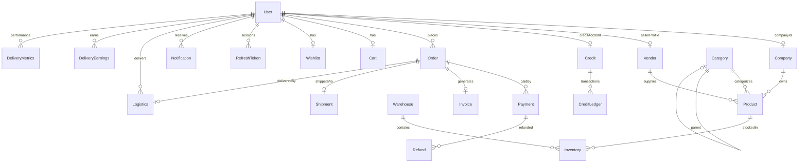
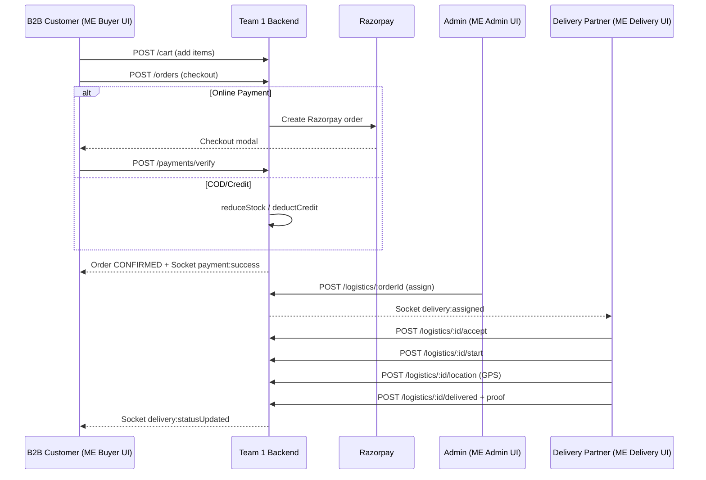

# FINAL MERGE ARCHITECTURE — Mokshith B2B Platform

**Analysis Date:** June 11, 2026  
**Source Documents:**
- **Team 1:** `PROJECT_COMPLETE_ANALYSIS.md` — Mokshith-Entreprises monorepo (`b2b-backend` + `b2b-frontend`, ~811 files)
- **ME:** `ME_PROJECT_COMPLETE_ANALYSIS.md` — Standalone ME project (`c:\Users\USER\Documents\ME`, ~211 files)

**Note:** No file named `TEAM1_PROJECT_COMPLETE_ANALYSIS.md` exists in the repository. Team 1 is identified as the Mokshith-Entreprises monorepo audit (`PROJECT_COMPLETE_ANALYSIS.md`) per repository evidence.

---

## Table of Contents

1. [Executive Comparison](#phase-1--executive-comparison)
2. [Feature Comparison Matrix](#phase-2--feature-comparison-matrix)
3. [Frontend Mapping (ME Pages → Team 1 Backend)](#phase-3--frontend-mapping)
4. [Backend Mapping (Team 1 Modules → ME UI)](#phase-4--backend-mapping)
5. [Database Merge](#phase-5--database-merge)
6. [API Integration Matrix](#phase-6--api-mapping)
7. [Authentication & Role Merge](#phase-7--authentication--role-merge)
8. [Workflow Comparison](#phase-8--workflow-comparison)
9. [Gap Analysis](#phase-9--gap-analysis)
10. [Enterprise Readiness](#phase-10--enterprise-readiness)
11. [Final Product Design](#phase-11--final-product-design)
12. [Implementation Roadmap](#phase-12--implementation-roadmap)
13. [Final Verdict](#phase-13--final-verdict)

---

## PHASE 1 — EXECUTIVE COMPARISON

### 1.1 Project Identity

| Attribute | Team 1 (Mokshith-Entreprises) | ME (Standalone) |
|-----------|------------------------------|-----------------|
| Repository | `Mokshith-Entreprises` monorepo | `ME` single-repo (frontend + `backend/`) |
| Structure | `b2b-backend` + `b2b-frontend` separate apps | `src/` + `backend/` in one tree |
| Total files | ~811 | ~211 |
| Overall completion | ~75% (per Team 1 audit) | ~42% (per ME audit) |
| Integration status | Frontend partially wired to backend (~50+ routes, apiClient) | **0% integration** — mock auth + static data |
| Production target | Render (API) + Vercel (SPA) | None configured |

### 1.2 Scorecards

| Dimension | Team 1 | ME | Winner | Evidence |
|-----------|--------|-----|--------|----------|
| **Overall Architecture** | 7/10 | 6/10 | **Team 1** | Layered modular monolith, 27 backend modules, Redis/BullMQ/Socket.IO (Team 1 §4); ME has clean layers but no integration (ME §4, §17) |
| **Frontend Maturity** | 6/10 | 8/10 | **ME** | ME: 44 pages, 88% UI, role-specific dashboards (ME §7, §17); Team 1: 42 routed pages, 12 orphans, broken RoleGuard (Team 1 §10) |
| **Frontend Integration** | 5/10 | 1/10 | **Team 1** | Team 1: apiClient, Redux, 25 service modules (Team 1 §10); ME: services never imported (ME §7.10) |
| **Backend Maturity** | 8/10 | 7/10* | **Team 1** | Team 1: ~120 endpoints, payments, inventory locks (Team 1 §8, §11); ME: 35 endpoints, phases 1–3 only (ME §9, §11) — *ME score is pattern quality, not completeness (~35%) |
| **Backend Completeness** | ~85% | ~35% | **Team 1** | Team 1: 24 models, 27 modules; ME: 4 collections (ME §10, §17) |
| **Security** | 7.2/10 | 5/10 | **Team 1** | Team 1: CSRF, 2FA, refresh rotation, sanitizers (Team 1 §12); ME: mock auth, pending-user JWT bug (ME §13) |
| **Testing** | 6.5/10 | 2/10 | **Team 1** | Team 1: 51 backend tests in CI (Team 1 §14); ME: 0 backend tests, misaligned E2E (ME §14) |
| **DevOps** | 5.5/10 | 2/10 | **Team 1** | Team 1: split GitHub Actions CI (Team 1 §15); ME: no CI/CD, no Docker (ME §16) |
| **Scalability** | 6/10 | 4/10 | **Team 1** | Team 1: Redis cache, BullMQ, Socket adapter (Team 1 §4.8); ME: no cache, no real-time (ME §15) |
| **Production Readiness** | ~65% | ~15% | **Team 1** | Team 1: health checks, graceful shutdown, CI; ME: prototype only (ME §16.7, Team 1 §15.7) |
| **UI/UX Quality** | 6/10 | 8/10 | **ME** | ME: design system, bulk pricing, delivery gamification (ME §8); Team 1: functional but less polished |
| **Documentation** | 6/10 | 5/10 | **Team 1** | Team 1: 16 code-guide docs, OpenAPI (Team 1 §6.12); ME: stale README, 3000-line stale integration report (ME §21) |

### 1.3 Strategic Summary

| Layer | Recommendation |
|-------|----------------|
| **Take from Team 1** | Entire backend, auth system, payments, inventory, database, CI/CD foundation, apiClient pattern |
| **Take from ME** | Page layouts, role dashboards, component libraries, mock-data UX flows, Recharts dashboards, landing page |
| **Merge/Hybrid** | Role model (6 roles + ME's 4-portal UX), routing table, analytics UI + Team 1 APIs, delivery earnings UI |
| **Discard** | ME mock AuthContext, ME partial backend (superseded), Team 1 orphan/unrouted pages (reconcile with ME routes) |

---

## PHASE 2 — FEATURE COMPARISON MATRIX

| Feature | Team 1 Status | ME Status | Winner | Recommended Version |
|---------|--------------|-----------|--------|---------------------|
| **Authentication** | JWT + refresh rotation, 2FA, CSRF, mobile login, 51 tests | JWT login/register API; frontend mock auth; email login UI | **Team 1** | Team 1 backend auth + ME login/register UI adapted to mobile + JWT |
| **Authorization** | 6 roles, ~80 RBAC permissions, SUPER_ADMIN bypass | 4 roles, simple `authorize()` middleware | **Team 1** | Team 1 RBAC; map ME `super-admin` → `SUPER_ADMIN` |
| **User Management** | Full CRUD, sessions, profile image, soft delete | Admin approve/reject/suspend vendors & delivery only | **Team 1** | Team 1 user/admin APIs + ME approval queue UI |
| **Vendor Management** | Vendor model, create, approve status, company link | Vendor profile CRUD + admin list/approve (separate Vendor collection) | **Hybrid** | Team 1 vendor module + ME Vendor profile fields (GST regex, businessType) |
| **Delivery Management** | Logistics module, GPS, queue, assignments, 10 endpoints | DeliveryPartner profile + admin approve; earnings/performance UI only | **Hybrid** | Team 1 logistics API + ME delivery portal pages (earnings, performance) |
| **Product Management** | Full CRUD, bulk pricing, variants, MOQ, ownership | Admin + vendor product UI (~100 mock products); no API | **Hybrid** | Team 1 product API + ME ProductCard, BulkPricingTable, FilterPanel |
| **Categories** | CRUD, parent hierarchy, cache, soft delete (Team 1) | CRUD API with slug; admin UI mock | **Team 1** | Team 1 category module; ME admin categories page wired to API |
| **Inventory** | Per-warehouse stock, optimistic locking, Redis reservations | Admin inventory UI mock only | **Team 1** | Team 1 inventory + ME Admin/Inventory page layout |
| **Orders** | Full lifecycle, idempotency, GST, bulk discounts | Complete UI flow mock; no API | **Hybrid** | Team 1 order service + ME OrderTimeline, OrderCard, checkout flow |
| **Payments** | Razorpay, webhooks, hybrid credit+online, refunds | Checkout UI with COD/UPI/Credit select; no processing | **Team 1** | Team 1 payment module + ME checkout UI |
| **Notifications** | In-app model + Socket.IO + BullMQ queue | NotificationDrawer in all layouts; mock data | **Hybrid** | Team 1 notification API + ME NotificationDrawer component |
| **Analytics** | 6 admin API endpoints (aggregations) | Recharts dashboards all roles; mock chart data | **Hybrid** | Team 1 analytics API + ME Recharts dashboard components |
| **Reporting** | Audit export, invoice PDF | Admin Reports page (non-functional download buttons) | **Hybrid** | Team 1 PDF/audit export + ME Reports page UI |
| **Dashboards** | SuperAdmin/Admin pages with API hooks (partial) | 4 role dashboards, KPI cards, highly polished | **ME** | ME dashboard layouts fed by Team 1 metrics APIs |
| **Settings** | Key-value settings, feature flags, public config | Settings tabs all roles; no persistence | **Team 1** | Team 1 settings module + ME settings tab UI |
| **Audit Logs** | Audit model, super-admin export, security audit middleware | SuperAdmin has no audit page | **Team 1** | Team 1 audit (super-admin/audit-logs) + new ME-style audit page |
| **Warehousing** | Warehouse CRUD, capacity, load | Not in ME UI | **Team 1** | Team 1 warehouse module; add ME admin nav entry |
| **Logistics** | Delivery queue, accept/start/deliver, GPS | Delivery lifecycle UI with proof upload | **Hybrid** | Team 1 logistics API + ME TimelineTracker, proof upload UI |
| **Cart** | Server-side cart API | Vendor cart with local state | **Team 1** | Team 1 cart API + ME CartItem component |
| **Wishlist** | Full API | Vendor wishlist UI mock | **Team 1** | Team 1 wishlist + ME WishlistCard |
| **Invoices** | PDF generation, download | Vendor invoices list/detail mock | **Team 1** | Team 1 invoice generator + ME Invoices page |
| **Credit (B2B)** | Credit accounts, ledger, hybrid payments | Checkout shows credit option; no backend | **Team 1** | Team 1 credit module; add ME credit display in checkout |
| **Promotions** | Coupon CRUD + apply | Vendor offers on dashboard mock | **Team 1** | Team 1 promotions; map ME offers UI to promotions API |
| **Reviews** | API with feature flag | Not in ME | **Team 1** | Team 1 reviews on product detail (extend ME ProductDetails) |
| **Search** | GET /search | Not in ME as page | **Team 1** | Team 1 search + add ME SearchBar integration |
| **Support** | Ticket API | Not in ME | **Team 1** | Team 1 support module |
| **Landing/Marketing** | 8 landing components, public pages | Home.jsx ~1650 lines, rich sections | **ME** | ME landing page design + Team 1 public routes |
| **Real-time** | Socket.IO (payment, delivery events) | None | **Team 1** | Team 1 SocketContext + ME layout toast areas |
| **Email** | Stub service | Brevo configured in .env.example | **Neither** | Implement email (Brevo) in merged platform |
| **File Upload** | S3/local + validation | Cloudinary in ME .env.example | **Team 1** | Team 1 upload middleware; optional Cloudinary adapter |

---

## PHASE 3 — FRONTEND MAPPING

### 3.1 ME Page Inventory — Complete Mapping Table

> **Legend:** API Support = Can Team 1 backend support this page today?  
> Status = ME current state

#### Public Pages (3)

| Page | Route | Purpose | Required APIs | Required Collections | ME Status | Team 1 API Support | Missing / Changes |
|------|-------|---------|---------------|---------------------|-----------|-------------------|-------------------|
| Home | `/` | Marketing landing, conversion | `GET /settings/public/config` (optional) | settings | Complete mock UI | Partial | Use ME layout; fix broken `/products` links; no API required for static marketing |
| Login | `/login` | Authentication | `POST /auth/login`, `GET /auth/csrf-token` | users, refreshtokens | Mock auth | **Yes** | Change email→mobile; store JWT+refresh+csrf; remove demo buttons in prod; map roles |
| Register | `/register` | User onboarding | `POST /auth/register` | users | Mock auth | **Yes** | Team 1 allows more roles; align role enum; wire approval pending state |

#### Super Admin Pages (8)

| Page | Route | Purpose | Required APIs | Collections | ME Status | Team 1 Support | Missing / Changes |
|------|-------|---------|---------------|-------------|-----------|---------------|-------------------|
| Dashboard | `/super-admin/dashboard` | Platform KPIs | `GET /superadmin/metrics`, `GET /superadmin/stats` | orders, users, payments | Mock UI | **Yes** | Wire MetricsCards to real metrics API |
| Platform | `/super-admin/platform` | System health | `GET /health`, `GET /health/ready`, `GET /metrics` | — | Mock UI | **Yes** | Wire to Team 1 health endpoints (not under /api/v1) |
| Admin Performance | `/super-admin/admin-performance` | Admin KPI comparison | `GET /analytics/dashboard`, `GET /admin/stats` | orders, users | Mock UI | **Partial** | No per-admin comparison API — **new endpoint needed** |
| Vendors | `/super-admin/vendors` | Vendor registry | `GET /vendors`, `GET /admin/users?role=VENDOR` | vendors, users | Mock UI | **Yes** | Merge Vendor + User views; Team 1 uses company/vendor modules |
| Delivery Partners | `/super-admin/delivery-partners` | Partner registry | `GET /admin/users?role=DELIVERY_PARTNER`, `GET /logistics` | users, logistics | Mock UI | **Yes** | Wire to admin user list + delivery partner fields on User model |
| Orders | `/super-admin/orders` | Platform orders | `GET /orders`, `PATCH /orders/:id/status` | orders | Mock UI | **Yes** | Direct wire possible |
| Analytics | `/super-admin/analytics` | Revenue charts | `GET /analytics/revenue`, `/sales`, `/orders-trends` | orders, payments | Mock UI | **Yes** | Feed Recharts from Team 1 analytics aggregations |
| Settings | `/super-admin/settings` | Platform settings | `GET/POST /superadmin/config`, `GET/PUT /users/me` | settings, users | UI only | **Yes** | Wire SystemConfigForm pattern to superadmin config API |

#### Admin Pages (10)

| Page | Route | Purpose | Required APIs | Collections | ME Status | Team 1 Support | Missing / Changes |
|------|-------|---------|---------------|-------------|-----------|---------------|-------------------|
| Dashboard | `/admin/dashboard` | Operations overview | `GET /admin/stats`, `GET /analytics/dashboard` | orders, products, users | Mock UI | **Yes** | Wire AdminStats component |
| Products | `/admin/products` | Product CRUD | `GET/POST/PUT/DELETE /products`, `PATCH .../stock` | products, categories | Mock UI | **Yes** | Wire modals to product API; add image upload |
| Categories | `/admin/categories` | Category CRUD | `GET/POST/PUT/DELETE /superadmin/categories` or `/categories` | categories | Mock UI | **Yes** | Team 1 has category routes (admin + super-admin) |
| Inventory | `/admin/inventory` | Stock management | `GET /inventory`, `POST /inventory`, `GET /inventory/low-stock` | inventory, products, warehouses | Mock UI | **Yes** | Requires warehouse setup first |
| Vendors | `/admin/vendors` | Vendor list | `GET /vendors`, `POST /admin/approve/:id` | vendors, users | Mock UI | **Yes** | Map ME approve flow to Team 1 admin approvals |
| Orders | `/admin/orders` | Order management | `GET /orders`, `PATCH /orders/:id/status` | orders | Mock UI | **Yes** | Direct wire |
| Delivery Assignment | `/admin/delivery-assignment` | Assign partner to order | `POST /logistics/:orderId`, `GET /logistics/delivery-queue` | logistics, orders | Mock UI | **Partial** | Team 1 has createShipment + assignment service; no dedicated "assignment UI" API — use logistics POST |
| Reports | `/admin/reports` | Report downloads | `GET /analytics/*`, `GET /superadmin/audit-logs/export` | audits, orders | UI only | **Partial** | Audit export exists; **sales report export API missing** |
| Analytics | `/admin/analytics` | Area analytics | `GET /analytics/categories`, `/top-products`, `/sales` | orders, products | Mock UI | **Yes** | Wire Recharts to analytics API |
| Settings | `/admin/settings` | Admin config | `GET/PUT /settings`, `PUT /users/me` | settings, users | UI only | **Yes** | Wire settings form; ME "area config" needs **new settings keys** |

#### Vendor Portal Pages (13)

| Page | Route | Purpose | Required APIs | Collections | ME Status | Team 1 Support | Missing / Changes |
|------|-------|---------|---------------|-------------|-----------|---------------|-------------------|
| Dashboard | `/vendor/dashboard` | Vendor home KPIs | `GET /orders`, `GET /products`, `GET /analytics/dashboard` | orders, products | Mock UI | **Partial** | No vendor-scoped analytics — filter by vendorId |
| Products | `/vendor/products` | Browse catalog | `GET /products`, `GET /categories` | products, categories | Mock UI | **Yes** | B2B customer browse — ME uses "vendor" role for buyer; **role semantics differ** |
| Product Details | `/vendor/products/:id` | Product detail | `GET /products/:id`, `POST /cart`, `POST /wishlist/add` | products, cart, wishlist | Mock UI | **Yes** | Wire BulkPricingTable to product.bulkPricing |
| Categories | `/vendor/categories` | Category browse | `GET /categories` | categories | Mock UI | **Yes** | Direct wire |
| Cart | `/vendor/cart` | Shopping cart | `GET/POST/DELETE /cart` | cart | Mock UI | **Yes** | Replace local state with cart API |
| Checkout | `/vendor/checkout` | Place order | `POST /orders`, `POST /payments/create-order` | orders, payments | UI only | **Yes** | Full Team 1 checkout flow |
| Order Success | `/vendor/order-success` | Confirmation | — | orders | UI only | **Yes** | Redirect after order create; show real order ID |
| Orders | `/vendor/orders` | Order history | `GET /orders` | orders | Mock UI | **Yes** | Direct wire |
| Order Details | `/vendor/orders/:id` | Order timeline | `GET /orders/:id`, `GET /shipments/order/:orderId` | orders, shipments, logistics | Mock UI | **Yes** | Wire OrderTimeline to order status + shipment |
| Invoices | `/vendor/invoices` | Invoice list | `GET /invoices`, `GET /orders/:id/invoice` | invoices | Mock UI | **Yes** | Team 1 invoice PDF download |
| Wishlist | `/vendor/wishlist` | Saved products | `GET /wishlist`, `DELETE /wishlist/remove/:id` | wishlist | Mock UI | **Yes** | Direct wire |
| Profile | `/vendor/profile` | Business profile | `GET/PUT /companies/me`, `GET /users/me` | companies, users | Mock UI | **Yes** | Map to company + user profile |
| Settings | `/vendor/settings` | Account settings | `PUT /users/me`, `POST /auth/change-password` | users | UI only | **Yes** | Wire forms |

#### Delivery Partner Pages (8)

| Page | Route | Purpose | Required APIs | Collections | ME Status | Team 1 Support | Missing / Changes |
|------|-------|---------|---------------|-------------|-----------|---------------|-------------------|
| Dashboard | `/delivery/dashboard` | Ops overview | `GET /logistics/my-assignments`, `GET /logistics/delivery-queue` | logistics | Mock UI | **Yes** | Direct wire |
| Assigned Orders | `/delivery/assigned-orders` | Active deliveries | `GET /logistics/my-assignments` | logistics | Mock UI | **Yes** | Direct wire |
| Order Details | `/delivery/order-details/:id` | Status updates | `POST /logistics/:id/accept|start|delivered`, `POST .../location` | logistics | Mock UI | **Yes** | Add proof upload → **extend upload API for delivery proof** |
| History | `/delivery/history` | Completed deliveries | `GET /logistics/history` | logistics | Mock UI | **Yes** | Direct wire |
| Earnings | `/delivery/earnings` | Earnings charts | — | — | Mock UI | **No** | **New API needed** — earnings aggregation by partner |
| Performance | `/delivery/performance` | Metrics, badges | — | — | Mock UI | **No** | **New API needed** — delivery performance metrics |
| Profile | `/delivery/profile` | Partner profile | `GET/PUT /users/me` | users | UI only | **Partial** | User model has delivery fields; no separate DeliveryPartner collection in Team 1 |
| Settings | `/delivery/settings` | Preferences | `PUT /users/me` | users | UI only | **Yes** | Wire profile update |

### 3.2 ME Pages — Team 1 Backend Support Summary

| Support Level | Count | Pages |
|--------------|-------|-------|
| **Full support (wire only)** | 28 | Login*, Register*, most admin/super-admin ops, cart, orders, logistics core |
| **Partial (adapt + wire)** | 8 | Dashboards (vendor), Delivery Assignment, Profile pages, Platform health |
| **New API required** | 4 | Admin Performance, Reports export, Earnings, Performance |
| **Static / no API** | 2 | Home (marketing), Order Success (redirect only) |

\*Requires auth field changes (email→mobile, role mapping)

### 3.3 Role Semantics Conflict (Critical)

| ME Role | ME UX Intent | Team 1 Equivalent | Resolution |
|---------|-------------|-------------------|------------|
| `vendor` | **Buyer** — browses catalog, cart, checkout | `VENDOR` = seller; `B2B_CUSTOMER` = buyer | Map ME Vendor Portal → **`B2B_CUSTOMER`** routes or rename ME "Vendor" to "Buyer" |
| `admin` | Area operations manager | `ADMIN` | Direct map |
| `super-admin` | Platform owner | `SUPER_ADMIN` | Map `superadmin` ↔ `SUPER_ADMIN` |
| `delivery` | Delivery partner | `DELIVERY_PARTNER` | Map `delivery` ↔ `DELIVERY_PARTNER` |

**Evidence:** ME vendor portal is a purchasing flow (cart, checkout, wishlist) — Team 1 `VENDOR` role is for sellers (product CRUD). Team 1 separates `B2B_CUSTOMER` for buyers (ME §12.2, Team 1 §9.2).

---

## PHASE 4 — BACKEND MAPPING

### 4.1 Team 1 Backend Modules — Complete Map

| Module | Purpose | Collections | Key APIs | ME Pages Using It | UI Compatibility |
|--------|---------|-------------|----------|-------------------|------------------|
| **auth** | Register, login, 2FA, sessions, logout | users, refreshtokens | 13 endpoints | Login, Register, all Settings | **Adapt** — mobile login, CSRF header |
| **user** | Profile, sessions, admin user mgmt | users | 9 endpoints | Profile, Settings (all roles) | **Compatible** |
| **company** | B2B company profiles | companies | 5 endpoints | Vendor Profile | **Compatible** |
| **vendor** | Seller onboarding | vendors | 3 endpoints | Admin/SuperAdmin Vendors | **Extend** — merge ME Vendor schema fields |
| **category** | Category hierarchy | categories | 3 endpoints | Admin Categories, Vendor Categories | **Compatible** |
| **product** | Catalog CRUD, stock, bulk pricing | products | 7 endpoints | Admin Products, Vendor Products/Details | **Compatible** — ME bulk pricing UI maps to product.bulkPricing[] |
| **pricing** | Dynamic price engine | products | 1 endpoint | Product Details | **Compatible** |
| **promotion** | Coupons | promotions | 6 endpoints | Vendor Dashboard offers | **Wire** ME offers → promotions |
| **cart** | Shopping cart | carts | 3 endpoints | Vendor Cart | **Compatible** |
| **wishlist** | Wishlist | wishlists | 4 endpoints | Vendor Wishlist | **Compatible** |
| **order** | Order lifecycle | orders | 6 endpoints | All order pages (admin, vendor, super-admin) | **Compatible** — ME OrderTimeline maps to order.status |
| **payment** | Razorpay, webhooks, hybrid | payments, refunds | 6 endpoints | Vendor Checkout | **Compatible** |
| **invoice** | PDF invoices | invoices | 2 endpoints | Vendor Invoices | **Compatible** |
| **credit** | B2B credit accounts | credits, creditledgers | 5 endpoints | Vendor Checkout (credit option) | **Wire** — ME has UI select only |
| **warehouse** | Warehouse CRUD | warehouses | 4 endpoints | Admin Inventory (implicit) | **Add** ME nav link |
| **inventory** | Per-warehouse stock | inventories | 5 endpoints | Admin Inventory | **Compatible** |
| **shipment** | Shipment records | shipments | 6 endpoints | Order Details (tracking) | **Compatible** |
| **logistics** | Delivery operations | logistics | 10 endpoints | Delivery portal (6 pages), Admin Delivery Assignment | **Compatible** — core delivery flow |
| **notification** | In-app notifications | notifications | 2 endpoints | All NotificationDrawer components | **Wire** ME drawers |
| **analytics** | Dashboard aggregations | orders, products (agg) | 6 endpoints | Analytics pages (admin, super-admin) | **Compatible** — feed ME Recharts |
| **settings** | System config | settings | 4 endpoints | All Settings pages | **Compatible** |
| **support** | Support tickets | supports | 4 endpoints | None in ME | **Add** help/support page |
| **review** | Product reviews | reviews | 2 endpoints | Product Details (extend) | **Add** to ME ProductDetails |
| **search** | Product search | products | 1 endpoint | Vendor Products search | **Wire** ME SearchBar |
| **admin** | Approvals, B2B customers, stats | users | 9 endpoints | Admin Vendors, Approvals | **Compatible** |
| **superAdmin** | Platform governance | users, audits, settings | 16 endpoints | Super Admin pages (8) | **Compatible** |
| **audit** | Audit logs (unmounted routes) | audits | 2 endpoints | None — add SuperAdmin audit page | **Add** ME-style audit UI |
| **payment** (refund) | Refunds | refunds | via payment service | None | **Future** |

### 4.2 Team 1 Infrastructure Modules (No ME UI)

| Component | Purpose | Merge Action |
|-----------|---------|--------------|
| Redis | Cache, locks, rate limits, reservations | **Keep** — required for production |
| BullMQ | Async jobs (post-order, post-payment) | **Keep** |
| Socket.IO | Real-time payment/delivery events | **Keep** — add to ME layout headers |
| Sentry | Error tracking | **Keep** — add to merged frontend |
| Cron jobs | Payment reconcile, inventory sync | **Keep** |
| CSRF middleware | Double-submit cookie | **Keep** — ME frontend must send x-csrf-token |
| Idempotency | Order/inventory duplicate prevention | **Keep** |

### 4.3 ME Backend Features to Port into Team 1

| ME Feature | Team 1 Status | Port Action |
|-----------|--------------|-------------|
| Vendor GST regex validation | Partial in Team 1 vendor module | Merge ME GST validator into Team 1 Joi schemas |
| Category slug auto-generation with counter | Team 1 has slug on category | **Keep Team 1** — verify parity |
| DeliveryPartner separate collection | Team 1 uses User delivery fields | **Evaluate** — ME separate profile vs Team 1 embedded fields |
| express-validator patterns | Team 1 uses Joi | **Keep Joi** — don't port express-validator |
| ApiResponse `{success, statusCode, data}` format | Team 1 uses responseHandler | **Standardize** on Team 1 format; adapt ME services |

---

## PHASE 5 — DATABASE MERGE

### 5.1 FINAL_DATABASE_ARCHITECTURE

**Engine:** MongoDB via Mongoose 9.x  
**Source:** Team 1 schema foundation (24 collections) + selective ME field additions

#### Collections to KEEP (from Team 1 — 24)

`users`, `refreshtokens`, `companies`, `vendors`, `categories`, `products`, `carts`, `wishlists`, `orders`, `payments`, `refunds`, `credits`, `creditledgers`, `inventories`, `warehouses`, `shipments`, `logistics`, `invoices`, `promotions`, `reviews`, `notifications`, `supports`, `settings`, `audits`

#### Collections to ADD (new for merged platform — 3)

| Collection | Purpose | Triggered By |
|-------------|---------|--------------|
| `deliveryearnings` | Partner earnings ledger (per delivery, bonuses) | ME Delivery/Earnings page |
| `deliverymetrics` | Performance snapshots (on-time %, ratings, badges) | ME Delivery/Performance page |
| `reportexports` | Async report generation jobs (sales, audit, inventory) | ME Admin/Reports page |

#### Collections to MODIFY

| Collection | Changes | Source |
|-----------|---------|--------|
| **users** | Add ME fields: `businessType` (enum), ensure `gstNumber` validation matches ME regex; add `rejected` to status enum (ME bug fix) | ME User/Vendor + ME §10.3 bug |
| **vendors** | Merge ME fields: `ownerName`, `businessType`, `pincode` validation, `businessName` indexing | ME Vendor schema |
| **categories** | Verify `sortOrder`, soft-delete parity with ME | Both have soft delete |
| **logistics** | Add `proofImageUrl`, `proofUploadedAt` for delivery proof upload | ME OrderDetails proof UI |
| **settings** | Add keys: `adminAreaCoverage`, `deliveryPreferences`, `platformHealthThresholds` | ME Settings pages |
| **products** | Ensure `bulkPricing[]`, `moq`, `minOrderQty` match ME UI tiers | Both aligned |

#### Collections to DROP (ME-only, superseded)

| ME Collection | Reason |
|--------------|--------|
| `deliverypartners` (separate) | Team 1 embeds delivery fields on User; migrate data to users on import |
| ME standalone `vendors` | Superseded by Team 1 vendors + companies model |

### 5.2 Final Entity Relationship (Merged)



### 5.3 Index Recommendations (Merged)

| Collection | Index | Priority |
|-----------|-------|----------|
| users | `{role: 1, status: 1}` | High |
| users | `{mobile: 1}` unique | High (Team 1 login) |
| products | `{name: "text", description: "text"}` | High |
| orders | `{userId: 1, createdAt: -1}` | High |
| orders | `{status: 1, createdAt: -1}` | High |
| logistics | `{deliveryPartnerId: 1, status: 1}` | High |
| deliveryearnings | `{userId: 1, period: 1}` | Medium (new) |
| inventories | `{stock: 1}` | Medium |
| notifications | `{userId: 1, isRead: 1}` | Medium |
| audits | `{createdAt: -1, severity: 1}` | Medium |

---

## PHASE 6 — API MAPPING

### 6.1 Complete API Integration Matrix (ME Pages → Team 1)

| ME Page | APIs Needed | Team 1 Exists | Missing / Modify |
|---------|------------|---------------|------------------|
| Login | `POST /auth/login`, `GET /auth/csrf-token` | ✅ | Modify: accept mobile (Team 1) not email (ME) |
| Register | `POST /auth/register` | ✅ | Modify: role enum mapping |
| Home | — | — | — |
| SA Dashboard | `GET /superadmin/metrics`, `GET /superadmin/stats` | ✅ | — |
| SA Platform | `GET /health/ready`, `GET /metrics` | ✅ | Not under /api/v1 |
| SA Admin Performance | Per-admin KPI comparison | ❌ | **NEW:** `GET /superadmin/admin-performance` |
| SA Vendors | `GET /vendors`, `GET /admin/users` | ✅ | — |
| SA Delivery Partners | `GET /admin/users?role=DELIVERY_PARTNER` | ✅ | — |
| SA Orders | `GET /orders` | ✅ | — |
| SA Analytics | `GET /analytics/*` (6 endpoints) | ✅ | — |
| SA Settings | `GET/POST /superadmin/config` | ✅ | — |
| Admin Dashboard | `GET /admin/stats` | ✅ | — |
| Admin Products | `GET/POST/PUT/DELETE /products` | ✅ | — |
| Admin Categories | `GET/POST/PUT/DELETE /categories` | ✅ | — |
| Admin Inventory | `GET/POST/PATCH /inventory` | ✅ | — |
| Admin Vendors | `GET /admin/approvals`, `POST /admin/approve/:id` | ✅ | — |
| Admin Orders | `GET /orders`, `PATCH /orders/:id/status` | ✅ | — |
| Admin Delivery Assignment | `POST /logistics/:orderId`, `GET /logistics/delivery-queue` | ✅ | — |
| Admin Reports | `GET /analytics/revenue` + export | Partial | **NEW:** `GET /admin/reports/export?type=sales|inventory` |
| Admin Analytics | `GET /analytics/*` | ✅ | — |
| Admin Settings | `GET/PUT /settings` | ✅ | Add area config keys |
| Vendor Dashboard | `GET /orders`, `GET /products` | ✅ | Filter by user |
| Vendor Products | `GET /products`, `GET /search` | ✅ | — |
| Vendor Product Details | `GET /products/:id`, `POST /cart` | ✅ | — |
| Vendor Cart | `GET/POST/DELETE /cart` | ✅ | — |
| Vendor Checkout | `POST /orders`, `POST /payments/create-order` | ✅ | — |
| Vendor Orders | `GET /orders` | ✅ | — |
| Vendor Order Details | `GET /orders/:id`, `GET /logistics/:id` | ✅ | — |
| Vendor Invoices | `GET /orders/:id/invoice` | ✅ | — |
| Vendor Wishlist | `GET/POST/DELETE /wishlist` | ✅ | — |
| Vendor Profile | `GET/PUT /users/me`, `GET /companies/me` | ✅ | — |
| Delivery Dashboard | `GET /logistics/my-assignments` | ✅ | — |
| Delivery Assigned Orders | `GET /logistics/my-assignments` | ✅ | — |
| Delivery Order Details | `POST /logistics/:id/accept|start|delivered` | ✅ | Add proof upload field |
| Delivery History | `GET /logistics/history` | ✅ | — |
| Delivery Earnings | Earnings aggregation | ❌ | **NEW:** `GET /logistics/earnings?period=week|month` |
| Delivery Performance | Performance metrics | ❌ | **NEW:** `GET /logistics/performance` |
| Delivery Profile | `GET/PUT /users/me` | ✅ | — |

### 6.2 New APIs Required (Summary)

| Endpoint | Method | Purpose | Priority |
|----------|--------|---------|----------|
| `/api/v1/superadmin/admin-performance` | GET | Per-admin KPI comparison | Medium |
| `/api/v1/admin/reports/export` | GET | CSV/PDF report download | Medium |
| `/api/v1/logistics/earnings` | GET | Delivery partner earnings | High |
| `/api/v1/logistics/performance` | GET | Delivery performance metrics | High |
| `/api/v1/logistics/:id/proof` | POST | Upload delivery proof image | Medium |

### 6.3 API Path Standardization

| Issue | ME | Team 1 | Merged Standard |
|-------|-----|--------|----------------|
| Base path | `/api` | `/api/v1` | **`/api/v1`** |
| Env var | `VITE_API_BASE_URL` | `VITE_API_URL` | **`VITE_API_URL`** (Team 1) with `/api/v1` suffix |
| Super admin path | `/super-admin/*` (routes) | `/superadmin/*` + `/super-admin/*` | **`/super-admin/*`** (ME UX) calling `/api/v1/superadmin/*` |
| Auth identifier | email | mobile | **mobile** (Team 1) |

---

## PHASE 7 — AUTHENTICATION & ROLE MERGE

### 7.1 Role Structure Comparison

| ME Role (frontend) | ME Role (backend) | Team 1 Role | Merged Role | Portal |
|-------------------|------------------|-------------|-------------|--------|
| `super-admin` | `superadmin` | `SUPER_ADMIN` | `SUPER_ADMIN` | Super Admin (8 pages) |
| `admin` | `admin` | `ADMIN` | `ADMIN` | Admin (10 pages) |
| `vendor` (buyer UX) | `vendor` | `B2B_CUSTOMER` | `B2B_CUSTOMER` | Buyer Portal (ME Vendor pages) |
| `delivery` | `delivery` | `DELIVERY_PARTNER` | `DELIVERY_PARTNER` | Delivery (8 pages) |
| — | — | `VENDOR` (seller) | `VENDOR` | Seller portal (future — product CRUD) |
| — | — | `B2C_CUSTOMER` | `B2C_CUSTOMER` | Retail checkout (Team 1) |

### 7.2 Permission System Comparison

| Aspect | ME | Team 1 | Merged |
|--------|-----|--------|--------|
| Model | Role string match (`authorize('admin')`) | RBAC with ~80 permissions | **Team 1 RBAC** |
| Frontend guard | ProtectedRoute (role string) | ProtectedRoute + RoleGuard | **Team 1 guards** + ME route table |
| SUPER_ADMIN bypass | Implicit | Explicit bypass all permissions | **Team 1** |
| Resource ownership | None | `requireOwnershipOr` for products | **Team 1** |
| Maintenance mode | None | Blocks non-super-admin | **Team 1** |

### 7.3 JWT Implementation Comparison

| Feature | ME Backend | Team 1 | Merged |
|---------|-----------|--------|--------|
| Access token TTL | 7 days (JWT_EXPIRE) | 15 minutes | **15 min** (Team 1) |
| Refresh token | Configured but unused | DB-backed rotation with family | **Team 1** |
| Token storage (FE) | localStorage.token (unused) | localStorage + Redux | **Team 1** |
| CSRF | None | Double-submit cookie | **Team 1** |
| 2FA | None | TOTP + backup codes | **Team 1** (optional for admin+) |
| Login field | email | mobile | **mobile** |
| Password policy | min 8 chars | Full policy + breach check | **Team 1** |
| Account lockout | None | Fraud detection + Redis | **Team 1** |
| Pending user block | Bug — JWT works while pending | Blocked at auth middleware | **Team 1** |

### 7.4 FINAL_AUTH_ARCHITECTURE

```
┌─────────────────────────────────────────────────────────────────┐
│                     MERGED AUTH ARCHITECTURE                     │
├─────────────────────────────────────────────────────────────────┤
│  FRONTEND (ME UI + Team 1 integration layer)                    │
│  ┌──────────────┐    ┌──────────────┐    ┌──────────────────┐ │
│  │ ME Login/    │───▶│ authService  │───▶│ apiClient        │ │
│  │ Register UI  │    │ (Team 1)     │    │ Bearer + CSRF    │ │
│  └──────────────┘    └──────────────┘    └──────────────────┘ │
│         │                                        │               │
│         ▼                                        ▼               │
│  ┌──────────────┐                    ┌──────────────────────┐   │
│  │ Redux        │◀── refresh ────────│ POST /auth/refresh   │   │
│  │ authSlice    │                    │ Token (Team 1)       │   │
│  └──────────────┘                    └──────────────────────┘   │
│  ┌──────────────┐                                                │
│  │ ProtectedRoute│ role map: super-admin→SUPER_ADMIN           │
│  │ (ME routes)  │              vendor→B2B_CUSTOMER             │
│  └──────────────┘              delivery→DELIVERY_PARTNER        │
├─────────────────────────────────────────────────────────────────┤
│  BACKEND (Team 1 — unchanged core)                              │
│  POST /auth/login (mobile+password) → accessToken (15m)        │
│                                    → refreshToken (DB, family)  │
│                                    → csrfToken                  │
│  Middleware: authenticate → requireRole → requirePermission       │
│  Optional: 2FA gate → POST /auth/2fa/verify                    │
│  Security: rate limit, fraud detection, password policy         │
└─────────────────────────────────────────────────────────────────┘
```

**Role redirect map (post-login):**

| Role | Redirect |
|------|----------|
| SUPER_ADMIN | `/super-admin/dashboard` |
| ADMIN | `/admin/dashboard` |
| B2B_CUSTOMER | `/vendor/dashboard` (ME buyer portal path) |
| DELIVERY_PARTNER | `/delivery/dashboard` |
| VENDOR (seller) | `/admin/products` or dedicated seller portal |

---

## PHASE 8 — WORKFLOW COMPARISON

### 8.1 Customer (Buyer) Workflow

| Step | ME (Current) | Team 1 (Current) | Merged (Recommended) |
|------|-------------|-----------------|---------------------|
| 1. Register | Mock — any credentials | API — pending approval | Team 1 API + ME Register UI |
| 2. Admin approve | Skipped in ME | POST /admin/approve/:id | Full approval gate |
| 3. Browse products | Mock vendorProducts.js | GET /products (public) | ME ProductCard + Team 1 API |
| 4. Add to cart | Local state | POST /cart | Team 1 cart API |
| 5. Checkout | UI form only | POST /orders + payment | ME Checkout UI + Team 1 order/payment |
| 6. Pay | Payment method select | Razorpay/COD/Credit/Hybrid | Team 1 Razorpay + ME payment select UI |
| 7. Track order | Mock timeline | GET /orders/:id + Socket.IO | ME OrderTimeline + Team 1 API + realtime |
| 8. View invoice | Mock invoices | GET /orders/:id/invoice | ME Invoices page + Team 1 PDF |

**Missing in ME:** Steps 2, 5–7 backend. **Missing in Team 1:** Polished buyer UX (ME vendor portal). **Redundant:** Team 1 separate `/home` and `/dashboard` — consolidate to ME `/vendor/dashboard`.

### 8.2 Vendor (Seller) Workflow

| Step | ME | Team 1 | Merged |
|------|-----|--------|--------|
| Seller registration | Same as vendor role (buyer) | VENDOR role + company | **Separate VENDOR seller onboarding** |
| Product CRUD | Admin does it in ME | VENDOR/ADMIN product API | Admin + VENDOR seller portal |
| Inventory | Admin inventory page | inventory API | ME Admin Inventory UI + Team 1 API |

**Note:** ME conflates buyer and seller under "vendor". Merged platform must **split** buyer (B2B_CUSTOMER) and seller (VENDOR) workflows.

### 8.3 Delivery Partner Workflow

| Step | ME | Team 1 | Merged |
|------|-----|--------|--------|
| Register + approve | Mock / ME backend approve | Team 1 admin approval | Team 1 approval + ME UI |
| View assignments | Mock assignedOrders | GET /logistics/my-assignments | ME AssignedOrders + Team 1 API |
| Accept → Deliver | Local state updates | POST accept/start/delivered | ME TimelineTracker + Team 1 API |
| Upload proof | UI only | **Missing** | ME UI + **new proof upload API** |
| Earnings | Mock charts | **Missing** | ME Earnings page + **new earnings API** |
| Performance | Mock badges | **Missing** | ME Performance page + **new metrics API** |
| Real-time GPS | None | POST /logistics/:id/location | Team 1 GPS + ME map component |

**Winner:** ME for UX completeness; Team 1 for operational API. **Merge both.**

### 8.4 Admin Workflow

| Step | ME | Team 1 | Merged |
|------|-----|--------|--------|
| Approve vendors/delivery | UI mock | Full API | ME table UI + Team 1 approve API |
| Manage products | Mock modals | Full CRUD API | ME modals wired to API |
| Assign delivery | console.log | POST /logistics/:orderId | ME assignment modal + Team 1 API |
| Reports | Non-functional buttons | Audit export only | **New report export API** |
| Area analytics | Mock charts | analytics API | ME Recharts + Team 1 data |

### 8.5 Super Admin Workflow

| Step | ME | Team 1 | Merged |
|------|-----|--------|--------|
| Platform metrics | Mock KPIs | GET /superadmin/metrics | ME DashboardCard + Team 1 metrics |
| System health | Mock status | GET /health/ready | ME Platform page + real health |
| Admin management | **Missing page** | Full admin CRUD API | **Add** ME page using Team 1 AdminsPage pattern |
| Audit logs | **Missing page** | GET /superadmin/audit-logs | Team 1 AuditPage + ME DataTable |
| Config | Mock settings | POST /superadmin/config | ME Settings tabs + Team 1 config API |

### 8.6 Merged Workflow Diagrams

#### Order-to-Delivery (Merged)



---

## PHASE 9 — GAP ANALYSIS

### 9.1 Features in Team 1 but MISSING in ME

| Feature | Team 1 Evidence | Priority |
|---------|----------------|----------|
| Razorpay payment processing | payment module, webhooks | **Critical** |
| Redis inventory reservations | inventory.service | **Critical** |
| B2B credit accounts + ledger | credit module | **High** |
| Refresh token rotation | RefreshToken model | **High** |
| 2FA (TOTP) | auth routes | **Medium** |
| CSRF protection | csrf.middleware | **High** |
| BullMQ async jobs | workers, queues | **High** |
| Socket.IO real-time | server.js, SocketContext | **High** |
| Warehouse management | warehouse module | **Medium** |
| Promotions/coupons API | promotion module | **Medium** |
| Product reviews API | review module | **Low** |
| Support tickets API | support module | **Medium** |
| Super admin admin CRUD | superAdmin routes | **High** |
| Audit log system | audit model + superAdmin | **High** |
| Feature flags / maintenance mode | settings + featureGuard | **Medium** |
| Idempotency on orders | idempotency.middleware | **Critical** |
| Payment reconciliation cron | paymentReconcile.job | **High** |
| B2C customer role + retail flow | Team 1 routes | **Medium** |
| S3/file upload pipeline | upload.middleware | **Medium** |
| 51 backend test suites | tests/ | **High** |
| CI/CD pipelines | .github/workflows | **High** |

### 9.2 Features in ME but MISSING in Team 1

| Feature | ME Evidence | Priority |
|---------|------------|----------|
| Polished 4-role dashboard UX | 44 pages, 88% UI | **Critical** (merge UI) |
| Delivery earnings page + charts | Delivery/Earnings | **High** — needs new API |
| Delivery performance gamification | Delivery/Performance | **High** — needs new API |
| Admin performance comparison | SuperAdmin/AdminPerformance | **Medium** — needs new API |
| Admin delivery assignment UI | Admin/DeliveryAssignment | **High** — wire to logistics API |
| Admin reports download UI | Admin/Reports | **Medium** — needs export API |
| Platform health monitoring page | SuperAdmin/Platform | **Medium** — wire to health API |
| Demo login buttons | Login.jsx | **Low** — dev/staging only |
| Recharts dashboard components | analytics pages | **High** — port to Team 1 frontend |
| NotificationDrawer (all roles) | component libraries | **High** — wire to notification API |
| Bulk pricing table UI | BulkPricingTable | **Medium** — exists in Team 1 FE too |
| Delivery proof upload UI | Delivery/OrderDetails | **Medium** — needs proof API |
| Indian market UX (GST, pincode, ₹) | mock data, validators | **High** — port validators |
| Area-based admin config | Admin/Settings | **Low** — new settings keys |
| Mobile app promotion section | MobileAppPromotion | **Low** — marketing only |

### 9.3 Features MISSING in BOTH

| Feature | Priority | Notes |
|---------|----------|-------|
| Email verification on registration | **Critical** | Both have stub/placeholder email |
| Password reset flow | **Critical** | ME has ForgotPassword page (unrouted); Team 1 no endpoint |
| Production Dockerfile + compose | **High** | Team 1 CI references missing Dockerfile |
| Email notifications (order, approval) | **High** | ME has Brevo config; Team 1 stub |
| Seller (VENDOR) dedicated portal | **High** | Team 1 has API; neither has full seller UI |
| Automated DB backups | **High** | Team 1 script exists, not scheduled |
| Log aggregation (ELK/Datadog) | **Medium** | Neither configured |
| i18n / Hindi support | **Low** | Neither |
| Mobile native app | **Low** | ME landing references it |
| AI product recommendations | **Low** | Phase 5 roadmap |
| Subscription/recurring orders | **Low** | Neither |
| Multi-warehouse order splitting | **Medium** | Team 1 single warehouse per order |

---

## PHASE 10 — ENTERPRISE READINESS

### 10.1 Production Deployment Requirements (Merged)

| Requirement | Team 1 | ME | Merged Action |
|-------------|--------|-----|---------------|
| **Security** | | | |
| JWT + refresh rotation | ✅ | Partial | Team 1 |
| CSRF | ✅ | ❌ | Team 1 |
| 2FA | ✅ | ❌ | Team 1 (admin+) |
| Rate limiting | ✅ | Basic | Team 1 |
| Input sanitization | ✅ | Placeholder | Team 1 |
| Secrets management | Manual .env | Secrets in .env.example | **Fix** — use GitHub Secrets / Vault |
| HTTPS | Vercel/Render | ❌ | Deploy targets |
| CSP headers | Partial | ❌ | Add to Vercel config |
| **Scaling** | | | |
| Redis cache/locks | ✅ | ❌ | Team 1 |
| BullMQ workers | ✅ | ❌ | Team 1 — separate worker process at scale |
| Socket.IO Redis adapter | Optional | ❌ | Enable for multi-instance |
| MongoDB indexes | Partial | Basic | Apply merged index plan |
| CDN for images | Optional S3/CDN | Cloudinary planned | Pick one |
| **Monitoring** | | | |
| Sentry | ✅ both | ❌ FE | Team 1 Sentry on merged FE |
| Health endpoints | ✅ | ✅ basic | Team 1 /health/live/ready |
| Structured logging | Winston | Console | Team 1 |
| APM | Sentry profiling | ❌ | Extend |
| Uptime monitoring | ❌ | ❌ | **Add** — UptimeRobot/Pingdom |
| **Testing** | | | |
| Backend unit/integration | 51 files CI | 0 | Team 1 + add logistics/superAdmin tests |
| Frontend unit | 39 files (not CI) | 4 files | Run Vitest in CI |
| E2E | 3 specs (stale) | 5 specs (misaligned) | Rewrite against merged UI |
| Load tests | 14 files (not CI) | ❌ | Add to release CI |
| **CI/CD** | | | |
| GitHub Actions | ✅ split pipelines | ❌ | Team 1 workflows |
| Docker | ❌ missing | ❌ | **Create** Dockerfile + compose |
| Staging environment | ❌ | ❌ | **Create** |
| **Infrastructure** | | | |
| MongoDB Atlas | Configured | Configured | Shared |
| Redis | CI + config | ❌ | Required for merged |
| Render (API) | Hardcoded | ❌ | Backend deploy |
| Vercel (SPA) | vercel.json | ❌ | Frontend deploy |

### 10.2 Enterprise Readiness Score (Merged Target)

| Area | Team 1 Today | ME Today | Merged Target |
|------|-------------|----------|---------------|
| Security | 7.2/10 | 5/10 | **8.5/10** |
| Scalability | 6/10 | 4/10 | **8/10** |
| Monitoring | 5/10 | 2/10 | **7.5/10** |
| Testing | 6.5/10 | 2/10 | **8/10** |
| CI/CD | 5.5/10 | 2/10 | **8/10** |
| **Production Ready** | ~65% | ~15% | **Target 90%** |

---

## PHASE 11 — FINAL PRODUCT DESIGN

### 11.1 FINAL_MOKSHITH_PLATFORM_ARCHITECTURE

```
┌────────────────────────────────────────────────────────────────────────┐
│                    MOKSHITH B2B — MERGED PLATFORM                       │
├────────────────────────────────────────────────────────────────────────┤
│  FRONTEND (Hybrid)                                                      │
│  Source: ME UI/UX (44 pages, components, layouts, Recharts)            │
│        + Team 1 integration (apiClient, Redux, hooks, SocketContext)   │
│  Deploy: Vercel (SPA)                                                   │
│  Stack: React 19, Vite 8, Tailwind v4, Redux Toolkit, Recharts       │
├────────────────────────────────────────────────────────────────────────┤
│  BACKEND (Team 1)                                                       │
│  Source: b2b-backend (100% — 27 modules, ~120 endpoints)               │
│  Deploy: Render / Docker on Railway                                     │
│  Stack: Express 5, Node 20, Mongoose 9, Joi                            │
├────────────────────────────────────────────────────────────────────────┤
│  DATA LAYER (Team 1 + extensions)                                       │
│  MongoDB Atlas — 24 base collections + 3 new                          │
│  Redis — cache, locks, reservations, rate limits, Socket adapter      │
├────────────────────────────────────────────────────────────────────────┤
│  ASYNC / REAL-TIME (Team 1)                                             │
│  BullMQ workers, node-cron jobs, Socket.IO                             │
├────────────────────────────────────────────────────────────────────────┤
│  PAYMENTS (Team 1)                                                      │
│  Razorpay — online, hybrid credit+online, webhooks, refunds            │
├────────────────────────────────────────────────────────────────────────┤
│  EXTERNAL SERVICES                                                      │
│  Sentry, Razorpay, MongoDB Atlas, Redis Cloud, Brevo (email — implement)│
└────────────────────────────────────────────────────────────────────────┘
```

### 11.2 Source Decision Matrix

| Component | Source | Rationale (Evidence) |
|-----------|--------|---------------------|
| **Frontend UI** | **ME** | 88% complete UI, 8/10 frontend score vs Team 1 6/10 (ME §17, Team 1 §17) |
| **Frontend integration layer** | **Team 1** | apiClient, Redux, CSRF, refresh, 25 services (Team 1 §10; ME services unused ME §7.10) |
| **Backend** | **Team 1** | 85% complete, 120 endpoints, production patterns (Team 1 §8–11; ME 35% ME §17) |
| **Database** | **Team 1 + extensions** | 24 models vs 4 (Team 1 §7; ME §10) + 3 new collections for ME-only features |
| **Auth** | **Team 1** | Refresh rotation, 2FA, CSRF, RBAC (Team 1 §12; ME mock auth ME §13) |
| **Payments** | **Team 1** | Full Razorpay vs none (Team 1 §9.7; ME §12.9) |
| **Inventory** | **Team 1** | Optimistic locking, Redis reservations (Team 1 §9.8; ME UI only) |
| **Analytics** | **Hybrid** | Team 1 API + ME Recharts dashboards (both §analytics) |
| **DevOps/CI** | **Team 1** | GitHub Actions vs none (Team 1 §15; ME §16) |
| **Testing** | **Team 1** + ME E2E structure | 51 backend tests + rewrite ME Playwright specs |
| **Documentation** | **Team 1** | 16 code-guides + OpenAPI (Team 1 §6.12) |

### 11.3 Merged Repository Structure (Target)

```
mokshith-platform/                    # Unified monorepo
├── .github/workflows/                  # Team 1 CI (extended)
├── docker-compose.yml                  # NEW — mongo + redis + api + web
├── Dockerfile                          # NEW — backend
├── README.md                           # NEW — setup guide
├── docs/
│   ├── FINAL_MERGE_ARCHITECTURE.md
│   └── openapi.yaml                    # Team 1
├── backend/                            # Team 1 b2b-backend (rename)
│   └── src/modules/                    # + earnings, performance, reports
└── frontend/                           # ME src/ merged with Team 1 services
    └── src/
        ├── pages/                      # ME 44 pages (primary)
        ├── components/                 # ME role libraries
        ├── modules/                    # Team 1 hooks/services (integration)
        ├── app/                        # Team 1 Redux store
        └── services/                   # Team 1 apiClient
```

---

## PHASE 12 — IMPLEMENTATION ROADMAP

### Phase 1: Frontend + Backend Integration (8–10 weeks)

**Goal:** ME UI wired to Team 1 API for auth, catalog, cart, orders.

| Task | Priority | Dependencies | Effort |
|------|----------|--------------|--------|
| Create unified monorepo structure | Critical | — | 3 days |
| Port ME `src/pages/` + `components/` into Team 1 frontend | Critical | Monorepo | 1 week |
| Replace ME mock AuthContext with Team 1 authSlice + apiClient | Critical | Monorepo | 1 week |
| Role mapping layer (`super-admin`→`SUPER_ADMIN`, vendor→`B2B_CUSTOMER`) | Critical | Auth wiring | 2 days |
| Wire Login/Register to `POST /auth/login`, `/register` (mobile) | Critical | Auth | 3 days |
| Wire Admin Categories to Team 1 category API | High | Auth | 3 days |
| Wire Admin/Vendor product pages to Team 1 product API | Critical | Auth | 1 week |
| Wire cart, checkout, orders to Team 1 order/payment APIs | Critical | Products | 2 weeks |
| Wire delivery portal to Team 1 logistics APIs | High | Orders | 1 week |
| Wire super-admin/admin dashboards to metrics/analytics APIs | High | Auth | 1 week |
| Add CSRF token fetch + header injection (Team 1 pattern) | Critical | Auth | 2 days |
| Fix frontend `npm test` → run Vitest; fix Team 1 RoleGuard bugs | High | — | 3 days |
| Integration smoke tests (auth → browse → cart → order) | High | All above | 1 week |

### Phase 2: Missing Backend Modules (4–6 weeks)

**Goal:** APIs for ME-only features not in Team 1.

| Task | Priority | Dependencies | Effort |
|------|----------|--------------|--------|
| `GET /logistics/earnings` — delivery earnings aggregation | High | Phase 1 delivery | 1 week |
| `GET /logistics/performance` — delivery metrics | High | Phase 1 delivery | 1 week |
| `POST /logistics/:id/proof` — delivery proof upload | Medium | Phase 1 delivery | 3 days |
| `GET /superadmin/admin-performance` — per-admin KPIs | Medium | Analytics module | 1 week |
| `GET /admin/reports/export` — CSV/PDF exports | Medium | Analytics + audit | 1 week |
| Implement Brevo email (registration, approval, order confirm) | High | Auth + orders | 1 week |
| Password reset API + wire ME ForgotPassword | Critical | Auth | 1 week |
| Merge ME GST/pincode validators into Team 1 Joi schemas | Medium | Vendor module | 2 days |
| VENDOR seller portal (product CRUD for sellers) | High | Products | 2 weeks |

### Phase 3: Production Readiness (4–5 weeks)

**Goal:** Deployable to staging with CI/CD, Docker, monitoring.

| Task | Priority | Dependencies | Effort |
|------|----------|--------------|--------|
| Create Dockerfile (backend) + docker-compose (mongo, redis, api, web) | Critical | Phase 1 | 1 week |
| Fix frontend CI to run Vitest with coverage | High | Phase 1 | 3 days |
| Rewrite Playwright E2E against merged UI | High | Phase 1 | 2 weeks |
| Add load tests to release CI pipeline | Medium | Phase 1 | 3 days |
| Staging deployment (Render + Vercel preview) | Critical | Docker | 1 week |
| Sentry on merged frontend; alert rules | High | Deploy | 3 days |
| Uptime monitoring on /health/ready | Medium | Deploy | 1 day |
| Secrets rotation; sanitize all .env.example files | Critical | — | 2 days |
| MongoDB index migration script | High | Phase 1 | 3 days |
| Automated backup cron (MongoDB Atlas or script) | High | Deploy | 2 days |
| Security hardening: CORS lockdown, CSP on Vercel | High | Deploy | 3 days |
| Root README + developer setup guide | High | Docker | 2 days |

### Phase 4: Enterprise Features (6–8 weeks)

| Task | Priority | Dependencies | Effort |
|------|----------|--------------|--------|
| 2FA setup UI for admin/super-admin | Medium | Phase 3 | 1 week |
| Refund management UI (Team 1 API exists) | Medium | Phase 1 payments | 1 week |
| Warehouse UI in admin nav | Medium | Phase 1 | 3 days |
| Support ticket page (Team 1 API exists) | Medium | Phase 1 | 1 week |
| Advanced analytics export + scheduled reports | Medium | Phase 2 reports | 2 weeks |
| Socket.IO in all ME layouts (payment/delivery toasts) | High | Phase 1 | 1 week |
| NotificationDrawer wired to notification API (all roles) | High | Phase 1 | 1 week |
| B2C retail flow (Team 1 B2C_CUSTOMER routes) | Low | Phase 1 | 1 week |
| Contract tests (OpenAPI validation) | Medium | Phase 3 | 1 week |
| Kubernetes manifests (optional) | Low | Phase 3 Docker | 2 weeks |

### Phase 5: AI Features (8–12 weeks, future)

| Task | Priority | Dependencies | Effort |
|------|----------|--------------|--------|
| AI product recommendations on buyer dashboard | Low | Phase 4 analytics | 3 weeks |
| AI demand forecasting for admin inventory | Low | Phase 4 analytics | 4 weeks |
| AI chatbot for vendor support (support module) | Low | Phase 4 support | 4 weeks |
| AI route optimization for delivery (extend routeOptimization.js) | Medium | Phase 2 delivery | 3 weeks |
| AI fraud detection enhancement (extend fraudDetection.service) | Medium | Phase 3 | 2 weeks |

### Roadmap Timeline

| Phase | Duration | Cumulative | Milestone |
|-------|----------|------------|-----------|
| Phase 1 | 8–10 weeks | 10 weeks | **MVP — connected platform** |
| Phase 2 | 4–6 weeks | 16 weeks | **Feature-complete vs ME UI** |
| Phase 3 | 4–5 weeks | 21 weeks | **Staging/production ready** |
| Phase 4 | 6–8 weeks | 29 weeks | **Enterprise-grade** |
| Phase 5 | 8–12 weeks | 41 weeks | **AI-enhanced** |

---

## PHASE 13 — FINAL VERDICT

### 13.1 Recommended Architecture

**Hybrid architecture:** ME frontend experience on Team 1 backend platform, unified in a single monorepo with shared CI/CD. The merged product is a **layered modular monolith** — Express API + React SPA + MongoDB + Redis, deployed to Render + Vercel with Docker for local/staging.

### 13.2 Recommended Tech Stack

| Layer | Technology |
|-------|-----------|
| Frontend | React 19, Vite 8, Tailwind CSS v4, Redux Toolkit, Recharts, React Router v7 |
| Backend | Node.js 20, Express 5, Mongoose 9, Joi, BullMQ, Socket.IO |
| Database | MongoDB Atlas |
| Cache/Queue | Redis (ioredis), BullMQ |
| Payments | Razorpay |
| Email | Brevo (to implement) |
| File Storage | AWS S3 or Cloudinary (pick one) |
| Monitoring | Sentry + Winston + health endpoints |
| CI/CD | GitHub Actions + Docker Compose |
| Deploy | Vercel (frontend) + Render (backend) |

### 13.3 Recommended Database Structure

27 MongoDB collections: Team 1's 24 + `deliveryearnings`, `deliverymetrics`, `reportexports`. User model extended with ME validation rules. Logistics extended with proof upload fields. See [Phase 5](#phase-5--database-merge).

### 13.4 Recommended Security Architecture

Team 1 security stack in full: JWT (15m) + refresh token rotation, CSRF double-submit, 2FA for admins, RBAC with 80 permissions, Helmet CSP, rate limiting, mongoSanitize, xssSanitize, fraud detection, password policy. Frontend uses apiClient with auto-refresh — no mock auth. Add email verification and password reset in Phase 2.

### 13.5 Recommended Deployment Architecture

```
┌─────────────┐     ┌─────────────┐     ┌──────────────┐
│   Vercel    │────▶│   Render    │────▶│ MongoDB Atlas│
│  (React SPA)│     │  (Express)  │     │              │
└─────────────┘     └──────┬──────┘     └──────────────┘
                           │
                    ┌──────▼──────┐     ┌──────────────┐
                    │ Redis Cloud │     │  Razorpay    │
                    └─────────────┘     └──────────────┘
```

Local dev: `docker-compose up` (mongo + redis + api + web). CI: GitHub Actions on every PR.

### 13.6 Recommended Testing Strategy

| Layer | Tool | Target |
|-------|------|--------|
| Backend unit | Jest | 85%+ (extend to logistics, superAdmin) |
| Backend integration | Jest + Supertest + Mongo/Redis | 80%+ |
| Frontend unit | Vitest + Testing Library | 80%+ (run in CI) |
| E2E | Playwright | Critical paths: auth, buy, pay, deliver |
| Load | Team 1 load tests | Release branch only |
| Contract | OpenAPI validation | Phase 4 |

### 13.7 What Is the Best Possible Version of Mokshith B2B?

The best possible merged Mokshith B2B platform combines:

1. **ME's world-class wholesale UX** — four purpose-built role portals with Indian B2B context (GST, bulk pricing, MOQ, delivery earnings gamification), 44 polished pages, Recharts analytics, and convincing demo-ready dashboards.

2. **Team 1's production backend** — complete commerce engine with Razorpay payments, credit/hybrid payments, Redis inventory reservations, idempotent orders, Socket.IO real-time, BullMQ workers, 80-permission RBAC, refresh token rotation, and 51 automated test suites.

3. **Corrected role model** — ME's "vendor" buyer portal becomes `B2B_CUSTOMER`; true `VENDOR` sellers get product management; six roles fully supported.

4. **Four new capabilities** neither project has alone — email notifications, password reset, delivery earnings/performance APIs, and Docker-based local development.

5. **Enterprise hardening** from Team 1's CI/CD, Sentry, health checks, and audit system — applied to ME's broader page coverage.

**The merged platform is not a compromise — it is a composition:** ME provides the **face** (what users see and touch), Team 1 provides the **engine** (what makes commerce actually work). Estimated **10 weeks to MVP**, **21 weeks to production**, **29 weeks to enterprise-grade**.

### Final Decision Summary

| Question | Answer |
|----------|--------|
| Which frontend to ship? | **ME UI** with **Team 1 integration layer** |
| Which backend to ship? | **Team 1 b2b-backend** (+ 5 new endpoints) |
| Which database? | **Team 1 schemas** (+ 3 collections, field extensions) |
| Which auth? | **Team 1** (mobile login, refresh, CSRF, RBAC) |
| Which payments? | **Team 1 Razorpay** (full module) |
| Which inventory? | **Team 1** (Redis reservations + optimistic locking) |
| Which analytics? | **Team 1 API** + **ME Recharts UI** |
| Overall merged completion | **~90% at MVP** (Phase 1), **~95% at production** (Phase 3) |

---

*End of FINAL MERGE ARCHITECTURE*  
*Generated: June 11, 2026*  
*Sources: PROJECT_COMPLETE_ANALYSIS.md (Team 1), ME_PROJECT_COMPLETE_ANALYSIS.md (ME)*  
*ME pages mapped: 44 | Team 1 API modules: 27 | New APIs required: 5*

