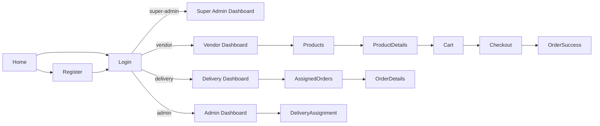
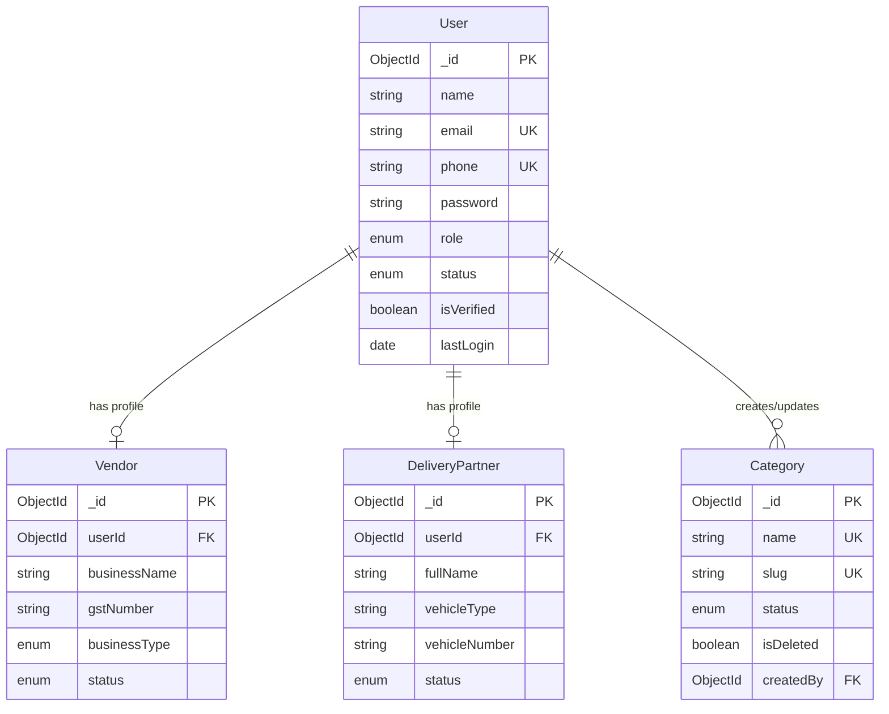

# ME Project — Complete Repository Analysis

**Project Name:** Mokshith B2B Platform  
**Audit Date:** June 11, 2026  
**Auditor Role:** Principal Software Architect / Full-Stack / DevOps / Security / QA / PM  
**Repository Path:** `c:\Users\USER\Documents\ME`  
**Total Files Analyzed:** 211 (excluding `node_modules`, `.git`)

---

## 1. Executive Summary

The **Mokshith B2B Platform** is a wholesale B2B e-commerce application targeting the Indian grocery/wholesale market. It connects four user roles — **Super Admin**, **Admin**, **Vendor**, and **Delivery Partner** — through role-based dashboards and a public marketing landing page.

### Current State at a Glance

| Layer | Status | Summary |
|-------|--------|---------|
| **Frontend UI** | ~88% complete | 44 pages, 4 role portals, rich mock data, professional Tailwind design |
| **Frontend–Backend Integration** | ~3% | Service layer exists but is **never imported** by pages; auth is mock localStorage |
| **Backend API** | ~35% complete | Phases 1–3: auth, profiles, admin approval, categories — **no products/orders/payments** |
| **Database** | ~25% complete | 4 MongoDB collections; no product/order/inventory schemas |
| **Testing** | ~12% complete | 4 unit test files, 5 E2E specs (mostly misaligned with actual UI) |
| **DevOps / CI/CD** | ~5% complete | No Docker, no CI pipelines, no deployment manifests |
| **Security** | ~45% complete | Backend has JWT/RBAC/Helmet/rate-limit; frontend auth is insecure mock |
| **Overall Project** | **~42%** | Strong UI prototype + partial backend foundation; integration gap is the critical blocker |

### Critical Finding

The frontend and backend were built **in parallel but not connected**. The frontend presents a fully functional B2B marketplace (products, cart, checkout, orders, delivery lifecycle) using static mock data. The backend implements user onboarding and category management only. Connecting them requires resolving role naming mismatches (`super-admin` vs `superadmin`), API path mismatches (`/api` vs `/api/v1`), and building ~70% of missing backend domains.

---

## 2. Repository Structure

```
ME/
├── index.html                    # Vite HTML entry
├── package.json                  # Frontend dependencies & scripts
├── package-lock.json
├── vite.config.js                # Vite build config
├── vitest.config.js              # Unit test config
├── playwright.config.ts          # E2E test config
├── tailwind.config.js            # Tailwind theme
├── postcss.config.js             # PostCSS for Tailwind
├── .env.example                  # Frontend env (VITE_API_BASE_URL)
├── README.md                     # Frontend project docs (partially outdated)
├── BACKEND_API_INTEGRATION_REPORT.md  # Integration blueprint (~3000 lines, stale)
├── ME_PROJECT_COMPLETE_ANALYSIS.md    # This document
│
├── src/                          # Frontend (136 files)
│   ├── main.jsx                  # React entry
│   ├── App.jsx                   # Router + route definitions
│   ├── index.css                 # Global styles + Tailwind
│   ├── components/               # 44 reusable components
│   │   ├── admin/                # 8 admin dashboard components
│   │   ├── superadmin/           # 9 super-admin components
│   │   ├── vendor/               # 13 vendor components
│   │   ├── delivery/             # 14 delivery components
│   │   ├── sections/             # 5 landing page sections
│   │   ├── Navbar.jsx, Footer.jsx, Button.jsx, Card.jsx
│   ├── context/                  # AuthContext + tests
│   ├── data/                     # 24 mock data files
│   ├── layouts/                  # 5 layout components
│   ├── pages/                    # 44 page components
│   │   ├── Home/, Auth/, SuperAdmin/, Admin/, Vendor/, DeliveryPartner/
│   ├── routes/                   # ProtectedRoute + tests
│   └── services/                 # 7 API service modules (unused by UI)
│
├── backend/                      # Backend (54 files)
│   ├── server.js                 # HTTP server + graceful shutdown
│   ├── app.js                    # Express app configuration
│   ├── package.json
│   ├── .env.example              # Backend env (contains real-looking secrets)
│   ├── README.md                 # Outdated (Phase 0 only)
│   ├── docs/                     # Postman collections + test docs
│   └── src/
│       ├── config/               # environment.js, database.js
│       ├── constants/            # appConstants, httpStatus, roleConstants
│       ├── controllers/          # 5 controllers
│       ├── middlewares/          # auth, authorize, error, security
│       ├── models/               # User, Vendor, DeliveryPartner, Category
│       ├── routes/               # 7 route modules
│       ├── seeds/                # authSeed.js
│       ├── services/             # 5 service modules
│       ├── utils/                # ApiError, ApiResponse, asyncHandler, authUtils, logger
│       └── validators/           # 6 validator modules
│
└── tests/                        # Test infrastructure
    ├── setup.js                  # Vitest global setup
    └── e2e/                      # 5 Playwright spec files
```

### Repository Map (Logical Domains)

```mermaid
graph TB
    subgraph Public
        Home[Landing Page]
        Login[Login]
        Register[Register]
    end

    subgraph Frontend["Frontend (React SPA)"]
        AuthCtx[AuthContext - Mock]
        MockData[data/ - 24 mock files]
        Services[services/ - Unused API layer]
        Pages[44 Pages - Mock UI]
    end

    subgraph Backend["Backend (Express API)"]
        AuthAPI[/api/v1/auth]
        VendorAPI[/api/v1/vendors]
        DeliveryAPI[/api/v1/delivery-partners]
        AdminAPI[/api/v1/admin/users]
        CategoryAPI[/api/v1/categories]
        MongoDB[(MongoDB)]
    end

    Home --> AuthCtx
    Login --> AuthCtx
    Register --> AuthCtx
    Pages --> MockData
    Services -.->|NOT CONNECTED| AuthAPI
    AuthAPI --> MongoDB
    VendorAPI --> MongoDB
    DeliveryAPI --> MongoDB
    AdminAPI --> MongoDB
    CategoryAPI --> MongoDB
```

---

## 3. Technology Stack

### Frontend Technologies

| Technology | Version | Purpose |
|------------|---------|---------|
| React | 18.2.0 | UI framework |
| Vite | 5.1.4 | Build tool & dev server (port 5173) |
| React Router DOM | 6.22.0 | Client-side routing |
| Tailwind CSS | 3.4.1 | Utility-first styling |
| Axios | 1.6.7 | HTTP client (configured, unused) |
| Recharts | 3.8.1 | Dashboard charts |
| Lucide React | 1.17.0 | Icons |
| React Icons | 5.0.1 | Icons |
| Context API | Built-in | Auth state management |

### Backend Technologies

| Technology | Version | Purpose |
|------------|---------|---------|
| Node.js | ES Modules | Runtime |
| Express | 4.18.2 | HTTP server framework |
| MongoDB / Mongoose | 8.0.3 | Database & ODM |
| bcrypt | 6.0.0 | Password hashing |
| jsonwebtoken | 9.0.3 | JWT authentication |
| express-validator | 7.0.1 | Request validation |
| Helmet | 7.1.0 | Security headers |
| express-rate-limit | 7.1.5 | Rate limiting (100 req/15min) |
| CORS | 2.8.5 | Cross-origin requests |
| Morgan | 1.10.0 | HTTP logging |
| Compression | 1.7.4 | Response compression |
| cookie-parser | 1.4.6 | Cookie parsing |

### Database

- **Engine:** MongoDB (Atlas URI in `.env.example`)
- **ODM:** Mongoose 8
- **Collections:** `users`, `vendors`, `deliverypartners`, `categories`
- **Missing:** products, orders, inventory, cart, invoices, payments, notifications

### Testing Stack

| Tool | Purpose |
|------|---------|
| Vitest 1.1.0 | Unit/component tests (jsdom) |
| @testing-library/react 14.1.2 | Component testing |
| Playwright 1.40.0 | E2E tests (5 browsers) |
| axe-core 4.8.2 | Accessibility (installed, unused) |

### External Services (Configured but Unused)

| Service | Config Location | Status |
|---------|---------------|--------|
| MongoDB Atlas | `backend/.env.example` MONGO_URI | Configured |
| Cloudinary | CLOUDINARY_* env vars | Placeholder only |
| Brevo Email (SMTP) | EMAIL_* env vars | Placeholder only |
| Payment Gateway | Integration report only | Not implemented |

### Authentication & Authorization

| Layer | Mechanism |
|-------|-----------|
| Frontend (current) | Mock localStorage: `user`, `role`, `isAuthenticated` — no JWT |
| Frontend (prepared) | Axios Bearer token from `localStorage.token` |
| Backend | JWT (`Authorization: Bearer <token>`), bcrypt passwords, RBAC middleware |
| Roles (frontend) | `super-admin`, `admin`, `vendor`, `delivery` |
| Roles (backend DB) | `superadmin`, `admin`, `vendor`, `delivery` |

### Deployment Configuration

- **None automated.** No Dockerfile, docker-compose, CI/CD workflows, or hosting manifests.
- Frontend builds to static `dist/` via `vite build`.
- Backend runs via `node server.js` on port 5000 (default).

### Environment Configuration

**Frontend (`.env.example`):**
```
VITE_API_BASE_URL=http://localhost:5000/api
```

**Backend (`backend/.env.example`):**
- `PORT`, `NODE_ENV`, `MONGO_URI`
- `JWT_SECRET`, `JWT_EXPIRE`, `REFRESH_TOKEN_SECRET` (unused), `REFRESH_TOKEN_EXPIRE` (unused)
- `CLIENT_URL=http://localhost:3000` (mismatch — Vite uses 5173)
- Cloudinary, Brevo email, seed user credentials

---

## 4. Architecture Overview

### Frontend Architecture

```
Browser → React Router → ProtectedRoute (role guard) → Layout (sidebar/nav) → Page Component
                                                              ↓
                                                    Mock data from src/data/
                                                    (NOT services/)
```

- **Pattern:** Page-centric with role-specific component libraries (`admin/`, `vendor/`, etc.)
- **State:** Local `useState` per page; global auth via Context API only
- **No custom hooks, no Redux/Zustand, no React Query**

### Backend Architecture

```
HTTP Request → Security (Helmet/CORS/RateLimit) → Route → authenticate → authorize → validate → Controller → Service → Model → MongoDB
                                                                                                                              ↓
                                                                                                                    Error Middleware
```

- **Pattern:** Clean layered architecture (Route → Middleware → Controller → Service → Model)
- **Response format:** Standardized `{ success, statusCode, data, message }` via `ApiResponse`
- **Error format:** `{ success: false, message, errors[] }` via `ApiError`

### Integration Gap Architecture

| Concern | Frontend Expects | Backend Provides | Gap |
|---------|-----------------|------------------|-----|
| API base path | `/api/auth/login` | `/api/v1/auth/login` | Missing `/v1` |
| Auth token | `localStorage.token` | JWT on login response | Never stored by AuthContext |
| Super admin role | `super-admin` | `superadmin` | Naming mismatch |
| Products | Full CRUD UI | Not implemented | 100% gap |
| Orders | Full lifecycle UI | Not implemented | 100% gap |
| Cart/Checkout | Full flow UI | Not implemented | 100% gap |
| Delivery ops | Status updates UI | Not implemented | 100% gap |
| Analytics | Charts with mock data | Not implemented | 100% gap |
| Payments | Checkout UI | Not implemented | 100% gap |

---

## 5. Folder-by-Folder Analysis

### 5.1 Root (`/`)

| File | Purpose | Status |
|------|---------|--------|
| `index.html` | Vite HTML shell with `#root` mount point | Complete |
| `package.json` | Frontend deps, scripts (dev/build/test/lint) | Complete |
| `vite.config.js` | React plugin, default Vite config | Complete |
| `vitest.config.js` | jsdom, coverage thresholds (95%), path aliases | Complete (thresholds unreachable) |
| `playwright.config.ts` | 5 browser projects, auto-starts dev server, JUnit reporter | Complete |
| `tailwind.config.js` | Brand color tokens (primary, secondary, accent, etc.) | Complete |
| `postcss.config.js` | Tailwind + Autoprefixer pipeline | Complete |
| `.env.example` | Single var: `VITE_API_BASE_URL` | Scaffold |
| `README.md` | Project overview; claims Phase 2 dashboards are "planned" but they exist as mock UI | Outdated |
| `BACKEND_API_INTEGRATION_REPORT.md` | 3000-line integration blueprint (PostgreSQL, 50+ endpoints) | Stale vs current MongoDB backend |

### 5.2 Frontend — `src/components/`

**Shared root (4 files):** Presentational primitives used on landing page.

**`admin/` (8 files):** Dashboard UI kit — Card, PageHeader, SearchBar, FilterDropdown, StatusBadge, Modal, NotificationDrawer. Props-driven, no API calls. **Complete (presentational).**

**`superadmin/` (9 files):** Extended admin kit + DashboardCard, DataTable, ActivityFeed. **Complete (presentational).**

**`vendor/` (13 files):** E-commerce UI — ProductCard, CartItem, OrderCard, OrderTimeline, WishlistCard, BulkPricingTable, AnalyticsCard, FilterPanel, plus layout primitives. **Complete (presentational).**

**`delivery/` (14 files):** Delivery ops UI — MetricCard, DeliveryCard, OrderDetailsCard, TimelineTracker, EarningsCard, PerformanceCard, AnalyticsCard, ProfileCard, plus filter/layout primitives. **Complete (presentational).**

**`sections/` (5 files):** Landing page sections — BusinessFeatures, ProductCategories, SocialProof, WholesaleDeals, MobileAppPromotion. **Complete.** Note: ProductCategories links to `/products` which has no route.

### 5.3 Frontend — `src/context/`

| File | Purpose | Security | Status |
|------|---------|----------|--------|
| `AuthContext.jsx` | Global auth state; mock login/register/logout via localStorage | **Low** — accepts any credentials, no password validation, no JWT | Complete (mock) |
| `AuthContext.test.jsx` | 7 tests for mock auth lifecycle | N/A | Complete |

### 5.4 Frontend — `src/data/` (24 mock files)

All files export static JavaScript arrays/objects representing Indian B2B wholesale data (groceries, dal, rice, spices, etc.). **No API calls. No persistence.**

| File | Records | Used By |
|------|---------|---------|
| `products.js` | ~20 admin products | Admin Products |
| `categories.js` | ~10 categories | Admin Categories, Products |
| `inventory.js` | ~20 stock records | Admin Inventory |
| `orders.js` | ~12 platform orders | Admin/SuperAdmin Orders, DeliveryAssignment |
| `vendors.js` | ~10 vendors | Admin/SuperAdmin Vendors |
| `deliveryPartners.js` | ~10 partners | Admin DeliveryAssignment, SuperAdmin |
| `admins.js` | 1 admin profile | Exported via index |
| `analytics.js` | 8 chart datasets | SuperAdmin Analytics, AdminPerformance |
| `vendorProducts.js` | ~100 products | Vendor Products, ProductDetails, Dashboard |
| `vendorCategories.js` | ~10 categories | Vendor Categories, Products |
| `vendorCart.js` | 4 cart items | Vendor Cart, Checkout |
| `vendorOrders.js` | ~53 orders | Vendor Orders, OrderDetails, Dashboard |
| `vendorInvoices.js` | ~17 invoices | Vendor Invoices |
| `vendorWishlist.js` | 5 items | Vendor Wishlist |
| `vendorOffers.js` | 8 offers | Vendor Dashboard |
| `vendorAnalytics.js` | KPIs + charts | Vendor Dashboard, Profile, Orders |
| `deliveryAssignedOrders.js` | ~29 active deliveries | Delivery Dashboard, AssignedOrders, OrderDetails |
| `deliveryHistory.js` | ~16 completed | Delivery History |
| `deliveryEarnings.js` | Earnings breakdown | Delivery Earnings |
| `deliveryPerformance.js` | Metrics/trends | Delivery Performance |
| `deliveryAnalytics.js` | Dashboard KPIs | Delivery Dashboard |
| `deliveryProfile.js` | Partner profile | Delivery Layout, Dashboard, Profile |
| `deliveryNotifications.js` | ~10 notifications | Delivery Layout |
| `index.js` | Barrel re-export | Vendor pages, SuperAdmin AdminPerformance |

### 5.5 Frontend — `src/layouts/` (5 files)

| File | Role | Logout Wired | Status |
|------|------|-------------|--------|
| `SuperAdminLayout.jsx` | super-admin shell | **No** — button present but not connected to AuthContext | Complete (mock UI) |
| `AdminLayout.jsx` | admin shell | **No** | Complete (mock UI) |
| `VendorLayout.jsx` | vendor shell | Partial — navigates to `/login` without clearing auth state | Complete (mock UI) |
| `DeliveryLayout.jsx` | delivery shell | Partial — same as vendor | Complete (mock UI) |
| `DashboardLayout.jsx` | Generic role layout | **Yes** — calls `logout()` correctly | **Legacy/unused** — not in App.jsx |

### 5.6 Frontend — `src/pages/` (44 pages)

See **Section 7 (Frontend Analysis)** for per-page status.

### 5.7 Frontend — `src/routes/`

| File | Purpose | Status |
|------|---------|--------|
| `ProtectedRoute.jsx` | Auth guard + role redirect to correct dashboard | Complete |
| `ProtectedRoute.test.jsx` | Tests a **local mock copy**, not the real component | Partial — misleading coverage |

### 5.8 Frontend — `src/services/` (7 files)

All services define Axios API methods but are **never imported by any page or component**.

| File | Methods | Backend Exists? |
|------|---------|----------------|
| `api.js` | Axios instance, Bearer interceptor, 401 redirect | N/A (client config) |
| `authService.js` | login, register, logout, getCurrentUser, refreshToken | Partial — no `/refresh` endpoint; path missing `/v1` |
| `userService.js` | getAllUsers, getUserById, createUser, updateUser, deleteUser, getUsersByRole | **No** |
| `productService.js` | Full product CRUD + stock + area filter | **No** |
| `orderService.js` | Full order CRUD + status + vendor/area filter | **No** |
| `deliveryService.js` | 18 delivery methods (assign, accept, earnings, route optimize, etc.) | **No** |
| `index.js` | Barrel export | N/A |

### 5.9 Backend — `backend/src/`

| Folder | Files | Purpose |
|--------|-------|---------|
| `config/` | 2 | Environment loading, MongoDB connect/disconnect |
| `constants/` | 3 | API versioning, HTTP status codes, role constants (unused in auth) |
| `controllers/` | 5 | HTTP request handlers for auth, vendor, delivery, admin, category |
| `middlewares/` | 7 | JWT auth, RBAC, error handling, security (Helmet/CORS/rate-limit) |
| `models/` | 4 | User, Vendor, DeliveryPartner, Category Mongoose schemas |
| `routes/` | 7 | Route definitions mounting controllers with middleware chains |
| `services/` | 5 | Business logic layer |
| `utils/` | 5 | ApiError, ApiResponse, asyncHandler, authUtils, logger |
| `validators/` | 6 | express-validator rules + validate middleware |
| `seeds/` | 1 | authSeed.js — creates 4 default users |

### 5.10 Tests — `tests/`

| File | Type | Tests | Alignment |
|------|------|-------|-----------|
| `setup.js` | Vitest setup | localStorage mock, matchMedia mock, jest-dom | Complete |
| `e2e/auth.spec.ts` | E2E | 7 | Low — wrong selectors, duplicate tests |
| `e2e/admin.spec.ts` | E2E | 6 | Low — expects toasts that don't exist |
| `e2e/vendor.spec.ts` | E2E | 5 | Low — product names don't match mock data |
| `e2e/delivery.spec.ts` | E2E | 4 | Low — nav labels differ |
| `e2e/superadmin.spec.ts` | E2E | 5 | Very low — routes `/super-admin/users` don't exist |
| `e2e/accessibility.spec.ts` | E2E | — | **Missing** (referenced in package.json) |

---

## 6. File-by-File Analysis

### 6.1 Frontend Entry & Core

#### `src/main.jsx`
- **Purpose:** React DOM entry point
- **Responsibility:** Mounts `<App />` in StrictMode to `#root`
- **Dependencies:** react, react-dom, App.jsx, index.css
- **Security:** N/A
- **Status:** Complete

#### `src/App.jsx`
- **Purpose:** Root router defining all application routes
- **Responsibility:** Wraps app in AuthProvider; defines 4 protected role trees + 3 public routes
- **Routes:** 39 total (3 public + 36 protected across 4 roles)
- **Dependencies:** React Router, AuthContext, ProtectedRoute, all page/layout imports
- **Security:** Role enforcement delegated to ProtectedRoute
- **Status:** Complete

#### `src/index.css`
- **Purpose:** Global styles
- **Responsibility:** Tailwind directives + utility classes (`.btn-primary`, `.card`, `.input-field`)
- **Status:** Complete

### 6.2 Frontend — Every Component File

| File Path | Main Export | Purpose | Dependencies | Security | Status |
|-----------|-------------|---------|--------------|----------|--------|
| `components/Navbar.jsx` | Navbar | Public navigation with scroll effect | react-router-dom | N/A | Complete |
| `components/Footer.jsx` | Footer | Site footer with links | None | N/A | Complete |
| `components/Button.jsx` | Button | Styled button (variants: primary/secondary/outline, sizes) | None | N/A | Complete |
| `components/Card.jsx` | Card | Generic card wrapper | None | N/A | Complete |
| `components/admin/Card.jsx` | Card | Admin-styled card | None | N/A | Complete |
| `components/admin/PageHeader.jsx` | PageHeader | Title + subtitle + action slot | None | N/A | Complete |
| `components/admin/SearchBar.jsx` | SearchBar | Search input with icon | lucide-react | N/A | Complete |
| `components/admin/FilterDropdown.jsx` | FilterDropdown | Status/category filter select | None | N/A | Complete |
| `components/admin/StatusBadge.jsx` | StatusBadge | Colored status pill | None | N/A | Complete |
| `components/admin/Modal.jsx` | Modal | Dialog overlay with close | None | N/A | Complete |
| `components/admin/NotificationDrawer.jsx` | NotificationDrawer | Slide-out notification panel | None | N/A | Complete |
| `components/superadmin/DashboardCard.jsx` | DashboardCard | KPI card with growth % | lucide-react | N/A | Complete |
| `components/superadmin/PageHeader.jsx` | PageHeader | Page title block | None | N/A | Complete |
| `components/superadmin/DataTable.jsx` | DataTable | Generic table (columns, data, onRowClick) | None | N/A | Complete |
| `components/superadmin/ActivityFeed.jsx` | ActivityFeed | Activity timeline list | None | N/A | Complete |
| `components/superadmin/SearchBar.jsx` | SearchBar | Search input | lucide-react | N/A | Complete |
| `components/superadmin/FilterDropdown.jsx` | FilterDropdown | Filter select | None | N/A | Complete |
| `components/superadmin/StatusBadge.jsx` | StatusBadge | Status pill | None | N/A | Complete |
| `components/superadmin/Modal.jsx` | Modal | Dialog overlay | None | N/A | Complete |
| `components/superadmin/NotificationDrawer.jsx` | NotificationDrawer | Notification panel | None | N/A | Complete |
| `components/vendor/ProductCard.jsx` | ProductCard | Product grid card (price, MOQ, image) | react-router-dom | N/A | Complete |
| `components/vendor/CartItem.jsx` | CartItem | Cart line with qty controls | None | N/A | Complete |
| `components/vendor/OrderCard.jsx` | OrderCard | Order summary card | None | N/A | Complete |
| `components/vendor/OrderTimeline.jsx` | OrderTimeline | Order status step tracker | None | N/A | Complete |
| `components/vendor/WishlistCard.jsx` | WishlistCard | Wishlist product card | None | N/A | Complete |
| `components/vendor/BulkPricingTable.jsx` | BulkPricingTable | Tier pricing table | None | N/A | Complete |
| `components/vendor/AnalyticsCard.jsx` | AnalyticsCard | KPI metric card | None | N/A | Complete |
| `components/vendor/FilterPanel.jsx` | FilterPanel | Advanced filters (category, brand, price, sort) | None | N/A | Complete |
| `components/vendor/PageHeader.jsx` | PageHeader | Page title + actions | None | N/A | Complete |
| `components/vendor/SearchBar.jsx` | SearchBar | Product search | lucide-react | N/A | Complete |
| `components/vendor/StatusBadge.jsx` | StatusBadge | Order/product status pill | None | N/A | Complete |
| `components/vendor/NotificationDrawer.jsx` | NotificationDrawer | Vendor notifications | None | N/A | Complete |
| `components/delivery/MetricCard.jsx` | MetricCard | Dashboard metric tile | None | N/A | Complete |
| `components/delivery/DeliveryCard.jsx` | DeliveryCard | Assigned order card | None | N/A | Complete |
| `components/delivery/OrderDetailsCard.jsx` | OrderDetailsCard | Order info display | None | N/A | Complete |
| `components/delivery/TimelineTracker.jsx` | TimelineTracker | Delivery progress tracker | None | N/A | Complete |
| `components/delivery/EarningsCard.jsx` | EarningsCard | Earnings summary card | None | N/A | Complete |
| `components/delivery/PerformanceCard.jsx` | PerformanceCard | Performance stat card | None | N/A | Complete |
| `components/delivery/AnalyticsCard.jsx` | AnalyticsCard | Chart/stat wrapper | None | N/A | Complete |
| `components/delivery/ProfileCard.jsx` | ProfileCard | Profile summary card | None | N/A | Complete |
| `components/delivery/FilterPanel.jsx` | FilterPanel | Order filter panel | None | N/A | Complete |
| `components/delivery/SearchBar.jsx` | SearchBar | Order search | lucide-react | N/A | Complete |
| `components/delivery/StatusBadge.jsx` | StatusBadge | Delivery status pill | None | N/A | Complete |
| `components/delivery/NotificationDrawer.jsx` | NotificationDrawer | Delivery notifications | None | N/A | Complete |
| `components/sections/BusinessFeatures.jsx` | BusinessFeatures | 6-feature grid for landing | None | N/A | Complete |
| `components/sections/ProductCategories.jsx` | ProductCategories | Category cards with links | react-router-dom | N/A | Complete (broken link `/products`) |
| `components/sections/SocialProof.jsx` | SocialProof | Testimonials and stats | None | N/A | Complete |
| `components/sections/WholesaleDeals.jsx` | WholesaleDeals | Deal showcase section | None | N/A | Complete |
| `components/sections/MobileAppPromotion.jsx` | MobileAppPromotion | App download CTA | None | N/A | Complete |

### 6.3 Frontend — Every Page File

| File Path | Route | Purpose | Data Source | Features | Status |
|-----------|-------|---------|-------------|----------|--------|
| `pages/Home/Home.jsx` | `/` | Marketing landing page (~1650 lines) | Inline mock auth stub | Hero, features, categories, social proof, CTA, embedded CSS | **Complete (mock UI)** — uses local auth stub, not AuthContext |
| `pages/Auth/Login.jsx` | `/login` | Login form + 4 demo login buttons | AuthContext (mock) | Email/password/role select, demo shortcuts | **Complete (mock auth)** |
| `pages/Auth/Register.jsx` | `/register` | Registration form | AuthContext (mock) | Name, email, phone, password, confirm, role | **Complete (mock)** |
| `pages/SuperAdmin/Dashboard.jsx` | `/super-admin/dashboard` | Platform overview | Inline hardcoded | KPI cards, quick actions, activity feed | **Complete (mock UI)** |
| `pages/SuperAdmin/Platform.jsx` | `/super-admin/platform` | System health monitoring | Inline hardcoded | Server status, uptime, API health | **Complete (mock UI)** |
| `pages/SuperAdmin/AdminPerformance.jsx` | `/super-admin/admin-performance` | Admin KPI comparison | analytics.js | Performance charts, admin comparison | **Complete (mock UI)** |
| `pages/SuperAdmin/Vendors.jsx` | `/super-admin/vendors` | Vendor management table | vendors.js | Search, filter, status badges | **Complete (mock UI)** |
| `pages/SuperAdmin/DeliveryPartners.jsx` | `/super-admin/delivery-partners` | Partner management | deliveryPartners.js | Search, filter, table view | **Complete (mock UI)** |
| `pages/SuperAdmin/Orders.jsx` | `/super-admin/orders` | Orders overview | orders.js | Table with status filters | **Complete (mock UI)** |
| `pages/SuperAdmin/Analytics.jsx` | `/super-admin/analytics` | Platform analytics | analytics.js | Recharts dashboards | **Complete (mock UI)** |
| `pages/SuperAdmin/Settings.jsx` | `/super-admin/settings` | Settings tabs | Local state | Profile, notifications, security | **UI Only** — no persistence |
| `pages/Admin/Dashboard.jsx` | `/admin/dashboard` | Operations dashboard | Inline hardcoded | KPI cards, recent activity | **Complete (mock UI)** |
| `pages/Admin/Products.jsx` | `/admin/products` | Product management | products.js, categories.js | List, add modal, view modal | **Complete (mock UI)** — modals don't persist |
| `pages/Admin/Categories.jsx` | `/admin/categories` | Category CRUD | categories.js | List, add, edit UI | **Complete (mock UI)** — no persistence |
| `pages/Admin/Inventory.jsx` | `/admin/inventory` | Stock management | inventory.js | Stock levels, restock modal | **Complete (mock UI)** |
| `pages/Admin/Vendors.jsx` | `/admin/vendors` | Vendor list | vendors.js | Search, view modal | **Complete (mock UI)** |
| `pages/Admin/Orders.jsx` | `/admin/orders` | Order management | orders.js | List, view modal, status filter | **Complete (mock UI)** |
| `pages/Admin/DeliveryAssignment.jsx` | `/admin/delivery-assignment` | Assign partners to orders | orders.js, deliveryPartners.js | Assignment modal | **Complete (mock UI)** — console.log only |
| `pages/Admin/Reports.jsx` | `/admin/reports` | Report download cards | Inline hardcoded | Download buttons | **UI Only** — non-functional |
| `pages/Admin/Analytics.jsx` | `/admin/analytics` | Admin analytics | Inline chart arrays | Recharts | **Complete (mock UI)** |
| `pages/Admin/Settings.jsx` | `/admin/settings` | Admin settings | Local state | Profile, area config tabs | **UI Only** |
| `pages/Vendor/Dashboard.jsx` | `/vendor/dashboard` | Vendor home | vendorAnalytics, vendorOrders, vendorProducts, vendorOffers | KPIs, recent orders, offers | **Complete (mock UI)** |
| `pages/Vendor/Products.jsx` | `/vendor/products` | Product browse | vendorProducts, vendorCategories | Search, filters, grid/list toggle | **Complete (mock UI)** |
| `pages/Vendor/ProductDetails.jsx` | `/vendor/products/:id` | Product detail | vendorProducts | Bulk pricing, add to cart | **Complete (mock UI)** |
| `pages/Vendor/Categories.jsx` | `/vendor/categories` | Category grid | vendorCategories | Category tiles | **Complete (mock UI)** |
| `pages/Vendor/Cart.jsx` | `/vendor/cart` | Shopping cart | vendorCart (local state) | Qty controls, totals | **Complete (mock UI)** |
| `pages/Vendor/Checkout.jsx` | `/vendor/checkout` | Checkout form | vendorCart | Address, payment method select | **UI Only** — no order API |
| `pages/Vendor/OrderSuccess.jsx` | `/vendor/order-success` | Order confirmation | Random order number | Success message | **UI Only** |
| `pages/Vendor/Orders.jsx` | `/vendor/orders` | Order history | vendorOrders, vendorAnalytics | Status filter, list | **Complete (mock UI)** |
| `pages/Vendor/OrderDetails.jsx` | `/vendor/orders/:id` | Single order view | vendorOrders | Timeline, items | **Complete (mock UI)** |
| `pages/Vendor/Invoices.jsx` | `/vendor/invoices`, `/vendor/invoices/:id` | Invoice list/detail | vendorInvoices | List + detail view | **Complete (mock UI)** |
| `pages/Vendor/Wishlist.jsx` | `/vendor/wishlist` | Wishlist grid | vendorWishlist | Product cards | **Complete (mock UI)** |
| `pages/Vendor/Profile.jsx` | `/vendor/profile` | Business profile | vendorAnalytics | Profile display | **Complete (mock UI)** |
| `pages/Vendor/Settings.jsx` | `/vendor/settings` | Account settings | Local state | Account, notifications, security tabs | **UI Only** |
| `pages/DeliveryPartner/Dashboard.jsx` | `/delivery/dashboard` | Delivery ops overview | deliveryAnalytics, assignedOrders, deliveryProfile | KPIs, active deliveries | **Complete (mock UI)** |
| `pages/DeliveryPartner/AssignedOrders.jsx` | `/delivery/assigned-orders` | Filterable order list | assignedOrders | Search, status filter | **Complete (mock UI)** |
| `pages/DeliveryPartner/OrderDetails.jsx` | `/delivery/order-details/:id` | Status updates, proof upload | assignedOrders | Accept, pickup, deliver actions | **Complete (mock UI)** — local state only |
| `pages/DeliveryPartner/History.jsx` | `/delivery/history` | Past deliveries | deliveryHistory | Completed deliveries list | **Complete (mock UI)** |
| `pages/DeliveryPartner/Earnings.jsx` | `/delivery/earnings` | Earnings charts | deliveryEarnings | Weekly/monthly charts, bonus info | **Complete (mock UI)** |
| `pages/DeliveryPartner/Performance.jsx` | `/delivery/performance` | Metrics and achievements | deliveryPerformance | Trends, badges | **Complete (mock UI)** |
| `pages/DeliveryPartner/Profile.jsx` | `/delivery/profile` | Editable profile | deliveryProfile | Form fields | **UI Only** — local state only |
| `pages/DeliveryPartner/Settings.jsx` | `/delivery/settings` | Settings (~500 lines) | Local state | Profile, notifications, delivery prefs | **UI Only** |

### 6.4 Backend — Every File

#### Entry Points

| File | Purpose | Key Exports | DB Ops |
|------|---------|-------------|--------|
| `backend/server.js` | HTTP server startup, DB connect, graceful shutdown (SIGTERM/SIGINT), unhandled rejection handler | default server | connectDatabase, disconnectDatabase |
| `backend/app.js` | Express configuration: body parser, cookies, compression, morgan, security, routes at `/api/v1`, 404 + error handler | default app | None |
| `backend/package.json` | Dependencies, scripts (start, dev, seed) | N/A | N/A |

#### Config

| File | Purpose | Exports |
|------|---------|---------|
| `src/config/environment.js` | Loads dotenv; exposes port, nodeEnv, mongoUri, jwtSecret, jwtExpire, clientUrl, cloudinary, email | default config |
| `src/config/database.js` | Mongoose connection management | connectDatabase, disconnectDatabase |

#### Constants

| File | Purpose | Exports | Notes |
|------|---------|---------|-------|
| `src/constants/appConstants.js` | API prefix `/api`, version `v1`, pagination defaults | AppConstants | Used in app.js route mounting |
| `src/constants/httpStatus.js` | HTTP status code constants | HttpStatus | Used in services |
| `src/constants/roleConstants.js` | Role names (SUPER_ADMIN, etc.) and hierarchy | RoleConstants, RoleHierarchy | **Unused** — DB uses lowercase without hyphens |

#### Utils

| File | Purpose | Exports | Security Relevance |
|------|---------|---------|-------------------|
| `src/utils/ApiError.js` | Custom error class (statusCode, message, errors[]) | default ApiError | Standardized error responses |
| `src/utils/ApiResponse.js` | Success response wrapper | default ApiResponse | Consistent API format |
| `src/utils/asyncHandler.js` | Async route wrapper, forwards errors to middleware | default asyncHandler | Prevents unhandled promise rejections |
| `src/utils/authUtils.js` | bcrypt hash/compare, JWT sign/verify | hashPassword, comparePassword, generateToken, verifyToken | **Critical** — password + token security |
| `src/utils/logger.js` | Console logger (info/error/warn/debug) | default logger | Operational logging |

#### Middleware

| File | Purpose | Exports | Security |
|------|---------|---------|----------|
| `src/middlewares/authenticate.js` | Validates Bearer JWT, loads user, attaches req.user; rejects suspended (403) | authenticate | **High** — does NOT block pending users |
| `src/middlewares/authorize.js` | Role-based access control factory | authorize(...roles) | **High** |
| `src/middlewares/errorMiddleware.js` | Global error handler, normalizes ApiError/Mongoose/JWT errors | default errorHandler | Medium |
| `src/middlewares/notFoundMiddleware.js` | 404 handler | default notFound | Low |
| `src/middlewares/security/index.js` | Helmet, CORS (CLIENT_URL), rate limit (100/15min on /api/) | default setupSecurity | **High** |
| `src/middlewares/security/rateLimiter.js` | Reusable rate limiter factory | createRateLimiter | **Unused** |
| `src/middlewares/security/sanitization.js` | Input sanitization placeholder | sanitizeInput | **Placeholder** — pass-through only |

#### Models

| File | Collection | Key Fields | Indexes | Relationships |
|------|-----------|------------|---------|---------------|
| `src/models/User.js` | users | name, email (unique), phone (unique), password (select:false), role, status, isVerified, lastLogin | email, phone unique | Referenced by Vendor, DeliveryPartner, Category |
| `src/models/Vendor.js` | vendors | userId (ref User, unique), businessName, ownerName, gstNumber, businessType, address, city, state, pincode, status | userId, status, businessName, email | userId → User |
| `src/models/DeliveryPartner.js` | deliverypartners | userId (ref User, unique), fullName, vehicleType, vehicleNumber, drivingLicense, address, status | userId, status, fullName, email | userId → User |
| `src/models/Category.js` | categories | name (unique), slug (auto, unique), description, image, status, sortOrder, isDeleted, deletedAt, createdBy, updatedBy | name, slug, status, isDeleted, sortOrder, createdAt | createdBy/updatedBy → User |

#### Services, Controllers, Routes, Validators, Seeds

See **Sections 9 (Backend Analysis)** and **Section 11 (API Documentation)** for complete details on all 5 services, 5 controllers, 7 route modules, 6 validator modules, and authSeed.js.

---

## 7. Frontend Analysis

### 7.1 Landing Page

| Page | Route | Purpose | Features | Status |
|------|-------|---------|----------|--------|
| Home | `/` | Marketing/conversion page | Hero, business features, product categories, social proof, wholesale deals, mobile app promo, embedded responsive CSS | **Complete (mock UI)** |

**Issues:** Uses local auth stub instead of AuthContext; links to `/products`, `/dashboard`, `/pricing` have no routes.

### 7.2 Authentication Pages

| Page | Route | Purpose | Features | Status |
|------|-------|---------|----------|--------|
| Login | `/login` | User authentication | Email/password/role form, 4 demo login buttons (Super Admin, Admin, Vendor, Delivery) | **Complete (mock auth)** |
| Register | `/register` | User registration | Name, email, phone, password, confirm password, role select; redirects to login on success | **Complete (mock)** |

### 7.3 Super Admin Dashboard (8 pages)

| Page | Route | Purpose | Status |
|------|-------|---------|--------|
| Dashboard | `/super-admin/dashboard` | Platform KPIs, quick actions | **Complete (mock UI)** |
| Platform | `/super-admin/platform` | System health monitoring | **Complete (mock UI)** |
| Admin Performance | `/super-admin/admin-performance` | Admin KPI comparison charts | **Complete (mock UI)** |
| Vendors | `/super-admin/vendors` | Vendor registry management | **Complete (mock UI)** |
| Delivery Partners | `/super-admin/delivery-partners` | Partner registry | **Complete (mock UI)** |
| Orders | `/super-admin/orders` | Platform-wide orders | **Complete (mock UI)** |
| Analytics | `/super-admin/analytics` | Revenue/growth charts (Recharts) | **Complete (mock UI)** |
| Settings | `/super-admin/settings` | Profile/notifications/security | **UI Only** |

### 7.4 Admin Dashboard (10 pages)

| Page | Route | Purpose | Status |
|------|-------|---------|--------|
| Dashboard | `/admin/dashboard` | Operations overview | **Complete (mock UI)** |
| Products | `/admin/products` | Product CRUD UI | **Complete (mock UI)** |
| Categories | `/admin/categories` | Category management | **Complete (mock UI)** |
| Inventory | `/admin/inventory` | Stock management | **Complete (mock UI)** |
| Vendors | `/admin/vendors` | Vendor list/view | **Complete (mock UI)** |
| Orders | `/admin/orders` | Order management | **Complete (mock UI)** |
| Delivery Assignment | `/admin/delivery-assignment` | Partner assignment | **Complete (mock UI)** |
| Reports | `/admin/reports` | Report downloads | **UI Only** |
| Analytics | `/admin/analytics` | Area analytics charts | **Complete (mock UI)** |
| Settings | `/admin/settings` | Admin configuration | **UI Only** |

### 7.5 Vendor Portal (13 pages)

| Page | Route | Purpose | Status |
|------|-------|---------|--------|
| Dashboard | `/vendor/dashboard` | Vendor home with KPIs | **Complete (mock UI)** |
| Products | `/vendor/products` | Product catalog browse | **Complete (mock UI)** |
| Product Details | `/vendor/products/:id` | Single product + bulk pricing | **Complete (mock UI)** |
| Categories | `/vendor/categories` | Category browsing | **Complete (mock UI)** |
| Cart | `/vendor/cart` | Shopping cart | **Complete (mock UI)** |
| Checkout | `/vendor/checkout` | Order placement form | **UI Only** |
| Order Success | `/vendor/order-success` | Confirmation page | **UI Only** |
| Orders | `/vendor/orders` | Order history | **Complete (mock UI)** |
| Order Details | `/vendor/orders/:id` | Single order view | **Complete (mock UI)** |
| Invoices | `/vendor/invoices` | Invoice management | **Complete (mock UI)** |
| Wishlist | `/vendor/wishlist` | Saved products | **Complete (mock UI)** |
| Profile | `/vendor/profile` | Business profile | **Complete (mock UI)** |
| Settings | `/vendor/settings` | Account settings | **UI Only** |

### 7.6 Delivery Partner Portal (8 pages)

| Page | Route | Purpose | Status |
|------|-------|---------|--------|
| Dashboard | `/delivery/dashboard` | Delivery ops overview | **Complete (mock UI)** |
| Assigned Orders | `/delivery/assigned-orders` | Active delivery list | **Complete (mock UI)** |
| Order Details | `/delivery/order-details/:id` | Status updates, proof upload | **Complete (mock UI)** |
| History | `/delivery/history` | Completed deliveries | **Complete (mock UI)** |
| Earnings | `/delivery/earnings` | Earnings breakdown + charts | **Complete (mock UI)** |
| Performance | `/delivery/performance` | Metrics and achievements | **Complete (mock UI)** |
| Profile | `/delivery/profile` | Partner profile | **UI Only** |
| Settings | `/delivery/settings` | Preferences | **UI Only** |

### 7.7 Navigation Flows



### 7.8 Component Architecture

- **Pattern:** Role-scoped component libraries mirroring dashboard needs
- **Composition:** Pages compose role-specific components + import mock data directly
- **No shared state** beyond AuthContext
- **No data fetching layer** (React Query/SWR absent)
- **Charts:** Recharts used in analytics pages

### 7.9 State Management

| Scope | Mechanism | Data |
|-------|-----------|------|
| Global auth | AuthContext (Context API) | user, role, isAuthenticated, loading |
| Page-level | useState per page | Filters, modals, form inputs, local cart qty |
| Persistent | localStorage (auth only) | user, role, isAuthenticated |
| Server state | None | All data is static imports |

### 7.10 API Integrations

**None active.** All 7 service modules are dead code from the UI perspective.

### 7.11 Responsive Design

- Tailwind responsive classes used throughout (`sm:`, `md:`, `lg:`, `xl:`)
- Sidebar collapses on mobile in layout components
- Landing page has extensive embedded responsive CSS
- Playwright tests include Mobile Chrome and Mobile Safari projects

### 7.12 Accessibility

- Some semantic HTML in forms (labels, required attributes)
- No ARIA landmarks systematically applied
- No skip navigation links
- `axe-core` installed but no accessibility tests exist
- Color contrast generally good with defined brand palette

---

## 8. UI/UX Analysis

### 8.1 Design System

| Token | Value | Usage |
|-------|-------|-------|
| Primary | `#0F172A` | Headers, sidebar backgrounds |
| Secondary | `#2563EB` | Buttons, links, accents |
| Accent | `#38BDF8` | Highlights, badges |
| Background | `#F8FAFC` | Page backgrounds |
| Success | `#10B981` | Active/approved statuses |
| Warning | `#F59E0B` | Pending statuses |
| Danger | `#EF4444` | Error/rejected statuses |

**Style:** Modern SaaS / Enterprise B2B — clean cards, soft shadows, rounded corners, generous spacing.

### 8.2 Layout Structure

- **Public pages:** Navbar + content + Footer
- **Dashboard pages:** Fixed sidebar (role-specific nav) + top header (search, notifications, profile) + main content area
- **Consistent patterns:** PageHeader → filters/search → data table or card grid → modals for CRUD

### 8.3 User Flows

| Flow | Steps | UX Quality |
|------|-------|------------|
| Demo login | Click demo button → dashboard | Excellent — instant role access |
| Vendor purchase | Browse → detail → cart → checkout → success | Good UI flow — no real persistence |
| Admin product mgmt | List → add modal → view modal | Good — modals feel complete |
| Delivery lifecycle | Assigned → details → status update | Good — timeline tracker is intuitive |
| Registration | Fill form → redirect to login | Adequate — no onboarding wizard |

### 8.4 UX Strengths

1. **Role-specific dashboards** feel purpose-built, not generic templates
2. **Rich mock data** makes demos convincing (Indian wholesale context)
3. **Consistent component patterns** across roles reduce cognitive load
4. **Demo login buttons** enable instant stakeholder demos
5. **Bulk pricing tables** and MOQ displays show B2B-specific thinking
6. **Recharts integration** provides professional analytics visuals

### 8.5 UX Weaknesses

1. **No feedback toasts** — actions log to console instead of user-visible confirmation
2. **Logout broken** in active layouts — session persists after "logout"
3. **Broken landing page links** — `/products`, `/pricing` lead to 404 (redirect home)
4. **No loading/error states** for data fetching (because there is no fetching)
5. **No empty states** for filtered results with zero matches
6. **Settings pages** appear functional but save nothing
7. **No breadcrumb navigation** in deep pages (vendor product details)
8. **No dark mode** toggle despite modern SaaS expectation

### 8.6 Dashboard Quality

| Portal | Quality (1-10) | Notes |
|--------|----------------|-------|
| Super Admin | 8 | Comprehensive platform view, good KPI cards |
| Admin | 8 | Full ops toolkit, delivery assignment is standout |
| Vendor | 9 | Most complete — full e-commerce flow |
| Delivery | 8 | Good lifecycle tracking, earnings/performance |

### 8.7 Mobile Responsiveness

- Layouts adapt with collapsible sidebars
- Grid layouts reflow to single column
- Landing page has dedicated mobile CSS
- Tables may overflow horizontally on small screens (no horizontal scroll wrapper)

### 8.8 What Makes This Frontend Unique

1. **Four-role B2B wholesale platform** in a single SPA — uncommon scope for a prototype
2. **Indian market context** — GST numbers, pincode validation, regional product names, ₹ pricing
3. **Bulk pricing tiers** and MOQ enforcement UI — true B2B, not B2C with a wholesale label
4. **Delivery partner as first-class role** with earnings/performance gamification
5. **Admin area-based operations** concept in settings (prepared for geographic admin assignment)

---

## 9. Backend Analysis

### 9.1 Complete Execution Flow

```
1. Client sends HTTP request
2. server.js receives on PORT (default 5000)
3. app.js middleware chain:
   a. express.json() + urlencoded parsing
   b. cookie-parser
   c. compression
   d. morgan logging
   e. setupSecurity: Helmet headers + CORS + rate limiter (100 req/15min)
4. Route matching at /api/v1/*
5. Route-specific middleware chain:
   a. authenticate (JWT verify → User.findById → req.user)
   b. authorize(required roles)
   c. express-validator rules
   d. validate (throws ApiError 400 on failure)
6. Controller handler (asyncHandler wrapped)
7. Service layer (business logic, DB queries)
8. Mongoose Model → MongoDB
9. ApiResponse JSON returned
10. On error → errorMiddleware → standardized error JSON
```

### 9.2 Routes Summary

| Route Module | Mount Path | Endpoints | Auth Required |
|-------------|------------|-----------|---------------|
| healthRoutes | `/health` | 1 | No |
| authRoutes | `/auth` | 5 | Mixed |
| vendorRoutes | `/vendors` | 5 | Yes |
| deliveryPartnerRoutes | `/delivery-partners` | 5 | Yes |
| adminUserRoutes | `/admin/users` | 11 | Yes (admin/superadmin) |
| categoryRoutes | `/categories` | 7 | Yes |
| index (root) | `/` | 1 | No |
| **Total** | | **35** | |

**Future placeholders (commented out):** `/products`, `/orders`

### 9.3 Controllers

| Controller | Handlers | Pattern |
|-----------|----------|---------|
| authController | register, login, logout, getCurrentUser, changePassword | Extract body → service → ApiResponse |
| vendorController | createProfile, getProfile, updateProfile, getVendor, getAllVendors | Same |
| deliveryPartnerController | createProfile, getProfile, updateProfile, getDeliveryPartner, getAllDeliveryPartners | Same |
| adminUserController | 11 handlers (lists, pending queues, approve/reject/suspend, statistics) | Same |
| categoryController | createCategory, getCategories, getCategoryById, updateCategory, deleteCategory, updateCategoryStatus, getDeletedCategories | Same |

### 9.4 Services — Business Logic

| Service | Key Functions | DB Operations |
|---------|--------------|---------------|
| authService | registerUser, loginUser, logoutUser, getCurrentUser, changePassword | User findOne/create/findById/save |
| vendorService | createProfile, getProfile, updateProfile, getVendorById, getAllVendors, updateVendorStatus | Vendor + User CRUD, populate |
| deliveryPartnerService | Same pattern for delivery partners | DeliveryPartner + User CRUD |
| adminUserService | getAllVendorsForAdmin, getAllDeliveryPartnersForAdmin, getPending*, approve/reject/suspend*, getStatistics | Vendor/DeliveryPartner/User countDocuments/find/save |
| categoryService | createCategory, getCategories, getCategoryById, updateCategory, deleteCategory (soft), updateCategoryStatus, getDeletedCategories | Category CRUD with soft delete |

### 9.5 Authentication Flow

1. **Register:** POST `/api/v1/auth/register` → creates User (status: pending) → returns JWT + user
2. **Login:** POST `/api/v1/auth/login` → validates credentials → blocks pending/suspended/inactive → updates lastLogin → returns JWT
3. **Protected routes:** Bearer token → verify JWT → load user → check role
4. **Logout:** POST `/api/v1/auth/logout` → stateless (client removes token)
5. **Change password:** PUT `/api/v1/auth/change-password` → verify current → hash new

### 9.6 Authorization (RBAC)

| Role | Permissions |
|------|------------|
| superadmin | Read vendors/delivery lists, statistics, categories |
| admin | Full admin user mgmt, category CRUD, approval workflows |
| vendor | Own vendor profile CRUD, read categories |
| delivery | Own delivery profile CRUD |

### 9.7 Validation

- **express-validator** chains on all write endpoints
- Shared rules in `validationRules.js`: MongoDB ID, pagination, email, password, name, phone
- Domain validators: auth, vendor (GST regex, pincode), delivery (vehicle, license), category
- Central `validate` middleware throws ApiError(400) with error array

### 9.8 Error Handling

- `ApiError` class for operational errors with statusCode
- Global handler catches: ApiError, Mongoose ValidationError/CastError, JWT errors, duplicate key (11000)
- Development mode includes stack trace
- 404 handler for unknown routes

### 9.9 Logging

- Morgan HTTP logging (dev: 'dev', prod: 'combined')
- Custom logger utility (console-based, no file rotation or external service)

---

## 10. Database Documentation

### 10.1 Collections Overview

| Collection | Model | Documents Expected | Purpose |
|-----------|-------|-------------------|---------|
| users | User | Seeded: 4 | Authentication, roles, account status |
| vendors | Vendor | 0 (created on profile submit) | Vendor business profiles |
| deliverypartners | DeliveryPartner | 0 (created on profile submit) | Delivery partner profiles |
| categories | Category | 0 (created by admin) | Product categorization |

### 10.2 Entity Relationship Diagram



### 10.3 Schema Details

#### User Schema
- **Password:** bcrypt hashed on pre-save (salt rounds: 10), excluded from queries by default (`select: false`)
- **Role enum:** `superadmin`, `admin`, `vendor`, `delivery`
- **Status enum:** `active`, `inactive`, `suspended`, `pending` — **missing `rejected`** (bug: adminUserService sets `rejected`)
- **Methods:** `comparePassword()`, `toJSON()` (strips password)

#### Vendor Schema
- **GST validation:** Regex `^[0-9]{2}[A-Z]{5}[0-9]{4}[A-Z]{1}[1-9A-Z]{1}Z[0-9A-Z]{1}$`
- **Pincode:** 6-digit regex
- **Business type enum:** sole_proprietorship, partnership, llp, pvt_ltd, public_ltd
- **Status enum:** pending, active, inactive, suspended, rejected

#### DeliveryPartner Schema
- **Vehicle type:** Required string (not enum-constrained in schema)
- **Status enum:** Same as Vendor

#### Category Schema
- **Slug:** Auto-generated from name on pre-save, uniqueness enforced with counter suffix
- **Soft delete:** `isDeleted: true` + `deletedAt` timestamp
- **Indexes:** name, slug, status, isDeleted, sortOrder, createdAt

### 10.4 Data Flow

```
Registration → User(pending) → Profile creation → Vendor/DeliveryPartner(pending)
    → Admin approve → User(active) + Profile(active)
    → Admin reject → Profile(rejected) + User(rejected) [BUG: User enum lacks rejected]
    → Admin suspend → Profile(suspended) + User(suspended)

Category: Admin create → Category(active) → Admin soft delete → Category(isDeleted:true)
    → Admin can list deleted via /deleted/list [BUG: route order]
```

### 10.5 Missing Schemas (Required by Frontend)

| Entity | Frontend Usage | Backend Status |
|--------|---------------|----------------|
| Product | Admin Products, Vendor catalog | **Not implemented** |
| Order | All role order pages | **Not implemented** |
| OrderItem | Order details | **Not implemented** |
| Inventory | Admin Inventory | **Not implemented** |
| Cart | Vendor Cart/Checkout | **Not implemented** |
| Invoice | Vendor Invoices | **Not implemented** |
| Payment | Vendor Checkout | **Not implemented** |
| Notification | All notification drawers | **Not implemented** |
| DeliveryAssignment | Admin DeliveryAssignment | **Not implemented** |
| Earnings | Delivery Earnings | **Not implemented** |

---

## 11. API Documentation

**Base URL:** `http://localhost:5000/api/v1`  
**Auth Header:** `Authorization: Bearer <JWT>`  
**Response Format:** `{ success, statusCode, data, message }`

### 11.1 Root & Health

#### GET `/`
- **Auth:** None
- **Response:** `{ success: true, message: "Mokshith B2B Backend API Running" }`

#### GET `/api/v1/health`
- **Auth:** None
- **Response:** `{ success, status: "UP", environment, timestamp }`

### 11.2 Auth Endpoints

#### POST `/api/v1/auth/register`
- **Auth:** None
- **Validation:** name, email, phone, password (min 8), confirmPassword, role (vendor|delivery)
- **Request:**
```json
{
  "name": "string",
  "email": "string",
  "phone": "string",
  "password": "string",
  "confirmPassword": "string",
  "role": "vendor | delivery"
}
```
- **Response:** `{ user, token }` — user status: pending
- **DB:** User.create

#### POST `/api/v1/auth/login`
- **Auth:** None
- **Validation:** email, password
- **Request:** `{ "email": "string", "password": "string" }`
- **Response:** `{ user, token }`
- **DB:** User.findOne (with password), update lastLogin
- **Blocks:** pending (403), suspended (403), inactive (403)

#### POST `/api/v1/auth/logout`
- **Auth:** JWT (any role)
- **Response:** `{ message: "Logged out successfully" }`

#### GET `/api/v1/auth/me`
- **Auth:** JWT (any role)
- **Response:** `{ user }`
- **DB:** User.findById

#### PUT `/api/v1/auth/change-password`
- **Auth:** JWT (any role)
- **Validation:** currentPassword, newPassword (min 8), confirmPassword
- **Request:** `{ "currentPassword", "newPassword", "confirmPassword" }`
- **DB:** User.findById (+password), compare, save new hash

### 11.3 Vendor Endpoints

#### POST `/api/v1/vendors/profile`
- **Auth:** JWT, role: vendor
- **Validation:** businessName, ownerName, phone, email, gstNumber, businessType, address, city, state, pincode
- **DB:** Vendor.create (status: pending)

#### GET `/api/v1/vendors/profile`
- **Auth:** JWT, role: vendor
- **DB:** Vendor.findOne({ userId }).populate('userId')

#### PUT `/api/v1/vendors/profile`
- **Auth:** JWT, role: vendor
- **Validation:** Partial update fields
- **DB:** Vendor.findOneAndUpdate

#### GET `/api/v1/vendors`
- **Auth:** JWT, roles: admin, superadmin
- **Query:** search, status, businessName, email, page, limit
- **DB:** Vendor.find with pagination, populate userId

#### GET `/api/v1/vendors/:id`
- **Auth:** JWT, roles: admin, superadmin
- **DB:** Vendor.findById, populate userId

### 11.4 Delivery Partner Endpoints

Same pattern as vendors with delivery-specific fields (fullName, vehicleType, vehicleNumber, drivingLicense).

| Method | Path | Auth Roles |
|--------|------|-----------|
| POST | `/delivery-partners/profile` | delivery |
| GET | `/delivery-partners/profile` | delivery |
| PUT | `/delivery-partners/profile` | delivery |
| GET | `/delivery-partners` | admin, superadmin |
| GET | `/delivery-partners/:id` | admin, superadmin |

### 11.5 Admin User Management Endpoints

| Method | Path | Auth | Purpose | DB Ops |
|--------|------|------|---------|--------|
| GET | `/admin/users/vendors` | admin, superadmin | List vendors | Vendor.find paginated |
| GET | `/admin/users/delivery-partners` | admin, superadmin | List partners | DeliveryPartner.find paginated |
| GET | `/admin/users/pending-vendors` | admin | Pending queue | Vendor.find({ status: pending }) |
| GET | `/admin/users/pending-deliveries` | admin | Pending queue | DeliveryPartner.find({ status: pending }) |
| PUT | `/admin/users/vendors/:id/approve` | admin | Approve vendor | Vendor→active, User→active+verified |
| PUT | `/admin/users/vendors/:id/reject` | admin | Reject vendor | Vendor→rejected, User→rejected |
| PUT | `/admin/users/vendors/:id/suspend` | admin | Suspend vendor | Vendor→suspended, User→suspended |
| PUT | `/admin/users/delivery/:id/approve` | admin | Approve partner | Same pattern |
| PUT | `/admin/users/delivery/:id/reject` | admin | Reject partner | Same pattern |
| PUT | `/admin/users/delivery/:id/suspend` | admin | Suspend partner | Same pattern |
| GET | `/admin/users/statistics` | admin, superadmin | Counts by status | countDocuments |

### 11.6 Category Endpoints

| Method | Path | Auth | Purpose | DB Ops |
|--------|------|------|---------|--------|
| POST | `/categories` | admin | Create category | Category.create (auto slug) |
| GET | `/categories` | admin, superadmin, vendor | List with search/filter/sort/pagination | Category.find |
| GET | `/categories/:id` | admin, superadmin, vendor | Get by ID | Category.findById |
| PUT | `/categories/:id` | admin | Update | Category.findByIdAndUpdate |
| DELETE | `/categories/:id` | admin | Soft delete | isDeleted=true, deletedAt=now |
| PATCH | `/categories/:id/status` | admin | Toggle active/inactive | Category status update |
| GET | `/categories/deleted/list` | admin | List deleted | Category.find({ isDeleted: true }) — **ROUTE ORDER BUG** |

### 11.7 Known API Bugs

1. **`GET /categories/deleted/list`** registered after `GET /categories/:id` — Express matches "deleted" as `:id`
2. **User.status `rejected`** not in enum — reject operations may fail Mongoose validation
3. **Pending users get JWT on register** but authenticate middleware doesn't block pending status
4. **Frontend API path** uses `/api` not `/api/v1` — all frontend service calls would 404
5. **Frontend authService** calls `/auth/refresh` — endpoint doesn't exist
6. **Role mismatch:** frontend `super-admin` vs backend `superadmin`

---

## 12. Business Workflow Analysis

### 12.1 User (Registration) Workflow

**Frontend (mock):**
1. User visits `/register`
2. Fills name, email, phone, password, role
3. Mock register resolves → redirect to `/login`
4. No approval gate — any credentials work on login

**Backend (real):**
1. POST `/auth/register` with role vendor or delivery
2. User created with status `pending`, isVerified `false`
3. JWT returned (can access protected routes despite pending status — bug)
4. Login blocked until admin approves (403 on pending)
5. User must create vendor/delivery profile separately

**Gap:** Frontend bypasses entire approval workflow.

### 12.2 Vendor Workflow

**Intended (from UI):**
1. Register/login as vendor
2. Browse product catalog by category
3. View product details with bulk pricing tiers
4. Add to cart (respecting MOQ)
5. Checkout with address + payment method
6. Track orders with timeline
7. View/download invoices
8. Manage wishlist
9. View analytics dashboard

**Current:** Steps 2-9 work with mock data. No persistence. Checkout doesn't create orders.

**Backend available:** Profile CRUD + category read only.

### 12.3 Admin Workflow

**Intended (from UI):**
1. Login as admin
2. Manage products (CRUD)
3. Manage categories
4. Monitor inventory levels, restock
5. View/manage vendors
6. Process orders
7. Assign delivery partners to orders
8. Generate reports
9. View area analytics
10. Configure settings (area coverage)

**Current:** Full UI for all steps with mock data. No persistence.

**Backend available:** Category CRUD, vendor/delivery list + approve/reject/suspend, statistics.

### 12.4 Super Admin Workflow

**Intended (from UI):**
1. Platform-wide oversight
2. Monitor system health
3. Compare admin performance
4. Manage all vendors and delivery partners
5. View platform orders and analytics
6. Configure platform settings

**Current:** Full mock UI. No user/admin management pages (E2E tests expect `/super-admin/users` which doesn't exist).

**Backend available:** Read-only access to vendor/delivery lists, statistics, categories.

### 12.5 Product Workflow

**Frontend:** Admin creates/views products via modals. Vendor browses ~100 mock products with search, filters, bulk pricing.

**Backend:** **Not implemented.** No Product model, no product routes.

### 12.6 Inventory Workflow

**Frontend:** Admin views stock levels, triggers restock modal (console.log).

**Backend:** **Not implemented.**

### 12.7 Order Workflow

**Frontend:**
1. Vendor adds items to cart
2. Checkout with delivery address
3. Order success page (random order number)
4. Admin views/manages orders
5. Admin assigns delivery partner
6. Delivery partner accepts → pickup → out for delivery → delivered
7. Vendor tracks via order timeline

**Backend:** **Not implemented.** Entire order lifecycle is UI-only.

### 12.8 Delivery Workflow

**Frontend:**
1. Admin assigns order to delivery partner
2. Partner sees assigned orders on dashboard
3. Partner accepts order
4. Partner marks pickup complete
5. Partner marks out for delivery
6. Partner marks delivered (with proof upload UI)
7. Partner views earnings and performance metrics

**Backend:** Profile management + admin approval only. No order assignment, status updates, or earnings tracking.

### 12.9 Payment Workflow

**Frontend:** Checkout page shows payment method selection (COD, UPI, Credit). No payment processing.

**Backend:** **Not implemented.** Integration report mentions Razorpay/Stripe but no code exists.

---

## 13. Security Audit

### 13.1 Authentication

| Check | Frontend | Backend | Risk |
|-------|----------|---------|------|
| Password hashing | N/A (mock) | bcrypt salt 10 | Low (backend) |
| JWT signing | N/A | HS256 with JWT_SECRET | Medium — depends on secret strength |
| Token storage | localStorage (no token stored) | Stateless JWT | Medium — XSS can steal tokens from localStorage |
| Session management | Mock localStorage | Stateless | No server-side revocation |
| Refresh tokens | authService calls `/auth/refresh` | Not implemented | Tokens valid until expiry (7d default) |
| Brute force protection | None | Rate limit 100/15min | Medium — may be too permissive for auth endpoints |
| Demo login buttons | Accept any credentials | N/A | **Critical in production** |

### 13.2 Authorization

| Check | Status | Risk |
|-------|--------|------|
| RBAC middleware | Implemented on all protected routes | Low |
| Role enum consistency | Frontend/backend mismatch | **High** — super-admin vs superadmin |
| Pending user access | JWT issued + authenticate allows pending | **High** — bypasses approval gate |
| Horizontal privilege | Profile endpoints scoped to own userId | Low |
| Super admin vs admin separation | Partial — superadmin can't approve/reject | Low (by design) |

### 13.3 Input Validation

| Layer | Status |
|-------|--------|
| Backend express-validator | Comprehensive on all write endpoints |
| Frontend form validation | HTML5 required + Register page custom validation |
| Sanitization middleware | **Placeholder only** — pass-through |
| NoSQL injection | Mongoose parameterized queries — Low risk |
| XSS | React auto-escaping — Low risk; no dangerouslySetInnerHTML found |

### 13.4 API Security

| Control | Status |
|---------|--------|
| Helmet security headers | Enabled |
| CORS | Restricted to CLIENT_URL (misconfigured port) |
| Rate limiting | 100 req/15min on /api/ |
| HTTPS enforcement | Not configured (deployment concern) |
| Request size limits | Default Express limits |

### 13.5 Vulnerabilities & Missing Protections

| # | Issue | Severity | Recommendation |
|---|-------|----------|----------------|
| 1 | Mock auth accepts any credentials | Critical | Connect to backend JWT auth |
| 2 | `.env.example` contains real-looking secrets | Critical | Sanitize to placeholders, rotate exposed credentials |
| 3 | Pending users can use JWT on protected routes | High | Block pending status in authenticate middleware |
| 4 | User.status `rejected` not in enum | High | Add `rejected` to User status enum |
| 5 | Role naming mismatch (super-admin vs superadmin) | High | Normalize across frontend/backend |
| 6 | No CSRF protection | Medium | Add CSRF tokens if using cookies |
| 7 | No refresh token rotation | Medium | Implement refresh token flow |
| 8 | No account lockout after failed logins | Medium | Add login attempt tracking |
| 9 | No input sanitization (XSS in stored data) | Medium | Implement sanitization middleware |
| 10 | No security headers on frontend (CSP) | Low | Add CSP meta tag or server headers |
| 11 | Logout doesn't clear auth in layouts | Medium | Wire logout to AuthContext in all layouts |
| 12 | API path mismatch (/api vs /api/v1) | High | Fix VITE_API_BASE_URL and service paths |

---

## 14. Testing Audit

### 14.1 Unit Tests (Vitest)

| File | Tests | Coverage Area | Quality |
|------|-------|--------------|---------|
| AuthContext.test.jsx | 7 | Mock auth lifecycle | Good |
| Login.test.jsx | 4 | Login form UI | Adequate — missing error assertion |
| Register.test.jsx | 4 | Registration validation | Good — best unit coverage |
| ProtectedRoute.test.jsx | 5 | Route guard logic | **Poor** — tests mock, not real component |

**Total unit tests:** ~20 test cases  
**Coverage vs codebase:** ~136 frontend source files → **~3% file coverage**

### 14.2 Integration Tests

- Vitest config includes `tests/integration/**` — **directory does not exist**
- No API integration tests
- No frontend-backend integration tests

### 14.3 E2E Tests (Playwright)

| Spec | Tests | Expected Pass Rate | Issues |
|------|-------|-------------------|--------|
| auth.spec.ts | 7 | ~40% | Wrong selectors, duplicate tests, missing form fields |
| admin.spec.ts | 6 | ~20% | Expects toasts that don't exist |
| vendor.spec.ts | 5 | ~15% | Product names don't match mock data |
| delivery.spec.ts | 4 | ~25% | Nav label mismatches |
| superadmin.spec.ts | 5 | ~5% | Routes `/super-admin/users` don't exist |
| accessibility.spec.ts | — | N/A | **File missing** |

### 14.4 Backend Tests

```json
"test": "echo \"Error: no test specified\" && exit 1"
```

- Zero automated backend tests
- Manual Postman collections exist (phase 2, phase 3)
- PHASE_1_POSTMAN_TESTS.md documents 20 auth test cases

### 14.5 Coverage Quality

| Metric | Target (vitest.config) | Actual | Gap |
|--------|----------------------|--------|-----|
| Lines | 95% | ~3% | Critical |
| Functions | 95% | ~3% | Critical |
| Branches | 90% | ~2% | Critical |
| Statements | 95% | ~3% | Critical |

### 14.6 Testing Gaps (Priority Order)

1. Backend API tests (Supertest) for auth, RBAC, categories
2. Rewrite E2E specs to match actual UI text, routes, selectors
3. Test real ProtectedRoute component (not mock)
4. Frontend service layer tests with mocked Axios
5. Integration tests for auth flow (register → approve → login)
6. Add missing accessibility.spec.ts or remove script
7. Admin/vendor/delivery page component tests
8. CI pipeline to run all tests on PR

---

## 15. Performance Audit

### 15.1 Frontend

| Concern | Assessment | Recommendation |
|---------|-----------|----------------|
| Bundle size | Not analyzed (no build run) | Run `vite build` + analyze; Home.jsx is ~1650 lines with embedded CSS — consider splitting |
| Large renders | Home.jsx renders entire landing in one component | Split into lazy-loaded sections |
| Re-render issues | No React.memo/useMemo usage detected | Low priority until real data fetching added |
| Mock data imports | All data imported statically — increases initial bundle | Lazy load per route when switching to API |
| Chart rendering | Recharts on analytics pages | Acceptable for dashboard use |
| Image loading | Placeholder URLs in mock data | Implement lazy loading + CDN when real images added |

### 15.2 Backend

| Concern | Assessment | Recommendation |
|---------|-----------|----------------|
| Database queries | Pagination implemented on all list endpoints | Good |
| Indexes | Defined on Vendor, DeliveryPartner, Category | Good |
| N+1 queries | populate('userId') used appropriately | Good |
| Compression | Enabled via middleware | Good |
| Connection pooling | Mongoose default | Monitor under load |
| Missing indexes | User model lacks explicit indexes beyond unique fields | Add index on role, status |

### 15.3 API Inefficiencies

- No caching layer (Redis)
- No CDN for static assets
- No query result caching
- Statistics endpoint runs 10 countDocuments calls — acceptable at current scale

### 15.4 Scalability Concerns

| Area | Current | At Scale |
|------|---------|----------|
| Auth | Stateless JWT | Need refresh tokens + revocation list |
| File uploads | Not implemented | Need Cloudinary/S3 integration |
| Real-time | Not implemented | WebSocket needed for order/delivery updates |
| Search | Regex-based | Need text indexes or Elasticsearch at scale |
| Single server | No clustering | PM2/K8s needed for production |

---

## 16. DevOps Audit

### 16.1 Build Process

| Component | Command | Output | Status |
|-----------|---------|--------|--------|
| Frontend | `npm run build` (vite build) | Static `dist/` folder | Configured |
| Backend | `npm start` (node server.js) | Running Node process | Configured |
| Backend dev | `npm run dev` (node --watch) | Hot reload | Configured |

### 16.2 Deployment Process

**Not configured.** No deployment scripts, hosting configs, or infrastructure-as-code.

Recommended deployment architecture:
```
Frontend (Vite SPA) → Vercel/Netlify/S3+CloudFront
Backend (Express)   → Railway/Render/EC2/Docker
Database            → MongoDB Atlas (already configured in .env.example)
```

### 16.3 Environment Management

| Issue | Detail |
|-------|--------|
| Frontend env | Single var: VITE_API_BASE_URL |
| Backend env | 20+ vars including secrets |
| Port mismatch | CLIENT_URL=3000, Vite=5173, Backend=5000 |
| API path mismatch | Frontend `/api`, Backend `/api/v1` |
| Secrets in .env.example | MongoDB URI, SMTP password exposed |

### 16.4 Docker

**Not present.** No Dockerfile, docker-compose.yml, or .dockerignore.

### 16.5 CI/CD

**Not present.** No `.github/workflows/`, GitLab CI, or any pipeline.

Recommended pipeline:
```
PR → lint → vitest (unit) → playwright (e2e) → backend tests → build → deploy preview
```

### 16.6 Monitoring & Logging

| Component | Status |
|-----------|--------|
| Backend HTTP logging | Morgan (dev/prod formats) |
| Backend app logging | Console logger utility |
| Frontend error tracking | None (no Sentry/etc.) |
| APM | None |
| Health check endpoint | `/api/v1/health` — available |
| Uptime monitoring | None configured |

### 16.7 Production Readiness Assessment

| Criterion | Ready? | Notes |
|-----------|--------|-------|
| Build artifacts | Partial | Frontend builds; backend runs directly |
| Environment separation | No | Single .env.example for each |
| Secret management | No | Secrets in example files |
| Containerization | No | |
| CI/CD | No | |
| Monitoring | No | Health endpoint only |
| Graceful shutdown | Yes | SIGTERM/SIGINT handlers in server.js |
| Error handling | Yes | Global error middleware |
| Database backup | No | Relies on Atlas if used |
| HTTPS | No | |
| **Overall production readiness** | **Not ready** | ~15% |

---

## 17. Feature Inventory

### 17.1 Complete Features (UI + partial backend)

| Feature | Frontend | Backend | Status |
|---------|----------|---------|--------|
| Landing page | Complete mock UI | N/A | **Complete (UI)** |
| Role-based routing | Complete | N/A | **Complete** |
| Login (mock) | Complete | JWT login exists | **Partial** — not connected |
| Register (mock) | Complete | JWT register exists | **Partial** — not connected |
| Super Admin dashboard | Complete mock UI | Statistics API exists | **Partial** |
| Admin dashboard | Complete mock UI | Category + admin APIs | **Partial** |
| Vendor portal (browse) | Complete mock UI | Category read API | **Partial** |
| Delivery portal | Complete mock UI | Profile API | **Partial** |
| Category management | Complete mock UI | Full CRUD API | **Partial** — UI uses mock data |
| Vendor approval workflow | Complete mock UI | Approve/reject/suspend API | **Partial** |
| Delivery approval workflow | Complete mock UI | Approve/reject/suspend API | **Partial** |
| Vendor/delivery profiles | Settings UI | Profile CRUD API | **Partial** |

### 17.2 UI-Only Features (no backend)

| Feature | Pages | Status |
|---------|-------|--------|
| Product catalog (admin) | Admin/Products | **UI Only** |
| Product catalog (vendor) | Vendor/Products, ProductDetails | **UI Only** |
| Shopping cart | Vendor/Cart | **UI Only** |
| Checkout & payment | Vendor/Checkout, OrderSuccess | **UI Only** |
| Order management | Admin/Orders, Vendor/Orders | **UI Only** |
| Order tracking/timeline | Vendor/OrderDetails, Delivery/OrderDetails | **UI Only** |
| Delivery assignment | Admin/DeliveryAssignment | **UI Only** |
| Delivery lifecycle | Delivery/AssignedOrders, OrderDetails | **UI Only** |
| Inventory management | Admin/Inventory | **UI Only** |
| Invoice management | Vendor/Invoices | **UI Only** |
| Wishlist | Vendor/Wishlist | **UI Only** |
| Analytics dashboards | All role analytics pages | **UI Only** |
| Reports download | Admin/Reports | **UI Only** |
| Earnings tracking | Delivery/Earnings | **UI Only** |
| Performance metrics | Delivery/Performance | **UI Only** |
| Platform monitoring | SuperAdmin/Platform | **UI Only** |
| Admin performance comparison | SuperAdmin/AdminPerformance | **UI Only** |
| Notifications | All notification drawers | **UI Only** |
| Settings persistence | All settings pages | **UI Only** |

### 17.3 Backend-Only Features (no frontend integration)

| Feature | API Endpoints | Status |
|---------|--------------|--------|
| JWT authentication | 5 auth endpoints | **Backend Only** |
| Password change | PUT /auth/change-password | **Backend Only** |
| Vendor profile CRUD | 5 vendor endpoints | **Backend Only** |
| Delivery profile CRUD | 5 delivery endpoints | **Backend Only** |
| Admin user management | 11 admin endpoints | **Backend Only** |
| Category CRUD + soft delete | 7 category endpoints | **Backend Only** |
| User seeding | npm run seed | **Backend Only** |
| Health check | GET /health | **Backend Only** |

### 17.4 Planned Features (in integration report, not implemented)

| Feature | Documented In | Status |
|---------|--------------|--------|
| Product CRUD API | BACKEND_API_INTEGRATION_REPORT.md | **Planned** |
| Order lifecycle API | Integration report | **Planned** |
| Cart API | Integration report | **Planned** |
| Payment gateway (Razorpay) | Integration report | **Planned** |
| Real-time notifications (WebSocket) | Integration report | **Planned** |
| File upload (Cloudinary/S3) | .env.example + report | **Planned** |
| Email notifications (Brevo) | .env.example | **Planned** |
| Refresh token flow | .env.example | **Planned** |
| User management (super admin) | E2E tests expect it | **Planned** |
| Admin creation | E2E tests expect it | **Planned** |
| PostgreSQL migration | Integration report | **Planned** (backend uses MongoDB instead) |

---

## 18. Completion Analysis

| Domain | Completion % | Reasoning |
|--------|-------------|-----------|
| **Frontend UI** | **88%** | 44 pages built with rich mock data; settings/checkout lack persistence; Home has broken links |
| **Frontend Integration** | **3%** | Service layer exists but zero page imports; auth is mock; API paths wrong |
| **Backend API** | **35%** | Auth + profiles + admin approval + categories done; products/orders/payments/inventory missing |
| **Database** | **25%** | 4 of ~15 needed collections; relationships only for user profiles |
| **Testing** | **12%** | 4 unit files, 5 misaligned E2E specs, zero backend tests |
| **Security** | **45%** | Backend has solid foundation; frontend mock auth is critical gap; integration bugs |
| **DevOps** | **5%** | No CI/CD, Docker, deployment, or monitoring |
| **Documentation** | **55%** | README outdated; integration report stale; Postman docs exist for backend |
| **Overall Project** | **~42%** | Weighted: strong UI prototype (40% weight) + partial backend (35%) + zero integration (25%) |

### Completion Reasoning

The project excels as a **UI prototype / demo platform** — all four role dashboards are visually complete with realistic Indian B2B data. However, as a **functional B2B marketplace**, it is roughly 42% complete because:

1. **Zero frontend-backend connectivity** — the most critical gap
2. **~65% of backend domains missing** — products, orders, cart, payments, inventory, notifications
3. **Testing suite is non-functional** for E2E and absent for backend
4. **No deployment infrastructure** for production launch

---

## 19. Quality Assessment

| Domain | Score (1-10) | Explanation |
|--------|-------------|-------------|
| **Frontend** | **8** | Professional UI, consistent design system, comprehensive role dashboards, good component architecture. Deducted for mock-only data, broken logout, broken links, no error/loading states |
| **Backend** | **7** | Clean layered architecture, good validation, RBAC, standardized responses. Deducted for bugs (route order, enum mismatch, pending user access), missing domains, outdated README |
| **Database** | **5** | Well-designed schemas for existing models with indexes and soft delete. Only 4 collections vs ~15 needed; User enum bug |
| **Architecture** | **6** | Good separation of concerns in both frontend and backend independently. Critical failure: no integration layer connecting them; role naming inconsistency |
| **Security** | **5** | Backend has JWT/RBAC/Helmet/rate-limit. Frontend mock auth is insecure; secrets in .env.example; pending user bypass; no refresh tokens |
| **Testing** | **2** | Test tooling configured but coverage is ~3%; E2E tests misaligned; zero backend tests; ProtectedRoute tests mock instead of real component |
| **Scalability** | **4** | Backend pagination and indexes are good foundations. No caching, no clustering, no real-time, no file storage |
| **DevOps** | **2** | Graceful shutdown and health endpoint only. No CI/CD, Docker, monitoring, or deployment |
| **Documentation** | **5** | Postman test docs are good. README and integration report are stale. No API docs (Swagger/OpenAPI) |

**Overall Quality Score: 4.9 / 10** — Strong prototype quality, not production quality.

---

## 20. Strengths

1. **Comprehensive four-role UI** — Super Admin, Admin, Vendor, and Delivery Partner portals are all built with purpose-specific dashboards
2. **Clean backend architecture** — Proper layered pattern (Route → Middleware → Controller → Service → Model) with standardized responses
3. **Realistic mock data** — Indian B2B wholesale context with GST, pincodes, bulk pricing, MOQ
4. **Professional design system** — Consistent Tailwind theme with enterprise SaaS aesthetic
5. **Role-based access control** — Both frontend (ProtectedRoute) and backend (authorize middleware) implement RBAC
6. **Backend security foundation** — JWT, bcrypt, Helmet, CORS, rate limiting, input validation
7. **Vendor e-commerce flow** — Complete browse → cart → checkout → order tracking UI flow
8. **Delivery lifecycle UI** — Accept → pickup → deliver workflow with timeline tracker
9. **Admin approval workflow (backend)** — Proper pending → approve/reject/suspend with dual User + Profile updates
10. **Category management (backend)** — Full CRUD with soft delete, slug generation, pagination
11. **Graceful shutdown** — Server handles SIGTERM/SIGINT with DB disconnect
12. **Demo-ready** — One-click demo login buttons for instant stakeholder presentations

---

## 21. Weaknesses

1. **Zero frontend-backend integration** — The single biggest blocker to a functional product
2. **Mock authentication** — Accepts any credentials; no JWT; no token storage
3. **65% of backend missing** — No products, orders, cart, payments, inventory, notifications
4. **Role naming mismatch** — `super-admin` (frontend) vs `superadmin` (backend)
5. **API path mismatch** — `/api` (frontend) vs `/api/v1` (backend)
6. **Broken logout** — Active layouts don't clear auth state
7. **Stale documentation** — README, integration report, backend README all outdated
8. **Non-functional test suite** — E2E tests don't match actual UI; zero backend tests
9. **No CI/CD or deployment** — Cannot ship to production
10. **Secrets in .env.example** — Real-looking credentials committed to repo
11. **Backend bugs** — Category route order, User rejected enum, pending user JWT access
12. **No user feedback** — Actions log to console instead of showing toasts/notifications
13. **Home.jsx isolation** — Uses local auth stub, not shared AuthContext
14. **No hooks/utils/assets folders** — README references them but they don't exist

---

## 22. Missing Features

### Critical (Blocks MVP)

- [ ] Frontend-backend auth integration (JWT)
- [ ] Product model + CRUD API + frontend integration
- [ ] Order model + lifecycle API + frontend integration
- [ ] Cart API + checkout flow integration
- [ ] Role naming normalization
- [ ] API path alignment (/api/v1)

### High Priority

- [ ] Delivery assignment + status update API
- [ ] Inventory management API
- [ ] Payment gateway integration
- [ ] Admin vendor/delivery approval UI connected to backend
- [ ] Category management UI connected to backend
- [ ] User registration connected to backend with approval flow
- [ ] Toast/notification feedback system
- [ ] Logout wired in all layouts

### Medium Priority

- [ ] Invoice generation API
- [ ] Analytics API (replace mock chart data)
- [ ] Earnings/performance tracking API
- [ ] File upload (product images, delivery proof)
- [ ] Email notifications (registration, approval, order updates)
- [ ] Refresh token flow
- [ ] Super Admin user/admin management pages
- [ ] Report generation/download

### Low Priority

- [ ] Real-time order updates (WebSocket)
- [ ] Wishlist API
- [ ] Dark mode
- [ ] Breadcrumb navigation
- [ ] Accessibility audit + fixes
- [ ] i18n (Hindi/regional language support)
- [ ] Mobile app (referenced in landing page)

---

## 23. Recommendations

### Phase 1: Integration Foundation (2-3 weeks)

1. **Fix API path:** Set `VITE_API_BASE_URL=http://localhost:5000/api/v1`
2. **Connect AuthContext to authService:** Store JWT in localStorage, map backend roles to frontend roles
3. **Normalize roles:** Map `superadmin` → `super-admin` in auth layer
4. **Fix backend bugs:** Add `rejected` to User enum, reorder category routes, block pending users in authenticate
5. **Wire logout** in all 4 active layouts
6. **Fix CLIENT_URL** to `http://localhost:5173`
7. **Sanitize .env.example** files — replace all secrets with placeholders

### Phase 2: Core Business Logic (4-6 weeks)

1. **Product API:** Model, CRUD, search/filter, pagination — connect Admin + Vendor product pages
2. **Order API:** Model, create from cart, status lifecycle — connect Vendor checkout + Admin orders + Delivery assigned orders
3. **Cart API:** Server-side cart with session/user association
4. **Category integration:** Connect Admin Categories page to existing backend API
5. **Admin approval UI:** Connect vendor/delivery management pages to admin user API

### Phase 3: Quality & DevOps (2-3 weeks)

1. **Backend tests:** Supertest suite for auth, RBAC, categories (target 80% coverage)
2. **Rewrite E2E tests** to match actual UI selectors and routes
3. **CI/CD pipeline:** GitHub Actions — lint → unit → e2e → backend tests → build
4. **Docker compose:** MongoDB + backend + frontend for local dev
5. **Add toast library** (react-hot-toast or similar) for user feedback

### Phase 4: Production Features (4-8 weeks)

1. Payment gateway (Razorpay for Indian market)
2. File upload via Cloudinary
3. Email notifications via Brevo
4. Delivery assignment + earnings API
5. Analytics API with real aggregation queries
6. Swagger/OpenAPI documentation
7. Deployment to staging environment

---

## 24. Final Verdict

The **Mokshith B2B Platform** is a **well-crafted UI prototype with a partial backend foundation** that has not yet been integrated. It demonstrates strong frontend engineering (88% UI complete across 4 role portals) and solid backend architectural patterns (35% API complete), but functions as two independent systems rather than one product.

### Verdict: **PROTOTYPE — NOT PRODUCTION READY**

| Aspect | Verdict |
|--------|---------|
| Demo/stakeholder presentation | **Ready** — rich mock UI with demo login |
| MVP launch | **Not ready** — requires integration + products + orders |
| Production deployment | **Not ready** — no CI/CD, no security hardening, no monitoring |
| Code quality (independent layers) | **Good** — both frontend and backend follow reasonable patterns |
| Code quality (system integration) | **Poor** — zero connectivity, naming mismatches, stale docs |

### Recommended Next Step

**Phase 1 Integration Foundation** — Connect auth, fix path/role mismatches, wire category and approval workflows. This unlocks the existing backend value and establishes the pattern for connecting remaining domains (products, orders).

### Estimated Timeline to MVP

| Milestone | Duration | Cumulative |
|-----------|----------|------------|
| Integration foundation | 2-3 weeks | 3 weeks |
| Products + categories live | 3-4 weeks | 7 weeks |
| Orders + cart + checkout | 4-5 weeks | 12 weeks |
| Delivery lifecycle | 2-3 weeks | 15 weeks |
| Testing + DevOps | 2-3 weeks | 18 weeks |
| **MVP ready** | | **~4-5 months** |

---

*End of ME Project Complete Analysis — Generated June 11, 2026*  
*Files analyzed: 211 | Frontend pages: 44 | Backend endpoints: 35 | Test files: 10*
