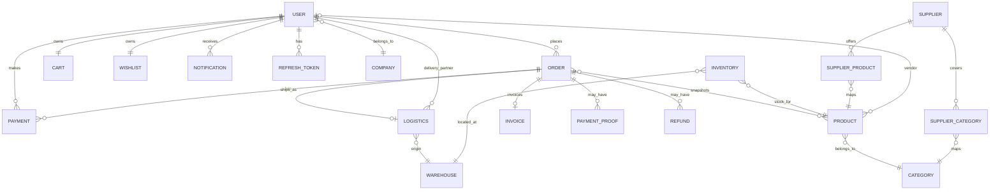
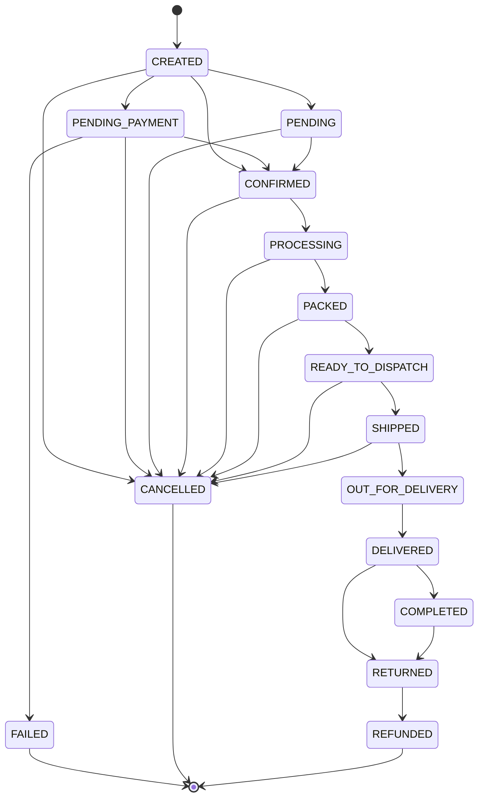
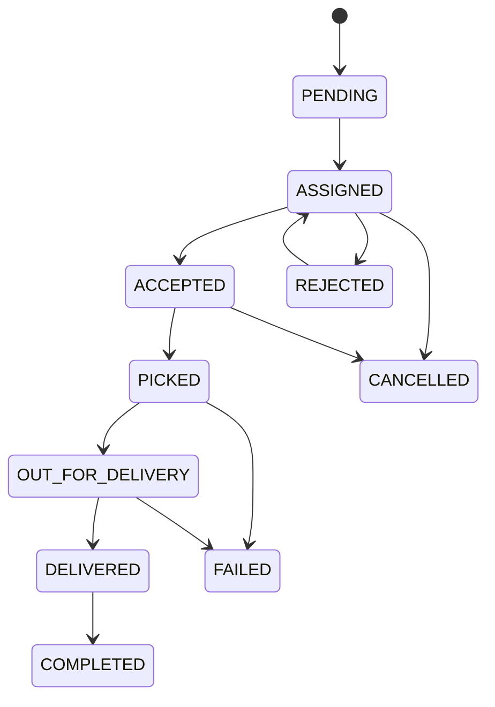
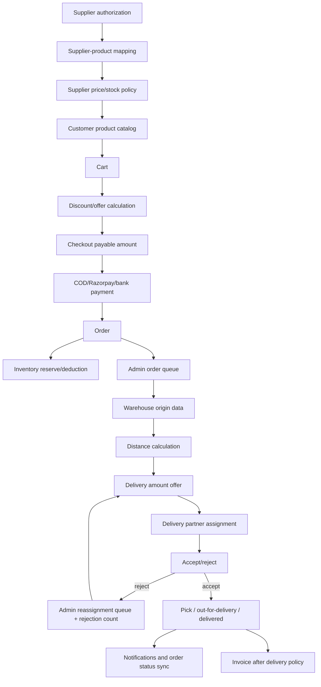

# V1 Codebase Baseline for V2

**Project:** Mokshith Enterprises B2B/B2C E-Commerce  
**Baseline:** V1 source tree currently present in this workspace  
**Audit type:** Read-only technical reconnaissance; no V2 feature implementation  
**Audit date:** 2026-09-23  
**Primary source of truth:** executable source and configuration. Existing documentation was used as a navigation aid and checked against source where material.

> This document records what is verifiable from the current codebase. It does not prescribe or implement V2. “NOT VERIFIED FROM CURRENT CODEBASE” is used where a requirement or behavior cannot be established from source.

## Executive summary

V1 is a two-application system: `Production/ME` is a React 18 + Vite frontend, and `Production/b2b-backend` is an ES-module Express 5 API backed by MongoDB/Mongoose. The frontend is a single-page application with four protected portal trees: Super Admin, Admin, Vendor (also the frontend destination for B2B customer), and Delivery Partner. The backend is organized by business module; most modules contain routes, controllers, services, repositories, validations, and models. API versioning mounts the same V1 routers at both `/api/v1` and the backward-compatible `/api` root. `/api/v2` currently contains only a health endpoint and welcome placeholder.

Major V1 capabilities include authentication, approval-controlled registration, JWT access tokens, database-backed rotating refresh tokens, CSRF double-submit protection, optional TOTP 2FA, catalog browsing and CRUD, categories, cart, wishlist, pricing, COD/credit/Razorpay/bank-transfer payment paths, orders, invoices, inventory, warehouses, logistics, notifications, analytics, audit logs, support, vendor/company management, supplier procurement/catalog functions, and extensive unit/integration/Playwright coverage.

The canonical customer order path is Product -> Cart -> Order creation. COD and credit orders become `CONFIRMED` and immediately reduce stock; online/bank-transfer orders become `PENDING_PAYMENT` and reserve inventory for a limited period. Successful payment confirms the order and finalizes inventory. Logistics is represented primarily by the `Logistics` model and `/logistics` routes; a separate older `Shipment` module remains in the backend. Admin/Super Admin can create, assign, and reassign delivery shipments. Delivery partners can accept, reject an assigned shipment, pick up, start delivery, mark delivered, collect COD, complete, and update location. Delivery rejection already emits a notification to Admin and Super Admin and clears the assignment, but there is no V2 offer amount, distance, rejection-count escalation, or dedicated supplier dashboard.

Supplier functionality is currently Super Admin-owned. The backend has Supplier, SupplierCategory, SupplierProduct, and SupplierProductPriceHistory models and a broad `/super-admin/suppliers` API. The frontend exposes supplier and procurement pages inside the Super Admin portal. There is no separate authenticated Supplier frontend route or supplier-specific dashboard in `App.jsx`; the `SUPPLIER` backend role exists but has an empty permission list.

Authentication is role based at the route boundary in the frontend and combines `authenticate`, `authorize`, permission middleware, ownership checks, validation, CSRF, rate limits, and status checks in the backend. Important compatibility constraints include the existing `/api` root alias, current role names, local-storage token behavior, current order/payment status fields, the dual Logistics/Shipment implementation, and existing test assumptions.

V2 should primarily extend the existing order, logistics, notification, supplier, product, inventory, and portal-layout seams. The highest-risk extension points are payment/inventory consistency, delivery state and reassignment semantics, Supplier authorization, the frontend/backend role mismatch for B2B customers and suppliers, duplicated/legacy shipment code, and security decisions around browser token storage and environment configuration.

## 1. Audit scope and evidence rules

Inspected source areas include:

- `Production/ME/src`, `Production/ME/tests`, frontend package/config files, and frontend documentation.
- `Production/b2b-backend/src`, `Production/b2b-backend/tests`, backend package/config files, deployment files, and backend documentation.
- Root `docs`, `tools/qa-dataset-builder`, `Production/docker-compose.yml`, Dockerfiles, Nginx/Vercel configuration, Playwright/Vitest/Jest configuration, and environment templates.

Relevant source anchors:

| Area | Source anchor |
|---|---|
| Frontend entry/router | `Production/ME/src/main.jsx`, `Production/ME/src/App.jsx` |
| Frontend HTTP/auth | `Production/ME/src/services/api.js`, `src/context/AuthContext.jsx`, `src/routes/ProtectedRoute.jsx` |
| Backend bootstrap | `Production/b2b-backend/server.js`, `src/app.js`, `src/routes/index.js`, `src/routes/v1.routes.js` |
| Backend module contract | `Production/b2b-backend/src/modules/**` |
| Roles/permissions/statuses | `src/constants/roles.js`, `permissions.js`, `orderStatus.js`, `deliveryStatus.js`, `paymentStatus.js` |
| Existing inventories | `src/modules/*/*.model.js` |
| Test commands | `Production/ME/package.json`, `Production/b2b-backend/package.json` |

The repository also contains generated or operational artifacts, including Jest output, coverage-related files, QA datasets, and test-artifact folders. They are not treated as production source unless explicitly referenced by executable configuration.

## 2. Project structure

### High-level tree

```text
.
├── Production/
│   ├── ME/                         React/Vite frontend
│   │   ├── src/
│   │   │   ├── pages/              portal and auth pages
│   │   │   ├── components/         shared and portal components
│   │   │   ├── layouts/            portal shells/sidebar/header/outlet layouts
│   │   │   ├── services/            Axios-backed API modules
│   │   │   ├── hooks/               data and UI hooks
│   │   │   ├── context/             auth and maintenance providers
│   │   │   ├── routes/              ProtectedRoute
│   │   │   └── utils/               mappers, storage, payment, validation helpers
│   │   ├── tests/                  Vitest/Playwright test suites and fixtures
│   │   ├── public/                 static assets
│   │   ├── *.config.*               Vite, Vitest, Playwright, Tailwind
│   │   ├── Dockerfile, nginx.conf, vercel.json
│   │   └── .env.example, .env.production
│   ├── b2b-backend/                Express/Mongoose backend
│   │   ├── src/
│   │   │   ├── modules/             bounded business modules
│   │   │   ├── middlewares/         auth, RBAC, validation, security, ops
│   │   │   ├── config/              DB, Redis, queues, payment, security, logging
│   │   │   ├── services/            cross-module infrastructure/services
│   │   │   ├── queues/, workers/     BullMQ producers/workers
│   │   │   ├── jobs/                 cron/scheduled work
│   │   │   ├── routes/               API version and health mounts
│   │   │   ├── models/               auth token models
│   │   │   ├── constants/            roles, permissions, statuses, flags
│   │   │   ├── validations/           reusable validation
│   │   │   └── utils/, errors/        shared helpers and typed errors
│   │   ├── tests/                   Jest unit/integration/infrastructure/smoke
│   │   ├── docs/                    OpenAPI, Postman, API guidance
│   │   ├── dangerous-dev-tools/     destructive seed/reset utilities
│   │   └── Dockerfile, .env.example, jest/eslint/prettier config
│   ├── docker-compose.yml           deployment/local infrastructure
│   ├── DATABASE_MIGRATION_GUIDE.md
│   └── testing/auth restore notes
├── docs/                            QA dataset and builder documentation
├── tools/qa-dataset-builder/        QA data generators, validators, runtime flows
├── BACKEND_DOCUMENTATION.md         root copy/reference
├── FRONTEND_DOCUMENTATION.md        root copy/reference
└── db-backups/                      database backup artifacts
```

There is no shared application package or monorepo workspace configuration. Frontend and backend have separate `package.json` files and communicate over HTTP. Shared business constants are not imported across the two projects; frontend role/status maps are duplicated client-side.

### Build/deployment configuration

- Frontend: Vite, React plugin, Tailwind/PostCSS, Dockerfile, Nginx config, Vercel config, runtime/build API base URL support.
- Backend: Node `>=20`, Express server, Dockerfile, Nodemon, environment resolver, MongoDB/Redis configuration, Sentry, logger, health probes.
- CI/CD: no root workflow file was found in the inspected tree. Existing package scripts and Playwright/Jest configs provide the test/build entry points. A complete external CI deployment contract is **NOT VERIFIED FROM CURRENT CODEBASE**.
- Docker/Rancher: Dockerfiles and `Production/docker-compose.yml` are present. No Rancher manifest was found in the relevant source inventory; Rancher-specific deployment behavior is **NOT VERIFIED FROM CURRENT CODEBASE**.
- Database: Mongoose models and initialization/migration/seed scripts; `db-backups/` is operational data, not application schema source.
- Redis/queues: `src/config/redis.js`, `src/config/queue.js`, `src/services/redis.service.js`, `src/services/queueManager.service.js`, `src/queues`, `src/workers`, and `src/jobs`.
- Storage: local `/uploads` fallback plus Cloudinary and S3 service implementations. Profile/product/category/payment-proof uploads use backend upload routes/services; exact production provider selection is environment controlled.

## 3. Frontend audit

### Technology and application architecture

| Concern | V1 implementation | Evidence |
|---|---|---|
| UI | React 18.2, JSX, no TypeScript in app source | `ME/package.json`, `src/**/*.jsx` |
| Build | Vite 8, `@vitejs/plugin-react` | `vite.config.js`, package |
| Styling | Tailwind 3.4, PostCSS, custom `index.css` | `tailwind.config.js`, `postcss.config.js` |
| Routing | React Router DOM 6.22, nested routes and `Outlet` layouts | `src/App.jsx`, layouts |
| State | React Context for auth/maintenance; local component state and custom hooks; no Redux/Zustand | `src/context`, `src/hooks` |
| HTTP | Axios 1.6 client | `src/services/api.js` |
| Validation | Component-level validation plus Playwright validators; no centralized frontend form library | `src/pages`, `tests/validators` |
| Charts | Recharts 3.8 | admin/super-admin analytics |
| Notifications | in-app notification service/drawers; Socket.IO client dependency | `notificationService.js`, `NotificationDrawer`, socket usage |
| Icons | lucide-react and react-icons | package |
| Auth | custom AuthContext/storage plus Axios interceptors | `AuthContext.jsx`, `authStorage.js` |
| Tests | Vitest, Testing Library, Playwright, axe-core | package and test tree |

Entry sequence:

```mermaid
flowchart TD
  A[main.jsx] --> B[React.StrictMode]
  B --> C[App.jsx]
  C --> D[AuthProvider]
  D --> E[MaintenanceProvider]
  E --> F[BrowserRouter]
  F --> G[ErrorBoundary + MaintenanceBanner]
  G --> H[Suspense/lazy Routes]
  H --> I[Protected portal layout or public page]
  I --> J[hook/page]
  J --> K[service/api.js]
  K --> L[/api/v1 backend]
```

`App.jsx` lazy-loads pages and layouts. `ErrorBoundary` wraps the route tree. `AuthProvider` restores a session on mount. `MaintenanceBanner` is globally mounted. There is no global data-fetching cache library; feature hooks generally fetch, set local state, and refetch after mutations.

### Frontend route inventory

All protected portal children inherit the parent `ProtectedRoute` and layout. `requiredRole` uses frontend role strings (`super-admin`, `admin`, `vendor`, `delivery`).

| Path | Page/component | Parent/layout | Auth/RBAC | Important calls | Status |
|---|---|---|---|---|---|
| `/` | `Home/Home` | none | public | public config/content | implemented |
| `/login`, `/register`, `/forgot-password`, `/reset-password` | `Auth/*` | none | public | auth endpoints | implemented; registration approval is backend-controlled |
| `/super-admin/dashboard` | `SuperAdmin/Dashboard` | `SuperAdminLayout` | authenticated + super-admin | super-admin stats/metrics/notifications | implemented |
| `/super-admin/platform` | `Platform` | SuperAdminLayout | super-admin | config/health-oriented calls | partial/cosmetic areas |
| `/super-admin/user-management` | `UserManagement` | SuperAdminLayout | super-admin | users, approvals, admin and delivery-agent management | implemented |
| `/super-admin/suppliers`, `/suppliers/comparison` | `Suppliers`, `SupplierComparison` | SuperAdminLayout | super-admin | supplier CRUD/catalog/comparison | implemented for Super Admin; not Supplier portal |
| `/super-admin/procurement/*` | procurement pages | SuperAdminLayout | super-admin | demand/plans/purchase requests | implemented/feature-specific tests present |
| `/super-admin/orders` | `SuperAdmin/Orders` | SuperAdminLayout | super-admin | orders, order status, delivery | partial mobile/read-only behavior noted in docs |
| `/super-admin/analytics`, `/settings`, `/system-settings` | corresponding pages | SuperAdminLayout | super-admin | analytics/settings | implemented with feature-specific gaps |
| `/super-admin/admin-approvals`, `/vendors`, `/delivery-partners` | redirects to user management tabs | SuperAdminLayout | super-admin | none directly | compatibility redirects |
| `/admin/dashboard` | `Admin/Dashboard` | `AdminLayout` | authenticated + admin | admin stats/orders/notifications | partial financial analytics |
| `/admin/products`, `/categories`, `/inventory`, `/vendors`, `/orders` | Admin pages | AdminLayout | admin | products/categories/inventory/users/orders | implemented |
| `/admin/delivery-assignment` | `DeliveryAssignment` | AdminLayout | admin | logistics queue, assign/reassign | implemented |
| `/admin/reports`, `/analytics`, `/support`, `/settings` | Admin pages | AdminLayout | admin | reports, delivery analytics, support/settings | reports/analytics partial |
| `/admin/payment-verifications` | no App route; stub/page/link exists in source | AdminLayout intent | not reachable as registered path | bank proof UI is directed to Super Admin | broken/unavailable route |
| `/vendor/dashboard`, `/products`, `/products/:id`, `/categories` | Vendor pages | `VendorLayout` | vendor frontend role | product/category/search/pricing | implemented; reviews/details partial |
| `/vendor/cart`, `/checkout`, `/order-success` | Vendor buying pages | VendorLayout | vendor | cart/order/payment | implemented; cart quantity edit absent; checkout partial |
| `/vendor/orders`, `/orders/:id`, `/orders/:id/payment` | order/payment pages | VendorLayout | vendor | orders/invoice/payment proof | implemented |
| `/vendor/invoices`, `/invoices/:id`, `/wishlist`, `/profile`, `/settings`, `/support` | Vendor pages | VendorLayout | vendor | invoice/wishlist/user/support | implemented; `:id` invoice is not materially used |
| `/delivery/dashboard`, `/assigned-orders`, `/order-details/:id` | Delivery pages | `DeliveryLayout` | delivery role | logistics queue/detail/status | implemented; dashboard is partial |
| `/delivery/history`, `/earnings`, `/performance`, `/profile`, `/settings` | Delivery pages | DeliveryLayout | delivery role | logistics analytics/user/settings | implemented; performance includes synthetic rating behavior |
| `*` | Navigate `/` | none | public | none | catch-all |

The frontend maps backend `B2B_CUSTOMER` to the same `vendor` dashboard. Backend `SUPPLIER` has no frontend role mapping, so a Supplier JWT cannot be restored by `AuthContext` without an unsupported-role error. This is a verified V1/V2-relevant mismatch.

### Layouts and dashboard behavior

- `SuperAdminLayout`, `AdminLayout`, `VendorLayout`, and `DeliveryLayout` provide portal navigation and render an `Outlet`.
- Common `PortalSidebar`, mobile-sidebar hook, headers, drawers, status badges, page headers, tables, cards, and confirmation dialogs are reusable seams.
- Mobile hamburger/sidebar state is implemented through shared layout/sidebar patterns and `useMobileSidebar` tests. Exact behavior is layout-specific and should be preserved when adding V2 navigation.
- Protected route checks are portal-level, not permission-level. The frontend has no separate supplier gate and no generic multi-role allow-list.
- Admin and Super Admin have separate pages/components for orders and delivery assignment, while common mapping utilities normalize backend shapes.

### Frontend authentication/session behavior

1. Login calls `POST /auth/login` with mobile/identifier and password.
2. If the response requires 2FA, the UI calls `POST /auth/2fa/verify` and only then persists the session.
3. Otherwise access token, refresh token, CSRF token, user, and frontend role are persisted by `authStorage.js` (localStorage keys include `accessToken`, legacy `token`, `refreshToken`, `csrfToken`, `user`, `role`, and auth flags).
4. On startup, `AuthContext` calls `/users/me`; on failure it rotates `/auth/refresh-token`, then restores the user and CSRF token.
5. Axios attaches `Authorization: Bearer`, uses `withCredentials: true`, adds `x-csrf-token` to state-changing requests, retries a CSRF failure once, and queues concurrent 401 refreshes.
6. `SESSION_REPLACED` or refresh failure clears local session and redirects to `/login`.
7. Logout attempts `/auth/logout` with the refresh token, then always clears local state.

### Frontend API service inventory

All paths below are relative to `VITE_API_BASE_URL`, normally `http://localhost:5000/api/v1` in development or the production API URL. Service errors generally propagate to pages/hooks for local display.

| Service | Calls |
|---|---|
| `authService` | `/auth/login`, `/logout`, `/refresh-token`, `/csrf-token`, `/register`, `/forgot-password`, `/reset-password`, `/2fa/verify`, `/2fa/enable`, `/2fa/verify-setup`, `/2fa/disable`, `/change-password`, `/logout-all`, `/sessions`; `/users/me`, `/users/me` PUT, profile image |
| `userService` | `/users`, `/users/:id`, `/users/:id` DELETE, `/admin/users?role=` |
| `productService` | `/products`, `/products/:id`, POST/PUT/DELETE product, `PATCH /products/:id/stock` |
| `categoryService` | `/categories`, `/categories/:id`, POST/PUT/DELETE |
| `searchService` | `GET /search?q=` |
| `pricingService` | `POST /pricing` with price/quantity |
| `cartService` | `GET/POST /cart`, `DELETE /cart/:productId` |
| `orderService` | `GET /orders`, `GET /orders/:id`, `POST /orders`, `PATCH /orders/:id/status`, invoice blob |
| `wishlistService` | `/wishlist`, `/wishlist/add`, remove and clear |
| `creditService` | `/credit`, `/credit/ledger`, `/credit/use`, `/credit/repay` |
| `paymentService` | Razorpay create/initiate/verify/fail/hybrid; bank-details, upload proof, pending proofs, approve/reject, order proof |
| `invoiceService` | `/invoices`, `/invoices/:orderId`, `POST /invoices/:orderId` |
| `deliveryService` | logistics queue/history/analytics, create/assign/reassign/detail, accept/pick/start/delivered/collect-payment/complete/location, notifications, user profile |
| `adminService` | `/admin/stats`, `/admin/users`, status update, approve/reject |
| `adminApprovalService` | `/admin-approvals`, pending, approve, reject |
| `superAdminService` | Super Admin stats/metrics/audit/config/users/admins/delivery agents; suppliers, categories, supplier products/categories/comparison; procurement demand/plans/purchase requests |
| `analyticsService` | `/analytics/dashboard`, `/analytics/delivery` |
| `notificationService` | `/notifications`, mark one/all read |
| `inventoryService` | inventory list/low-stock/stats/update/create |
| `supportService` | contact, create/my/all tickets, detail/reply/status |
| `settingsService` | `/settings` GET/PUT |
| `uploadService` | `POST /upload/image` FormData |

Important request details are verified in service files: order create may add `Idempotency-Key` and uses a browser in-flight dedupe; FormData requests remove the JSON content type and use a longer timeout; product/image and bank-proof calls are multipart. Exact response shapes vary by service but backend success responses conventionally use `{ success, data, message }`; invoice download is a binary blob. The frontend mappers (`productMapper`, `orderMapper`, `cartMapper`, `deliveryMapper`, `adminDeliveryMapper`, `inventoryMapper`) normalize backend variations.

## 4. Backend audit

### Technology

| Concern | V1 implementation |
|---|---|
| Runtime | Node.js `>=20`, ES modules |
| HTTP | Express `5.2.1` |
| Database | MongoDB via Mongoose `9.6.2` |
| Auth/security | jsonwebtoken, bcryptjs, cookie-parser, helmet, cors, express-rate-limit, custom CSRF, Mongo/XSS sanitizers |
| Validation | Joi route schemas and reusable validation middleware |
| Cache/locks | Redis/ioredis and in-memory caches; Redis locks/reservations/idempotency used by flows |
| Queues | BullMQ 5 with Redis |
| Jobs | node-cron, payment reconciliation, cleanup/analytics/notification/inventory/credit jobs |
| Payments | Razorpay SDK, HMAC signature checks, webhook raw body handling, refund model |
| Storage | local uploads, Cloudinary, AWS S3/presigned URLs |
| Realtime | Socket.IO and optional Redis adapter |
| Logging/monitoring | Winston, Morgan, correlation IDs, Sentry, performance/error-rate monitoring |
| PDF | PDFKit for invoices |
| Testing | Jest 30, Supertest, mongodb-memory-server, ioredis-mock |

### Bootstrap and middleware order

`server.js` loads environment/database startup and conditionally starts workers/cron. `src/app.js` creates Express, chooses upload directories, serves uploads, mounts health probes, then applies (in order) Sentry handlers, correlation IDs, monitoring/error tracking, compression, CORS, IP block, timeout, preflight, Helmet/security/sanitization/global rate limit, cookies, JSON/urlencoded body parsing, Morgan/request logging, idempotency, maintenance middleware, metrics gate, `/api` routes, not-found, Sentry error handler, and global error handler.

The API router mounts:

```text
/api/v1/*  -> v1.routes
/api/*     -> same v1.routes (backward compatibility alias)
/api/v2/*  -> placeholder v2.routes
```

Most authenticated parent mounts apply `authenticate` and `injectCsrfToken`; module routers add more specific `protect`, `authorize`, `requirePermission`, ownership, validation, upload, rate-limit, or idempotency middleware. Auth routes require database readiness; payment webhook routes use signature verification and raw request body rather than CSRF.

### Backend module architecture

The common module pattern is:

```text
route -> middleware/validation -> controller -> service -> repository/model -> responseHandler
```

Not every module has every layer. Cross-cutting services include payment, delivery assignment, Redis/cache, queue management, notification, email, S3/Cloudinary, PDF, audit, fraud detection, encryption, monitoring, scheduler, and webhooks. Controllers generally use `asyncHandler`; successful responses use `successResponse`, while `AppError` subclasses reach the global error handler.

## 5. Backend API contract map

The backend has approximately 179 route registrations across the active module routers. The following is the consolidated contract map; paths are under `/api/v1` and also under the compatibility `/api` alias unless noted.

| Group | Method/path families | Auth/RBAC and implementation path |
|---|---|---|
| Health | `GET /health`, `/health/live`, `/health/ready`, `/health/redis`; also `/api/health*`, `/api/v1/health*` | public probes; health controller |
| Auth | `POST /auth/register`, `/login`, `/forgot-password`, `/reset-password`, `/refresh-token`, `/logout`; `GET /auth/csrf-token`; protected 2FA/password/session endpoints | database readiness, auth rate limits, Joi; protected mutations use auth + CSRF; auth service/repositories/User/RefreshToken/PasswordResetToken |
| Users | `GET /users/me`, sessions; `PUT /users/me`; profile image; admin/user list/detail/delete and session actions | authenticated; admin/Super Admin for governance; User model and upload service |
| Companies/vendors | company create/list/me/update/detail; vendor create/list/status | authenticated; admin/Super Admin for governance; Company/Vendor/User |
| Categories | `GET /categories`, `/:id`; POST/PUT/DELETE | reads public; writes Admin/Super Admin with auth/CSRF/validation; Category/Product aggregation |
| Products | `GET /products`, `/:id`; POST/PUT/DELETE; `PATCH /:id/stock`, `/:id/status` | public reads; Admin/Super Admin and owned Vendor writes; Product, Category, Inventory |
| Search/pricing/reviews | `GET /search`; `POST /pricing`; reviews POST and GET | search/public read; pricing validation; review auth/feature flag; Product/Review |
| Cart/wishlist | cart GET/POST/DELETE; wishlist GET/add/remove/clear | authenticated + CSRF for mutations; Cart/Wishlist/Product |
| Orders | `POST /orders`, `POST /orders/:id/fail`, `PATCH /orders/:id/status`, `GET /orders`, `GET /orders/:id`, invoice download | authenticated parent, order rate limit, CSRF, idempotency, Joi; status update RBAC/workflow; Order, Product, Inventory, Logistics, Payment, Invoice |
| Payments | Razorpay create/initiate/verify/fail/hybrid; webhook; refund history/create/detail; bank transfer proof routes | route-specific auth; webhook signature; Admin/Super Admin refund/proof decisions; Payment/Refund/PaymentProof/Order |
| Credit | credit create/get/ledger/use/repay | authenticated; selected actions role/permission controlled; Credit/CreditLedger/User/Order |
| Logistics | queue/history/analytics; accept/reject/pick/start/delivered/collect/complete/location; create shipment; my assignments; list/detail; assign/reassign | Admin/Super Admin manage; Delivery Partner lifecycle; Logistics/Order/User/Warehouse |
| Legacy shipment/warehouse/inventory | Shipment create/status/list/detail; warehouse CRUD; inventory create/list/low-stock/stats/update | Admin/Super Admin and selected Vendor inventory operations; Shipment/Warehouse/Inventory/Product |
| Notifications | list/read/read-all | authenticated; Notification/UserSettings; persisted plus optional Socket.IO |
| Admin | users, B2B customer creation, approvals, approve/reject, stats, user updates | Admin/Super Admin; User/Company/Vendor and stats |
| Admin approvals | list/pending/approve/reject | parent auth; Super Admin controller/service |
| Super Admin | user/admin/delivery-agent CRUD, config/stats/metrics/audit; category CRUD; suppliers/categories/products/status/price/comparison; procurement demand/plans/purchase requests | Super Admin only by router/controller; User, Supplier, SupplierProduct, price history, Category, procurement models |
| Analytics/audit | analytics dashboard/sales/trends/categories/top-products/revenue; delivery; audit list/detail/export | Super Admin for financial analytics; Admin/SA delivery; audit Admin/SA |
| Promotions | CRUD/toggle and public-ish `POST /promotions/apply` validation | Admin CRUD; apply route is implemented but promotion integration into checkout is incomplete |
| Invoices/support/settings/upload | invoice list/generate/detail; support contact/ticket/reply/status; public config/user/platform settings; image upload | authenticated; role-specific support/settings; Invoice/Support/Settings/PlatformSettings/storage |

The route definitions were checked, but some request/response fields are implemented in controllers/services rather than route declarations. For field-level contracts, use the linked validation schemas and service/controller source together; OpenAPI/Postman files are supporting references and may lag executable code.

### Endpoint-level register

The following expands the family map into the concrete method/path surface that V2 must treat as the V1 contract. All `/api/v1` paths are also available under the compatibility `/api` mount unless the path is explicitly `/api/v2`, `/health`, `/metrics`, or `/uploads`.

| Group | Concrete method/path register | Controller/service/model path |
|---|---|---|
| Auth | `POST /auth/register`, `/auth/login`, `/auth/forgot-password`, `/auth/reset-password`, `/auth/refresh-token`, `/auth/logout`, `/auth/2fa/verify`, `/auth/2fa/enable`, `/auth/2fa/verify-setup`, `/auth/2fa/disable`, `/auth/change-password`, `/auth/logout-all`; `GET /auth/csrf-token`, `/auth/sessions`; `DELETE /auth/sessions/:tokenId` | Auth controller/service; User, RefreshToken, PasswordResetToken |
| Users | `GET /users/me`, `/users/sessions`, `/users`, `/users/:id`; `PUT /users/me`, `/users/change-password`; `POST /users/profile-image`, `/users/logout-all`; `DELETE /users/:id` | User controller/service; User and upload |
| Companies | `POST /companies`; `GET /companies`, `/companies/me`, `/companies/:id`; `PUT /companies/me`, `/companies/:id` | Company controller/service; Company/User |
| Vendors | `POST /vendors`; `GET /vendors`; `PATCH /vendors/:id/status` | Vendor controller/service; Vendor/Company/User |
| Categories | `GET /categories`, `/categories/:id`; `POST /categories`; `PUT /categories/:id`; `DELETE /categories/:id` | Category controller/service/repository; Category/Product |
| Products | `GET /products`, `/products/:id`; `POST /products`; `PUT /products/:id`; `DELETE /products/:id`; `PATCH /products/:id/stock`, `/products/:id/status` | Product controller/service/repository; Product/Category/Inventory |
| Search/pricing/reviews | `GET /search`, `/reviews/:productId`; `POST /pricing`, `/reviews` | Search/Pricing/Review controllers/services; Product/Review |
| Cart | `GET /cart`; `POST /cart`; `DELETE /cart/:productId` | Cart controller/service/repository; Cart/Product |
| Wishlist | `GET /wishlist`; `POST /wishlist/add`; `DELETE /wishlist/remove/:productId`, `/wishlist/clear` | Wishlist controller/service/repository; Wishlist/Product |
| Orders | `POST /orders`, `/orders/:id/fail`; `GET /orders`, `/orders/:id`, `/orders/:id/invoice`; `PATCH /orders/:id/status` | Order controller/service/workflow/repository; Order/Product/Inventory/Logistics/Invoice |
| Invoices | `GET /invoices`, `/invoices/:orderId`; `POST /invoices/:orderId` | Invoice controller/service/repository/generator; Invoice/Order |
| Credit | `GET /credit`, `/credit/ledger`; `POST /credit`, `/credit/use`, `/credit/repay` | Credit controller/service; Credit/CreditLedger/User/Order |
| Promotions | `GET /promotions`; `POST /promotions`, `/promotions/apply`; `PUT /promotions/:id`; `PATCH /promotions/:id/toggle`; `DELETE /promotions/:id` | Promotion controller/service/repository; Promotion |
| Payments | `POST /payments/webhook`, `/payments/create-order`, `/payments/initiate/:orderId`, `/payments/verify`, `/payments/fail`, `/payments/hybrid`, `/payments/refund`; `GET /payments/refund/order/:orderId`, `/payments/refund/:refundId`, `/payments/bank-transfer/bank-details`, `/payments/bank-transfer/pending`, `/payments/bank-transfer/order/:orderId`; `POST /payments/bank-transfer/upload`; `PATCH /payments/bank-transfer/:proofId/approve`, `/payments/bank-transfer/:proofId/reject` | Payment controller/service/gateway/webhook; Payment/Refund/PaymentProof/Order |
| Logistics | `GET /logistics/delivery-queue`, `/logistics/history`, `/logistics/analytics`, `/logistics/my-assignments`, `/logistics`, `/logistics/:id`; `POST /logistics/:id/accept`, `/reject`, `/pick`, `/start`, `/delivered`, `/collect-payment`, `/complete`, `/location`, `/logistics/:orderId`; `PATCH /logistics/:id/assign`, `/reassign`, plus route-defined update/status operations | Logistics controller/service/repository; Logistics/Order/User/Warehouse |
| Legacy shipments | `POST /shipments`; `GET /shipments`, `/shipments/:id`, `/shipments/order/:orderId`; `PATCH /shipments/:id/status` and route-defined assignment/update operations | Shipment controller/service/repository; Shipment/Order/Warehouse |
| Warehouses | `POST /warehouses`; `GET /warehouses`; `PUT /warehouses/:id`; `DELETE /warehouses/:id` | Warehouse controller/service/repository; Warehouse |
| Inventory | `POST /inventory`; `GET /inventory`, `/inventory/low-stock`, `/inventory/stats`; `PATCH /inventory/update` | Inventory controller/service/repository; Inventory/Product/Warehouse |
| Notifications | `GET /notifications`; `PATCH /notifications/read-all`, `/notifications/:id/read` | Notification controller/service; Notification/UserSettings |
| Analytics | `GET /analytics/dashboard`, `/analytics/sales`, `/analytics/orders-trends`, `/analytics/categories`, `/analytics/top-products`, `/analytics/revenue`, `/analytics/delivery` | Analytics controller/service/repository/aggregations; Order/Product/Category/Logistics |
| Audit | `GET /audit`, `/audit/:id` | Audit controller/service/repository; Audit/User |
| Support | `GET /support/contact`, `/support/my-tickets`, `/support/all`, `/support/:id`; `POST /support`, `/support/:id/reply`; `PATCH /support/:id/status` | Support controller/service/repository; Support/User |
| Settings | `GET /settings/public/config`, `/settings`, `/settings/platform/:key`, `/settings/:key`; `PUT /settings`; `POST` route-defined platform/settings update operations | Settings/user-settings/platform-settings controllers/services; Settings/UserSettings/PlatformSettings |
| Upload | `POST /upload/image` | Upload controller/service; storage provider |
| Admin | `GET /admin/users`, `/admin/approvals`, `/admin/stats`; `POST /admin/b2b-customers`, `/admin/approve/:id`, `/admin/reject/:id`; `PATCH /admin/users/:id`, plus route-defined credit/status updates | Admin controller/service/repository; User/Company/Vendor/Credit |
| Admin approvals | `GET /admin-approvals`, `/admin-approvals/pending`; `PATCH /admin-approvals/:id/approve`, `/admin-approvals/:id/reject` | Admin approvals controller/service; User/Audit |
| Super Admin users/staff | `GET /super-admin/users`, `/admins`, `/delivery-agents`; `POST /super-admin/admins`, `/delivery-agents`; `PATCH /super-admin/admins/:id`, `/delivery-agents/:id`; `DELETE /super-admin/admins/:id`, `/delivery-agents/:id` | Super Admin controller/service/repository; User |
| Super Admin supplier/catalog | `GET /super-admin/suppliers`, `/suppliers/:id`, `/suppliers/:id/products`, `/suppliers/:id/categories`, `/super-admin/categories`, `/super-admin/suppliers/:id/products/:mappingId`, `/super-admin/suppliers/:id/products/search`, `/super-admin/products/:productId/supplier-comparison`; `POST /super-admin/suppliers`, `/suppliers/:id/products`, `/suppliers/:id/categories`; `PATCH` supplier, status, category, product mapping, price/status, and activation paths defined in `superAdmin.routes.js` | Super Admin/supplier controllers/services/repositories; Supplier/SupplierProduct/SupplierCategory/price history/Product/Category |
| Super Admin procurement/config | `GET /super-admin/procurement/demand`, `/procurement/plans`, `/procurement/plans/:id`, `/procurement/purchase-requests`, `/procurement/purchase-requests/:id`; `POST /super-admin/procurement/plans`, `/procurement/purchase-requests`; `PATCH` plan and purchase-request update/submit/cancel/acknowledge/fulfillment paths; `GET /super-admin/stats`, `/metrics`, `/audit-logs`, `/audit-logs/export`, `/config`; `POST /super-admin/config`; `GET/POST/PATCH/DELETE /super-admin/categories*` | Super Admin/procurement controllers/services; procurement models/Category/Audit/Settings |
| Health/ops | `GET /health`, `/health/live`, `/health/ready`, `/api/health*`, `/api/v1/health*`, `/api/v1/health/redis`, `/metrics`; `GET /uploads/:filename`, `/uploads/:folder/:filename`; `GET /api/v2/`, `/api/v2/health` | health controller, metrics gate, static upload serving, v2 placeholder |

Some route files use multi-line middleware declarations whose action names are not visible in a single `router.*` line. For those entries, the route file itself is the definitive field-level register. No route was inferred solely from a frontend service name.

## 6. Database and model inventory

Mongoose timestamps are used broadly. User is the only model with verified soft-delete behavior (`isDeleted` filtering). Collections are default Mongoose pluralization unless a model specifies a collection.

| Model/collection | Fields and behavior relevant to V2 |
|---|---|
| `User/users` | name, email unique, mobile unique, password select:false, role enum `SUPER_ADMIN/ADMIN/VENDOR/B2B_CUSTOMER/B2C_CUSTOMER/DELIVERY_PARTNER/SUPPLIER`, companyId, status, deletion flag, 2FA fields, addresses subdocuments, credit fields, vendor payment settings, delivery vehicle/location fields, active session/device/IP, timestamps. Unique email/mobile; soft-delete filters. |
| `Company/companies` | name/email/phone/GST, active flag, creator User; unique email. |
| `Vendor/vendors` | name, Company ref, contact/address fields, status `PENDING/APPROVED/REJECTED`. |
| `Product/products` | name, description, price, stock, Category ref, optional vendor User and Company refs, active flag, catalog scope, unit/MOQ, GST, image/image URL/public ID, bulk pricing and variants. Product-level stock is retained alongside warehouse inventory. |
| `Category/categories` | name, slug, parent Category ref, image fields, active flag; unique `{name,parentId}`. |
| `Cart/carts` | one per User, items of Product ref and quantity; unique user. |
| `Wishlist/wishlists` | one per User, Product item refs; unique user. |
| `Order/orders` | User ref; embedded item snapshots (Product ref, name, price, quantity, discount fields, final price); total/subtotal/tax/discount/commission; payment method enum; Logistics ref; payment status; COD collection fields; embedded shipping address; order status; unique order number; idempotency key; attempts; status history with actor/note; timestamps and compound user/status/payment indexes. |
| `Payment/payments` | Order/User refs, amount, status `INITIATED/PENDING/SUCCESS/FAILED`, method, Razorpay IDs, metadata; indexed by order/user/status. |
| `Refund/refunds` | Order/Payment/User refs, amount, FULL/PARTIAL, status, Razorpay refund ID, reason, actor, inventory-restored flag, restored item snapshots; explicit `refunds` collection and indexes. |
| `PaymentProof/paymentproofs` | Order/User refs, amount, BANK_TRANSFER method, UTR, screenshot, status `PENDING/APPROVED/REJECTED`, reviewer/reason/date; status/order/user indexes. |
| `Invoice/invoices` | unique Order ref and invoice number, User ref, amounts/GST, file URL; one invoice per order. |
| `Inventory/inventories` | Product and Warehouse refs, stock, reservedStock, reorderLevel, version; unique `{productId,warehouseId}` and optimistic-locking service logic. |
| `Warehouse/warehouses` | name, address/city/state/country/pincode, active, capacity/currentLoad. No latitude/longitude fields. |
| `Logistics/logistics` | Order/Warehouse/User delivery-partner refs, delivery status, required address/customer/phone/tracking number, estimated/delivered/completed dates, current location, proof/notes, rejection fields; delivery-partner/status index; unique tracking number. |
| `Shipment/shipments` | older parallel Order/Warehouse shipment with status `CREATED/IN_TRANSIT/DELIVERED` and tracking number. It remains a separate model/module. |
| `Notification/notifications` | recipient User, title/message, type `ORDER/PAYMENT/SYSTEM`, read flag, timestamps. |
| `Promotion/promotions` | unique code, type `PERCENTAGE/FLAT`, value, max discount, active, expiry. No verified product/category targeting or minimum-order fields in this model. |
| `Credit/credits` and CreditLedger | one credit account per User, limit/used/available, `ACTIVE/BLOCKED`; ledger transactions. User also stores credit fields, creating a dual-source risk. |
| `Supplier/suppliers` | name/contact/email/GST/address, status `PENDING/APPROVED/ACTIVE/INACTIVE`, role marker `SUPPLIER`, optional linked User/creator, activation flag; sparse unique email/GST. |
| `SupplierCategory` | Supplier + Category unique pair, active/inactive status, actor refs. |
| `SupplierProduct` | Supplier + Product unique pair, supplier price, optional minimum/order quantity fields, status, notes, actor refs. |
| `SupplierProductPriceHistory` | SupplierProduct/Supplier/Product refs, price/minimum price, actor, changedAt; indexed history. |
| Procurement models | plans, demands, purchase requests, counter and receipts; Product/Supplier/SupplierProduct/User refs, status enums and audit dates. Super Admin workflow. |
| `Review/reviews` | User/Product refs, rating, comment, timestamps. |
| `Support/supports` | User, subject/message, embedded messages, status/priority, assignee and timestamps. |
| `Audit/audits` | User, action/entity, arbitrary data, severity. |
| `Settings/settings` and `PlatformSettings` | key/value settings and platform singleton flags/branding/actor. |
| `UserSettings/usersettings` | one per user, notification preferences, UI preferences, business details. |
| Auth token models | RefreshToken with TTL/family/revocation/reuse fields and PasswordResetToken with TTL. |

### Relationship map



Relationships shown are actual Mongoose refs or embedded snapshots. There is no verified Order -> Supplier ref, no verified warehouse coordinates, and no verified Supplier-owned inventory collection; supplier stock is represented indirectly through SupplierProduct pricing/catalog fields and procurement models.

## 7. Authentication, authorization, and role matrix

### Authentication flow

- Public registration is rate limited, feature-gated, Joi validated, fraud-tracked, password-hashed with bcrypt, and creates a `VENDOR` user in `PENDING` status. It also attempts to create a default credit account.
- Login accepts identifier/mobile and password. Non-Super Admin users must be `ACTIVE`; pending/rejected/inactive users are blocked. Successful login creates a new `activeSessionId`, signs an access JWT, creates a database refresh token, and returns a sanitized user.
- Access JWT validation accepts Bearer header and backend cookie paths; middleware loads the User, checks active session and status, and attaches `req.user`.
- Refresh tokens are stored in MongoDB, rotated by family, have TTL indexes, track device/IP, and revoke the family on reuse detection. `JWT_REFRESH_SECRET` exists in env documentation but the inspected token implementation signs with the access JWT secret; this is a high-priority configuration/design finding.
- Password reset tokens are hashed and TTL indexed. Password changes revoke all refresh tokens. TOTP 2FA uses `@otplib`; backup codes are stored hashed and consumed on use.
- CSRF is a double-submit cookie/header check for state-changing authenticated requests, except public auth and signed webhook paths. The frontend obtains the token and sends `x-csrf-token`.

### Role/permission matrix

| Role | Frontend dashboard | Backend permission posture | Verified current access |
|---|---|---|---|
| `SUPER_ADMIN` | `/super-admin/*` | `ROLE_PERMISSIONS.SUPER_ADMIN = all permissions`; explicit Super Admin routers | platform config, users/admins/delivery agents, approvals, suppliers/procurement, catalog categories, orders, audit, analytics |
| `ADMIN` | `/admin/*` | broad users/catalog/orders/payments/inventory/analytics/delivery/settings permissions | catalog CRUD, inventory, users/approvals, orders, delivery assignment, reports/support/settings; exact endpoint allow-list controls apply |
| `VENDOR` | `/vendor/*` | product/inventory/order/payment/analytics/notification/delivery permissions, ownership checks | browse/buy, own product/inventory operations where route permits, orders, checkout, invoices, support, profile |
| `B2B_CUSTOMER` | mapped to `/vendor/*` in frontend | browse/order/payment/credit/delivery/read permissions | backend may call customer endpoints; frontend intentionally shares vendor portal |
| `B2C_CUSTOMER` | no frontend role mapping | browse/order/payment/delivery/notification permissions | backend role exists; direct frontend dashboard access is not mapped |
| `DELIVERY_PARTNER` | `/delivery/*` | delivery read/update/list and order read/list | assigned logistics queue, lifecycle, location, COD collection, profile/settings |
| `SUPPLIER` | no frontend mapping | empty `ROLE_PERMISSIONS.SUPPLIER` list | Supplier model/role exists; dedicated Supplier portal/access is not implemented |

The backend has both exact role middleware and a granular permissions map. Routes do not uniformly use the same mechanism. Frontend authorization is coarser than backend authorization and is not a security boundary by itself.

## 8. Order lifecycle and delivery

### Order creation and payment states

The order service validates address, item existence, active catalog/stock, MOQ, payment method, COD/credit settings, cutoff/maintenance flags, and idempotency. It recalculates pricing server-side from product data and bulk tiers; the frontend amount is not the source of truth.

| Payment method family | Initial order status | Payment status | Inventory/cart side effect |
|---|---|---|---|
| COD | `CONFIRMED` | `PENDING` until delivery collection | immediate stock deduction; cart cleared after creation |
| CREDIT | `CONFIRMED` | `PAID` | stock deduction and credit debit; cart cleared |
| ONLINE/RAZORPAY/UPI/CARD/HYBRID remainder | `PENDING_PAYMENT` | `PENDING` | Redis reservation/hold; final deduction on payment success |
| BANK_TRANSFER | `PENDING_PAYMENT` | `PENDING` | proof uploaded; Super Admin approval transitions payment/order and finalizes reservation |

### Order statuses and transitions

The enum contains: `CREATED`, `PENDING_PAYMENT`, `PENDING`, `CONFIRMED`, `PROCESSING`, `PACKED`, `READY_TO_DISPATCH`, `SHIPPED`, `ASSIGNED`, `ACCEPTED`, `OUT_FOR_PICKUP`, `PICKED_UP`, `OUT_FOR_DELIVERY`, `DELIVERED`, `COMPLETED`, `CANCELLED`, `RETURNED`, `REFUNDED`, `FAILED`, `DELIVERY_FAILED`, `CUSTOMER_UNAVAILABLE`, `REJECTED`.

The workflow implementation permits the following main transitions:



The enum includes more values than the main workflow graph. Their active transition/UI usage is not uniformly verified; do not add V2 transitions by assuming every enum value is reachable.

Order status updates go through `PATCH /orders/:id/status`, workflow validation, status history, actor/audit handling, and order-service side effects. Logistics status is synchronized back to order status by a rank-based sync module; the two status systems are related but not identical.

### Delivery lifecycle

Primary logistics statuses are `PENDING`, `ASSIGNED`, `ACCEPTED`, `PICKED`, `OUT_FOR_DELIVERY`, `DELIVERED`, `COMPLETED`, `CANCELLED`, `FAILED`, and `REJECTED`.



Admin/Super Admin can create shipment and assign/reassign an active delivery partner. Delivery Partner can accept only their assignment, reject only an `ASSIGNED` assignment, pick, start, mark delivered, collect COD, complete, and update location. Rejection uses an atomic conditional update, sets `REJECTED`, records partner/time/reason, unsets the active partner, leaves the customer order/payment/inventory intact, audits the event, emits Socket.IO events, and sends persisted notifications to Admin and Super Admin. This is already a reusable seam for V2 reassignment, but offer amount, distance, rejection count, escalation, and offer versioning do not exist.

COD collection is restricted to `OUT_FOR_DELIVERY`, `COD` orders, and assigned partner. It requires `QR` or `CASH`; cash requires proof. It writes Order payment collection fields and marks `paymentStatus=PAID`. A separate order payment-completed filter also treats delivered/completed COD as payment-completed in some reporting logic; this dual behavior must be preserved or deliberately reconciled in V2.

## 9. Product, category, supplier, inventory, discount

### Product/category flow

Admin/Super Admin can create/edit/delete categories and products. Vendors can mutate products when ownership middleware allows it. Product reads, category reads, search, and pricing are consumed by the Vendor portal. Product creation validates positive price, non-negative stock, category, and optional image fields; product service provisions/synchronizes inventory. Product list responses populate category and use mappers on the frontend.

Supplier catalog is a separate mapping layer: Super Admin creates a SupplierProduct record connecting Supplier and Product with supplier price/status and retains price history. Supplier categories similarly map Supplier to Category. The general customer Product model does not contain a Supplier ref; product supplier provenance is therefore not automatically available in the customer order item snapshot.

### Inventory/stock audit

Stock exists at two levels:

1. `Product.stock` is a product-level field used by catalog/service compatibility.
2. `Inventory.stock` and `reservedStock` are warehouse-level records, unique per Product/Warehouse, with reorder level and optimistic version.

Order creation checks inventory and either reduces stock (COD/CREDIT) or reserves stock (online/pending payment). Payment success finalizes the reservation; failure/cancellation/refund paths restore or release stock. Manual inventory routes support create/list/update/low-stock/stats. Admin UI exposes inventory and low-stock views. Product stock update routes also exist, so dual sources must remain synchronized.

The inventory service has retries/optimistic locking and repository-level stock operations. Order flows use transactions when Mongo replica-set transaction support is available; standalone deployments degrade to sequential writes/manual rollback. A verified low-stock threshold is present in inventory repository logic. Warehouse capacity/current load exists, but warehouse coordinates and distance-based allocation do not.

### Discounts/offers

- Product order item snapshots include `discountPercent`, `discountAmount`, and `finalPrice`.
- Order creation applies server-side quantity/bulk pricing tiers and GST/commission logic. The frontend also has pricing calculators for display.
- `Promotion` supports code, percentage/flat value, max discount, active flag, and expiry; CRUD is Admin-protected.
- `POST /promotions/apply` exists with validation, but promotion/coupon application is not verified as part of the canonical order creation/checkout pricing path.
- No verified Product/Category discount fields, minimum order value, eligibility audience, or maximum-use rules exist in the Promotion model.
- The security boundary is order-service recomputation; never trust a client-submitted final total.

## 10. Payment audit

### Current V1 implementation

Razorpay integration is implemented through `payment.gateway`, `payment.service`, `payment.controller`, and frontend `paymentService`/`razorpayCheckout`. Supported payment methods include COD, online/Razorpay, credit, UPI, card, hybrid, and bank transfer.

| Stage | Current behavior |
|---|---|
| Create | `/payments/create-order` or `/payments/initiate/:orderId` creates a Razorpay order; amount is validated server-side and gateway config is environment based. |
| Checkout | frontend opens Razorpay checkout using the returned order/key data; exact UI orchestration is in `razorpayCheckout.js` and checkout page. |
| Verify | `/payments/verify` validates Razorpay signature using HMAC, checks ownership/amount/order, uses Redis replay/lock protection, updates Payment and Order, finalizes reservation, clears cart, emits events, and queues post-payment work. |
| Webhook | `POST /payments/webhook` captures raw body in `app.js`, requires `x-razorpay-signature` and configured webhook secret, and handles captured/failure events. A deprecated compatibility webhook file delegates/guards rather than being the active route. |
| Failure/retry | `/payments/fail`, order failure, reconciliation cron, and reservation cleanup mark failed/release or restore inventory. Retry behavior is bounded by idempotency/locks rather than a frontend generic retry. |
| Hybrid | credit may cover all or part of the amount; Redis lock and reversal logic handle gateway failure. |
| COD | no gateway; order is confirmed, payment remains pending until delivery collection or completion logic. |
| Bank transfer | user uploads UTR/screenshot; Super Admin approves/rejects. Approval finalizes payment/order; exact amount enforcement is not verified and rejection reservation release is incomplete per source/docs. |
| Refund | Refund model/service supports full/partial Razorpay refunds, idempotency, status, and inventory-restored tracking; refund access is role/ownership constrained. |

Production/live payment readiness is **NOT VERIFIED FROM CURRENT CODEBASE**. The frontend example uses a test Razorpay key, while production key/configuration is environment supplied. V2 must separate current behavior from any production migration and must not change payment semantics without compatibility tests.

### Payment risks requiring V2 attention

- `JWT_REFRESH_SECRET` configuration is not the signing secret used by the inspected token implementation.
- Bank transfer proof approval/rejection paths need explicit amount and reservation invariants.
- Online reservation, payment reconciliation, refund restoration, Product.stock, and warehouse Inventory can be affected by concurrent/partial failures.
- Payment and order services are substantial and have multiple entry points (client verify, webhook, fail, reconciliation); all must converge on idempotent state transitions.
- Sensitive payment logs must continue to redact secrets/signatures/tokens; the code contains debug logging of request metadata and requires continued review.

## 11. Notifications, Redis, BullMQ, and scheduled work

### Notifications

The Notification model persists in-app notifications. `notification.service` writes notifications and can emit Socket.IO events. Delivery status changes notify the customer, assigned partner, Admin, and Super Admin as applicable. Delivery rejection specifically sends Admin/Super Admin notifications. Frontend reads `/notifications`, marks one/read-all, and renders portal notification drawers. UserSettings contains notification preferences.

Email infrastructure exists but the worker implementation is explicitly mock/logging-oriented in the inspected worker. SMS/push provider delivery is not verified. Socket.IO is present; Redis adapter is optional via configuration. There is no verified external mobile push provider.

### Redis/BullMQ

Redis is used for connection, caching, rate limits/locks, idempotency, payment replay protection, and inventory reservations. Queue modules include audit, email, inventory, notification, payment, and webhook queues. Workers include email, notification, inventory, payment, webhook, audit, image-processing, and archival workers; several contain TODO/mock behavior. Worker startup is disabled in tests and controlled by `ENABLE_QUEUE`/`ENABLE_WORKERS`. Cron is disabled in tests and non-production unless explicitly enabled; payment reconciliation runs every five minutes when enabled.

These facilities can support V2 offer expiry, delivery notification, reassignment, and delayed escalation, but no such jobs exist today. V2 must define idempotency, retry, dead-letter/manual-recovery behavior before using them for delivery offers or payment state.

## 12. Distance and delivery calculation

The inspected code has address, pincode, warehouse location text, and delivery partner current-location fields. Search for latitude, longitude, geocoding, Haversine, Google Maps, Mapbox, OpenStreetMap, distance APIs, and coordinates found no verified distance-calculation implementation. **NO EXISTING DISTANCE CALCULATION IMPLEMENTATION FOUND.** Warehouse location is textual; current delivery location is stored as a generic object. V2 distance and delivery amount will require new data, provider/configuration decisions, backend calculation, persistence, validation, and tests.

## 13. Security reconnaissance

Existing controls:

- Helmet with CSP, HSTS in production, frame/no-sniff/referrer policies.
- CORS configuration, trust proxy, rate limiting, request timeout, compression, IP blocking, maintenance mode, correlation IDs, structured logging, Sentry.
- JWT authentication, active-session replacement, rotating refresh tokens with reuse detection, bcrypt password hashing, password policy, optional breach/history checks in strict mode, TOTP 2FA.
- CSRF double-submit for authenticated mutations, raw-body Razorpay webhook signature verification, idempotency middleware, order/payment-specific locks.
- Joi validation, ObjectId/pagination/query/file validation, custom Mongo sanitization, XSS sanitization, upload MIME/magic-byte/size checks, ownership checks, and destructive guards.

Risks/findings:

| Severity | Finding | V2 implication |
|---|---|---|
| Critical | Supplier role has no permissions and no frontend mapping, while supplier data is managed by Super Admin routes. | Supplier dashboard must be deny-by-default and separately authorized; do not rely on route hiding. |
| High | Access and refresh tokens are persisted in browser localStorage. | XSS compromise exposes sessions; preserve compatibility carefully but consider a migration strategy. |
| High | Refresh-token env secret is documented but not used by token signer. | Align configuration/signing only with explicit migration and token invalidation plan. |
| High | Product-level stock and warehouse Inventory coexist. | V2 stock/delivery changes must choose authoritative writes and reconcile both. |
| High | Logistics and legacy Shipment modules coexist. | New delivery features must identify the canonical model and avoid split state. |
| High | Payment/bank transfer/reconciliation paths have multiple state writers. | Require idempotent transitions and failure tests before extending. |
| Medium | CSRF is intentionally bypassed in normal Jest test mode unless enabled. | Security tests must explicitly enable CSRF and cover each new mutation. |
| Medium | Frontend returns a neutral success-like response for some 403 analytics/bank-transfer calls. | UI can mask authorization/configuration failures; V2 finance/admin surfaces need explicit errors. |
| Medium | CSP includes `'unsafe-inline'`; upload/static responses allow broad cross-origin behavior. | Preserve required Razorpay/static compatibility while tightening where possible. |
| Medium | Some workers/email/image/archive behavior is mock/TODO. | Do not assume asynchronous delivery means external notification was delivered. |
| Medium | Super Admin and Admin authorization is split between role and permission middleware. | New endpoints need an explicit, tested policy rather than copying a nearby route. |
| Low | Public `/api` alias and multiple health mounts increase contract surface. | Keep compatibility but document deprecation only after client inventory. |

No destructive security testing was performed. SSRF, live payment abuse, privilege escalation, and production secret exposure were not actively probed. Their absence from findings means **NOT VERIFIED FROM CURRENT CODEBASE**, not proof of safety.

## 14. Testing audit

### Backend

- Jest unit tests cover auth, password policy, 2FA, sanitization, file validation, fraud, cart utilities, bulk pricing, order status synchronization, payment filters, supplier service, and user settings.
- Integration tests cover auth/session/rate limits, checkout/cart/order, product/category, inventory concurrency/reservation, payment/webhook/refund, logistics assignment/rejection/status sync, vendor isolation, supplier/procurement flows, notifications, warehouse transfer, support/settings, and infrastructure.
- Infrastructure tests cover BullMQ/Redis behavior. Smoke tests and helper fixtures exist. `mongodb-memory-server`, ioredis-mock, Razorpay mocks, Supertest, and integration fixtures are the primary test strategy.
- Test scripts: `npm test`, `npm run test:unit`, `test:integration`, `test:infrastructure`, `test:coverage`, `lint`, `format:check`.
- Backend `test:e2e` script points at `tests/e2e`, but an extensive `tests/e2e` inventory was not present in the initial source listing; e2e coverage is **NOT VERIFIED FROM CURRENT CODEBASE** beyond the script/config references.

### Frontend

- Vitest/Testing Library unit/component tests cover services, mappers, hooks, AuthContext, ProtectedRoute, layouts, dialogs, forms, and hardening cases.
- Playwright suites cover smoke, functional, authorization, validation, accessibility, cart, orders, payments, inventory, logistics, notifications, admin, Super Admin, vendor, wishlist, and supporting flows. Multiple feature-specific configs exist.
- Test fixtures/helpers include API, browser, auth, database, payment, upload, selectors, screenshots, data factories, environment configuration, and retry utilities.
- Commands: `npm test`, `test:unit`, `test:integration`, `test:e2e`, `test:smoke`, `test:functional`, `test:validation`, feature-specific Playwright commands, `test:coverage`, `test:accessibility`, `build`, `lint`.

### Coverage gaps relevant to V2

Supplier dedicated portal authorization does not exist to test. Distance/coordinates, delivery offers/amount revisions, rejection-count escalation, supplier-owned product mutations, production Razorpay configuration, and exact bank-transfer amount enforcement are not current V1 features. Add unit, integration, authorization, race, and browser tests before treating those V2 requirements as complete.

## 15. Environment configuration

Only variable names and purposes are recorded; secret values are intentionally omitted.

| Variable | Purpose | Side | Required/optional | Dev/test/prod evidence |
|---|---|---|---|---|
| `NODE_ENV`, `PORT`, `FRONTEND_URL` | runtime/API origin/port | backend | required/defaulted | `.env.example`; deployment-specific |
| `MONGO_URI`, `MONGO_URI_DIRECT`, `USE_IN_MEMORY_MONGO` | Mongo connection/test mode | backend | required except test memory mode | config/db |
| `JWT_SECRET`, `JWT_REFRESH_SECRET`, `JWT_EXPIRES_IN`, `JWT_REFRESH_EXPIRES_IN` | auth token configuration | backend | required | example; signing-secret mismatch noted above |
| `REDIS_HOST`, `REDIS_PORT`, `REDIS_PASSWORD`, `REDIS_DB`, `REDIS_URL`, `USE_SOCKET_REDIS_ADAPTER` | Redis/cache/queues/socket adapter | backend | optional by feature/deployment | example/config |
| `ENABLE_QUEUE`, `ENABLE_WORKERS`, `ENABLE_CRON` | async infrastructure gates | backend | optional defaults | example/startup |
| `ENABLE_MAINTENANCE_MODE`, `ENABLE_ANALYTICS`, `ENABLE_AUDIT_LOGS`, `ENABLE_REGISTRATIONS`, `AUTH_STRICT_MODE` | feature/security gates | backend | optional/defaulted | example/config |
| `RAZORPAY_KEY_ID`, `RAZORPAY_KEY_SECRET`, `RAZORPAY_WEBHOOK_SECRET`, payment flags | Razorpay gateway | backend | required for online payment | payment config; exact names beyond templates must be checked before deploy |
| `VITE_API_BASE_URL`, `VITE_AUTH_STRICT_MODE`, `VITE_RAZORPAY_KEY_ID` | frontend API/auth/payment public key | frontend | API URL required in production; others feature-dependent | `.env.example`, `.env.production` |
| `CLOUDINARY_*`, `USE_S3_STORAGE`, `S3_*` | media storage provider | backend | optional/provider-specific | example |
| `SMTP_*`, `EMAIL_FROM` | email transport | backend | optional; worker currently mock-oriented | example |
| `SENTRY_DSN`, `LOG_LEVEL`, `ENABLE_FILE_LOGGING`, `MONITORING_ALERT_WEBHOOK`, `METRICS_TOKEN` | observability/metrics | backend | optional or protected endpoint-specific | example/config |
| encryption, upload, CORS, rate-limit, maintenance settings | security/ops behavior | backend | configuration-dependent | source/config |

Development/test/production values are not fully represented in tracked templates. Actual deployment secret values are **NOT VERIFIED FROM CURRENT CODEBASE** and are not reproduced here.

## 16. Frontend-to-backend traces

### Login/session

`Login.jsx` -> `AuthContext.login` -> `authService.login` -> `POST /auth/login` -> rate limit/Joi/database/auth controller -> auth service/User/password/fraud/2FA/RefreshToken -> `{user, accessToken, refreshToken}` or `requires2FA` -> localStorage/context role -> dashboard. Subsequent requests use Axios Bearer + CSRF cookie/header. 401 refresh is single-flight and replays the request.

### Browse, product, category, cart

`Vendor/Products` and `Categories` -> `useProducts/useCategories` -> product/category services -> public `GET /products`, `GET /categories` -> product/category repositories -> Product/Category -> mapper -> cards/filter UI. `Vendor/ProductDetails` -> `GET /products/:id`. Add to cart -> `cartService.addToCart` -> authenticated/CSRF/Joi -> Cart service checks active product, MOQ and stock -> Cart/Product -> cart state/refetch.

### Checkout/COD

`Vendor/Checkout` -> `useCheckout` -> `orderService.createOrder` with items, address, payment method, idempotency key -> auth/CSRF/rate-limit/idempotency/Joi -> order service recalculates price, checks stock/settings, creates Order in transaction where supported, reduces/reserves inventory, clears cart for COD/credit, creates shipment/notification/post-order work -> response -> order success route and order UI.

### Online payment

Checkout -> `paymentService.createRazorpayOrder`/initiate or hybrid -> payment controller/service/gateway -> Razorpay order and Payment record -> browser checkout -> `verifyPayment` -> HMAC/amount/ownership/replay/lock -> Order/Payment/Inventory/Cart/queues -> UI success. Razorpay webhook independently enters the same verified backend payment path.

### Admin orders and delivery

`Admin/Orders` -> order service `GET /orders` with status/payment filters -> Admin role/controller/service/Order plus Logistics population -> order table. `DeliveryAssignment` -> delivery service queue/create/assign/reassign -> Logistics/User/Order -> Admin UI. Partner `AssignedOrders`/`OrderDetails` -> my assignments/detail -> Delivery Partner authorization and ownership -> Logistics/Order/User/Warehouse -> partner status action -> logistics transition validation -> Order status sync + notifications + Socket.IO -> all relevant UIs.

### Delivery completion/COD

Partner UI -> collect payment -> `POST /logistics/:id/collect-payment` -> assigned partner/out-for-delivery/COD checks -> Order payment fields and status history -> persisted/socket/customer/admin notifications. Partner complete -> logistics transition -> delivery proof/notes -> Logistics -> Order sync and notifications.

### Product/category/inventory/admin

Admin page -> product/category/inventory service -> authenticated route + role/permission/ownership + Joi/CSRF -> controller/service/repository -> Product/Category/Inventory -> response mapper/refetch. Product stock and inventory update are separate API paths and must be reconciled.

### Supplier

Super Admin supplier pages -> `superAdminService` -> `/super-admin/suppliers*` -> Super Admin route/controller/service/repositories -> Supplier, SupplierCategory, SupplierProduct, price history, Category/Product, procurement models -> Super Admin panels. No Supplier dashboard/page/service flow exists. This is a deliberate V2 gap, not an unsearched assumption.

## 17. V1 feature matrix

| Feature | Frontend | Backend | Database | API | Authorization | Tests | Status | V2 impact |
|---|---|---|---|---|---|---|---|---|
| Login/session/2FA | AuthContext/pages/services | auth module/token middleware | User/RefreshToken/PasswordResetToken | auth/users | auth/status/CSRF | strong unit/integration/browser | COMPLETE | preserve contracts; supplier/B2C mapping gap |
| Admin/Super Admin portals | layouts/pages/services | admin/superAdmin modules | User/Audit/Settings | admin/super-admin | role/permission | strong | COMPLETE/PARTIAL UI | reuse layouts; extend permissions carefully |
| Vendor/customer browse | vendor pages/hooks/mappers | product/category/search/pricing | Product/Category | catalog/search/pricing | public reads + auth buying | strong | COMPLETE | preserve frontend shared vendor/B2B behavior |
| Cart | Vendor Cart/hooks | cart module | Cart/Product | cart | authenticated | strong | PARTIAL | quantity edit and pricing/stock UX gaps |
| Order creation | checkout/order pages | order/inventory/notification | Order/Inventory | orders | auth, CSRF, idempotency | strong | COMPLETE with edge risks | foundation for offers/distance/payment |
| COD | checkout + delivery collection UI | order/logistics | Order/Logistics | orders/logistics | customer/partner/admin | strong | COMPLETE | preserve collection semantics |
| Razorpay | checkout utilities | payment/gateway/webhook | Payment/Order | payments | auth/signature | strong | COMPLETE V1/test-config dependent | production hardening before migration |
| Bank transfer | proof upload/verification pages | payment-proof/payment service | PaymentProof/Order | payment-proof/payment | vendor + Super Admin | tests present | PARTIAL | amount/reservation rules need explicit V2 work |
| Products/categories | admin/vendor pages | product/category | Product/Category | products/categories | admin/vendor ownership | strong | COMPLETE | supplier provenance and authorization extension |
| Inventory | Admin Inventory | inventory/product/order services | Inventory/Product/Warehouse | inventory/product stock | admin/vendor scoped | concurrency tests | COMPLETE/PARTIAL dual source | choose authority and preserve stock consistency |
| Delivery lifecycle | Admin assignment + Delivery portal | logistics service | Logistics/Order/User/Warehouse | logistics | Admin/SA/DP | logistics tests | COMPLETE V1 | extend rejection/offer/distance without parallel model |
| Notifications | drawers/hooks | notification/socket/queue | Notification/UserSettings | notifications | authenticated | backend/frontend tests | PARTIAL | reuse for offer/rejection escalation; external delivery unverified |
| Supplier catalog | Super Admin pages | supplier/superAdmin/procurement | Supplier* / Product / Category | super-admin supplier APIs | Super Admin only | supplier integration tests | COMPLETE for SA; NOT IMPLEMENTED for Supplier | new restricted Supplier Dashboard |
| Discounts/promotions | pricing UI, limited coupon use | promotion + order pricing | Promotion/Order snapshots | promotions/pricing | Admin CRUD | pricing/promotion tests | PARTIAL | integrate final payable rules |
| Invoices | vendor invoice pages/download | invoice/PDF | Invoice/Order | invoices/order invoice | owner/admin | flow tests | COMPLETE/PARTIAL | post-delivery invoice requirements need lifecycle rule |
| Distance/maps | none | none found | no coordinates | none | none | none | NOT IMPLEMENTED | new V2 capability |

## 18. V2 gap analysis and dependency map

### Delivery Partner V2

Already reusable: Admin assignment/reassignment APIs, Logistics status model, delivery partner ownership checks, rejection atomic update, Admin notifications, Socket.IO events, delivery pages/cards, and logistics integration tests.

Missing or requiring modification: warehouse/customer coordinates, distance calculation/provider, delivery offer amount and version/history, acceptance/rejection payload semantics, rejection count, reassignment queue semantics, admin offer increase API/UI, partner updated-offer UI, expiry/timeout jobs, and tests for concurrent reject/reassign/offer updates. V1 rejection currently returns the shipment to an unassigned `REJECTED` state and notifies Admin; it does not model a monetary offer.

### Vendor/customer V2

Browse, categories, cart, checkout, COD, order details, invoices, discounts scaffolding, and payment UI exist. Production Razorpay, robust tracking, post-delivery invoice policy, and complete offer/coupon integration require explicit extension. `B2B_CUSTOMER` shares the vendor frontend; `B2C_CUSTOMER` is backend-only from the inspected frontend.

### Admin V2

Orders, payment filters, assignment, product/category, inventory, and delivery analytics exist. Distance, delivery amount allocation/escalation, rejection queue handling, low-stock policy, and future extensibility require extending existing Admin pages/services rather than new parallel admin architecture.

### Super Admin/Supplier V2

Super Admin already has user governance and supplier CRUD/catalog/procurement. A dedicated Supplier Dashboard is missing. Supplier access must be designed as an authenticated backend role with explicit endpoints/permissions and a frontend role mapping; hiding Super Admin links is insufficient. The current `SUPPLIER` permission list is empty, which is a safe deny-by-default starting point but cannot support the required dashboard without a deliberate policy.

### Dependency graph



V2 should sequence work around these dependencies: authorization/data model first; pricing/stock/payment invariants next; delivery coordinates/offer/state; then portal UI and notifications; finally reporting/analytics and migration cleanup.

## 19. V2 implementation recommendations (no code)

Reuse:

- `ProtectedRoute`/portal layouts, `PortalSidebar`, mobile-sidebar behavior, common cards/tables/status badges, notification drawers, order timeline, delivery cards, and existing mappers.
- Existing `api.js` CSRF/refresh/idempotency behavior, service-module convention, response handler, validation middleware, audit service, notification service, Socket.IO events, and test fixtures.
- Existing `Logistics` model/service and rejection/assignment atomic patterns as the canonical delivery foundation.
- Existing Supplier/SupplierProduct/price-history models and Super Admin supplier services for the data and administrative side.

Extend:

- Order and logistics services/controllers for offer metadata, rejection counters, assignment history, and state transitions.
- Notification service/model/types for offer updates, rejection escalation, expiry, and recipient targeting.
- Warehouse/address models or dedicated location value objects for validated coordinates; add a provider abstraction only if V2 chooses an external map service.
- Inventory service and order/payment compensation paths before exposing supplier-specific stock.
- Frontend role map/AuthContext/ProtectedRoute plus a new Supplier layout/page tree, while keeping the Super Admin supplier pages intact.

Potential new models (only after confirming requirements): delivery-offer or assignment-attempt history, location/coordinate value fields, and supplier-specific inventory/warehouse allocation. Do not add them merely as UI storage; define ownership, indexes, lifecycle, idempotency, and migration behavior first.

Routes to preserve unchanged where possible: `/auth/*`, `/products`, `/categories`, `/cart`, `/orders`, existing payment verification/webhook paths, `/invoices`, and current delivery lifecycle paths. Additive fields and endpoints are safer than changing response shapes. If a delivery endpoint must change, support old payloads during migration and add contract tests.

Tests to add before V2 acceptance: Supplier role authentication and direct URL/API denial; Supplier catalog CRUD ownership; distance calculation provider/invalid coordinates; offer calculation and rounding; offer revision race; reject/reassign race; rejection count escalation; Admin notifications; payment/inventory/order idempotency across webhook/verify/retry; low-stock and supplier-stock consistency; frontend portal redirects and mobile navigation.

## 20. V1 compatibility requirements and breaking-change register

Must remain compatible:

- Login/register/refresh/logout/2FA behavior and existing role names.
- `/api/v1` and legacy `/api` endpoint mounts, existing response envelopes, and current frontend service paths.
- Product/category/cart/order/payment/invoice routes and existing order/payment/status values.
- Existing Product and Inventory data, Order item snapshots, Logistics assignments, refresh-token records, and existing dashboards.
- Existing Playwright/Jest contracts, Docker/build/start commands, health probes, and deployment environment names.

| Potential change | Current behavior | Proposed V2 direction | Impact | Migration/compatibility strategy |
|---|---|---|---|---|
| Supplier dashboard role | Supplier exists in backend but frontend cannot map it; supplier APIs are Super Admin-only | add explicit Supplier-authenticated portal/API policy | new auth surface and access rules | deny by default first; add role-map tests; preserve SA APIs |
| Delivery offer | no amount/distance/count fields | add offer/attempt metadata | Logistics schema/API/UI changes | additive fields; keep current lifecycle endpoints and default absent offer behavior |
| Coordinates | text addresses only | validated warehouse/drop coordinates | data backfill/provider dependency | nullable fields initially; geocode/backfill separately; fallback behavior documented |
| Stock source | Product.stock plus warehouse Inventory | supplier/warehouse stock may become visible | consistency risk | define authoritative source; dual-write/reconcile with migration and invariant tests |
| Payment production config | environment/test-key dependent Razorpay path | production gateway operation | financial risk | no behavior change until config, webhook, reconciliation, refund, and live smoke certification |
| Invoice timing | invoice can be generated/downloaded via order/invoice services; one per order | invoice after delivery requirement | customer/admin workflow change | preserve existing generation endpoint; add post-delivery trigger as additive policy |
| Promotion final payable | Promotion CRUD/apply exists but checkout integration is incomplete | final discount/offer rules | totals/order snapshots change | server-side versioned calculation, explicit snapshots, regression fixtures |
| Legacy Shipment | separate model/module remains | likely consolidate on Logistics | data/API break if removed | do not delete; inventory usage and migration first; compatibility adapter if needed |

## 21. Technical debt and risks

### Critical/high

- Payment, inventory reservation, refund, bank transfer, and order failure paths have multiple writers and degraded non-replica behavior. Race/compensation correctness is business-critical.
- Supplier authorization is structurally incomplete: role exists, permissions empty, frontend unsupported. Any V2 Supplier endpoint must be explicitly denied to other roles and scoped to supplier identity.
- Delivery has a primary Logistics model plus a legacy Shipment model; state can diverge if V2 work touches both.
- Product-level and warehouse-level stock coexist, and restore logic/reporting must keep them consistent.
- Browser token storage in localStorage increases session exposure to XSS.
- Payment configuration/signing needs a deliberate audit before production migration; do not infer production readiness from the presence of Razorpay code.

### Medium

- Promotion model/API exists but is not fully part of checkout calculation.
- Email worker, image processing, archival, and some notification delivery are mock/TODO-oriented.
- Frontend role mapping collapses B2B customer into vendor and excludes B2C/Supplier routes.
- Frontend soft-resolves selected 403 responses, masking authorization/configuration errors.
- Several frontend pages/components are present but unrouted or redirected, including payment-verification surfaces.
- Existing docs may describe broader behavior than current route wiring; executable source wins.

### Low

- Duplicate service names/legacy aliases, duplicated compatibility mounts, and mixed naming (`delivery`, `delivery partner`, `vendor/customer`) increase cognitive load.
- In-memory catalog cache and query-bust patterns are simple but need invalidation/performance review at scale.
- Some operational scripts are destructive by design; keep them gated and out of production flows.

## 22. Explicit non-findings and verification limits

- **NO EXISTING DISTANCE CALCULATION IMPLEMENTATION FOUND.**
- No verified map/geocoding provider, coordinates, delivery amount offer, rejection count, offer escalation, or dedicated Supplier dashboard exists.
- No shared package/workspace was found.
- A complete external CI/CD/Rancher contract is **NOT VERIFIED FROM CURRENT CODEBASE**.
- Live Razorpay credentials, production webhook configuration, Mongo/Redis topology, and actual secret values are intentionally not verified or recorded.
- No destructive security testing or live payment testing was performed.
- Where docs and source disagree, this baseline follows source (for example, the frontend payment-verification route is not registered even though related page/link code exists).

## 23. V2 readiness checklist

- [x] Frontend architecture understood
- [x] Backend architecture understood
- [x] Database understood
- [x] Authentication understood
- [x] RBAC understood
- [x] Order lifecycle understood
- [x] Payment flow understood
- [x] Delivery flow understood
- [x] Supplier flow understood
- [x] Product flow understood
- [x] Inventory understood
- [x] Discount system understood
- [x] Notification system understood
- [x] Redis/BullMQ understood
- [x] API contracts documented
- [x] Frontend/backend dependencies documented
- [x] Existing tests documented
- [x] V1 compatibility risks documented
- [x] Security risks documented
- [x] V2 gaps documented
- [x] V2 dependencies documented

The checkboxes above mean the corresponding V1 implementation was traced in source at the level required for planning. They do not mean the feature is complete, production-safe, or ready for V2 without the risks and gaps documented in this report.
